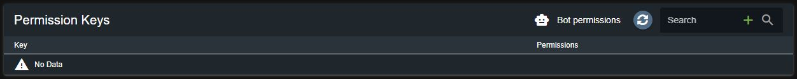
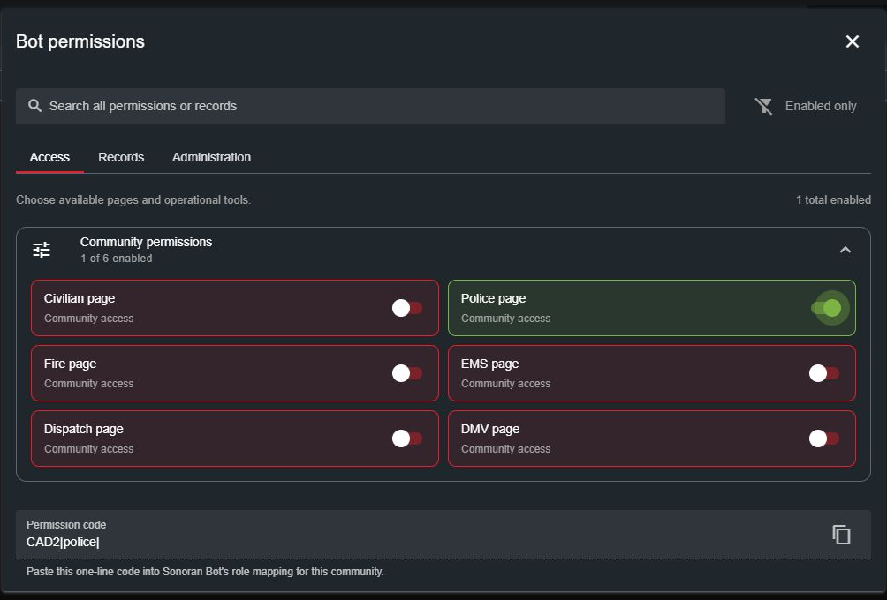
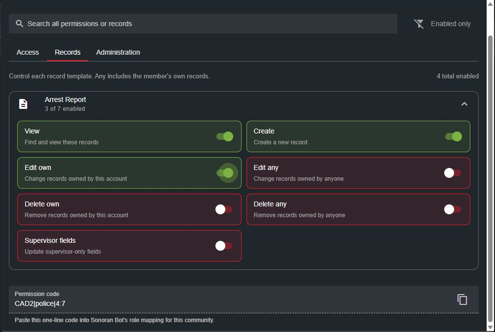

# Sonoran CAD Integration

Map Discord roles to Sonoran CAD permissions. Members receive the combined permissions from their mapped roles across all linked Discord servers.


CAD role mapping is unavailable in CMS mode. If CMS is configured, manage CAD permissions through [CMS ranks](https://docs.sonoransoftware.com/cms/integration-capabilities/sonoran-cad-sync) instead.


## Setup

### 1. Link Your CAD Community

[Invite Sonoran Bot and link your community](getting-started.md). If the bot is already configured, run `/settings` and select **API Menu > Change CAD Setup** to enter your CAD community ID and API key.

### 2. Generate a Permission Code in CAD

In your CAD community, open **Administration > Permission Keys** and select **Bot permissions**.

<figure><figcaption>
Open the bot permission builder from Permission Keys.
</figcaption></figure>

Select the permissions this Discord role should grant:

* **Access:** Pages and operational tools, such as the Police page.
* **Records:** View, create, edit, delete, and supervisor-field permissions for each record template.
* **Administration:** Administrative permissions, if needed for the role.

<figure><figcaption>
Choose page access for the role.
</figcaption></figure>

For example, a patrol role could have **Police page** access and **View**, **Create**, and **Edit own** for Arrest Report records. Choose your community's templates and permissions; the screenshots use sample data.

<figure><figcaption>
Select record actions, then copy the Permission code using the copy button.
</figcaption></figure>

**Any** includes the member's own records. **Supervisor fields** is a separate permission for fields marked supervisor-only.

Copy the **Permission code** at the bottom. This one-line code replaces the old external bitmap generator. The bot applies it to its configured CAD community. It is configuration for the bot, not a permission key for members to redeem.

### 3. Map the Code to a Discord Role

1. Run `/rolemap` and select **Discord → Sonoran**.
2. Select **Create Mapping**.
3. Choose **CAD** under **Type**, then choose the Discord role.
4. Select **Set Permission**, paste the complete code, and submit.
5. Select **Create Mapping** to save.

The separate **Discord → Discord** option mirrors roles between linked Discord servers and does not grant CAD permissions.

Repeat for each role. To change a mapping, select **Edit Mapping**, choose the mapping, use **Edit Permission** to paste a new code, then select **Save Mapping**. Use **Delete Mapping** to remove it.

### 4. Sync Members

Members must link their Discord and Sonoran Software accounts using `/linkme`.

Sonoran Bot updates CAD permissions when members' Discord roles change, they leave a linked server, or they are banned from it. Members can run `/sync` to sync immediately. Administrators can run `/sync community: yes` to sync the community.


Sync replaces each member's CAD permissions with the combined permissions from their mapped roles. Manual grants and redeemed permission-key grants are overwritten unless a mapped role also grants them. A member with no mapped roles has no synced permissions. The community owner is excluded from synchronization.


## Existing Mappings and Template Changes

* **Existing numeric mappings keep working.** Replace them with a generated code when you want permissions for individual templates.
* **New templates need to be selected.** A generated code grants only the templates you selected. Generate and save an updated code to add another template. Existing numeric mappings retain their legacy category behavior.
* **Deleted templates:** If a mapped template is deleted, regenerate the affected code and update its mapping.
* **Large permission selections:** Codes are limited to 1,000 characters. If the builder reports that your selection is too large, split the permissions across additional Discord roles and map each separately.

Only grant the access each role needs, especially administrative and delete permissions.
