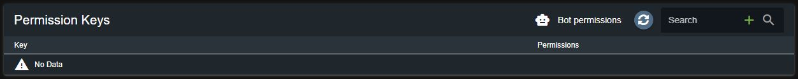
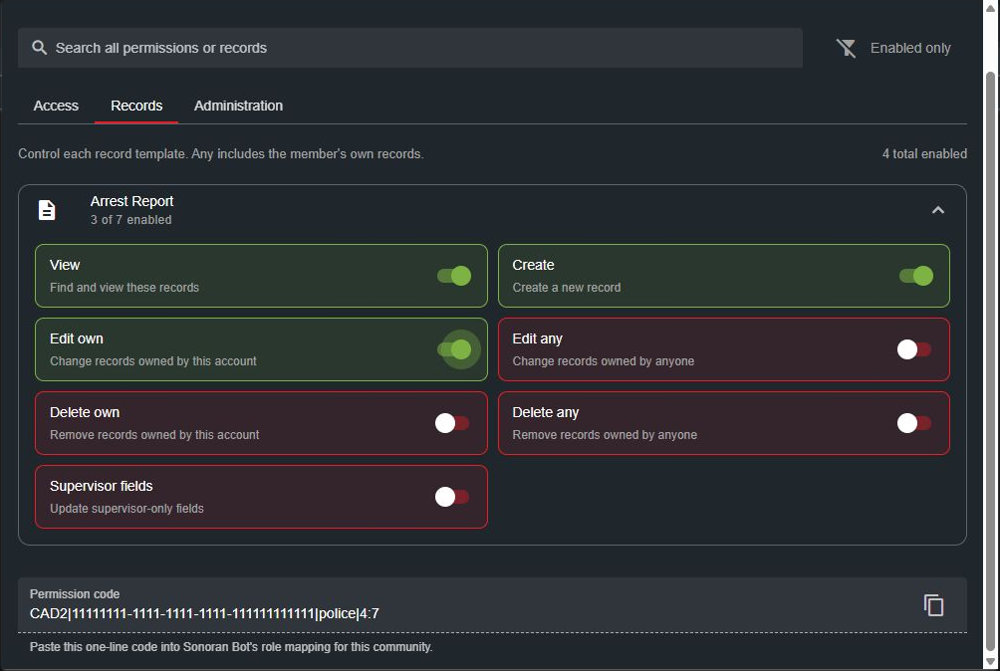

# Sonoran CAD Integration

[Invite Sonoran Bot and link your CAD community](getting-started.md) before setting up role sync.

If your bot uses CMS, configure [CAD permissions through CMS ranks](https://docs.sonoransoftware.com/cms/integration-capabilities/sonoran-cad-sync) instead.

## 1. Select Permissions

In CAD, open **Administration > Permission Keys > Bot permissions**.

<figure><figcaption></figcaption></figure>

Select the page, record, and administrative permissions the Discord role should grant, then copy the **Permission code** at the bottom.

<figure><figcaption></figcaption></figure>

## 2. Map to a Discord Role

1. Run `/rolemap` and select **Discord → Sonoran**.
2. Select **Create Mapping**.
3. Choose **CAD** under **Type**, then choose the Discord role.
4. Select **Set Permission**, paste the code, and submit.
5. Select **Create Mapping** to save.

## 3. Sync Members

Members link their accounts with `/linkme`, then run `/sync` to apply their permissions. Administrators can run `/sync community: yes` to sync everyone.

Future Discord role changes update CAD permissions automatically.


Sync replaces members' CAD permissions with the combined permissions from their mapped roles. Manual grants and permission-key grants are overwritten.

