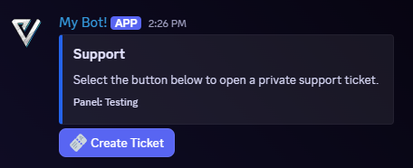
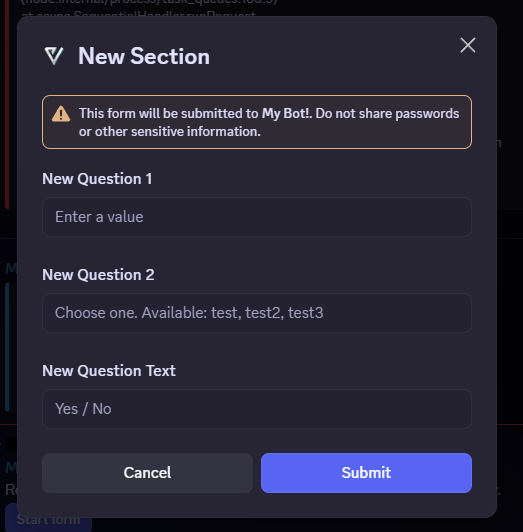
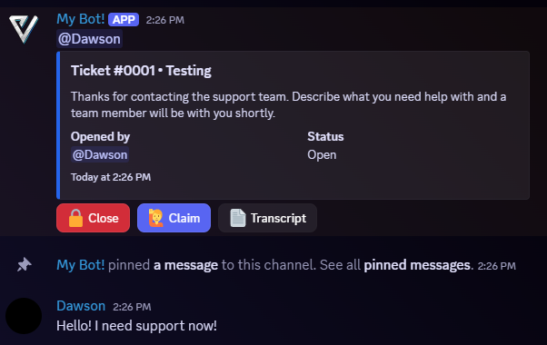

# Ticket System

Sonoran Bot can create private support channels from configurable ticket panels. Each panel can use its own support roles, categories, intake questions, limits, transcripts, and logging channels.

<figure><figcaption>
Members select the panel button to open a private ticket.
</figcaption></figure>

## Create a Ticket Panel

You need the **Manage Server** permission to configure ticket panels. Sonoran Bot also needs permission to manage channels and messages in the ticket categories.

1. Create the panel and select an initial support role and open-ticket category:

   `/ticket panel create name:Support support_role:@Support open_category:Open Tickets`
2. Configure where closed tickets, transcripts, and ticket logs should go:

   `/ticket panel edit panel:Support closed_category:Closed Tickets transcript_channel:#ticket-transcripts log_channel:#ticket-logs`
3. Publish the panel in a channel members can access:

   `/ticket panel send panel:Support channel:#open-a-ticket`

Use `/ticket panel list` to view existing panels. Running `/ticket panel send` again publishes another copy of the same panel.

## Add Intake Questions

A panel can ask up to five questions before opening the ticket. Add each question with `/ticket form add`:

`/ticket form add panel:Support question:What can we help you with? style:Paragraph required:True`

Use `/ticket form list`, `/ticket form remove`, or `/ticket form clear` to review and change the questions.

<figure><figcaption>
Intake answers are displayed to the support team when the ticket opens.
</figcaption></figure>

## Configure Access and Limits

Use `/ticket panel role-add` and `/ticket panel role-remove` to manage these role groups:

* **Support team:** Can view and manage tickets for the panel.
* **Read-only observer:** Can view tickets without replying.
* **Allowed to open:** Limits panel use to selected roles.
* **Blocked from opening:** Prevents selected roles from opening tickets.
* **Bypass ticket limits:** Allows selected roles to ignore panel limits.

`/ticket panel edit` also configures the maximum open tickets per user and across the panel, automatic transcripts, claiming, close confirmation, channel names, and behavior when a ticket owner leaves the server.

## Manage Tickets

New tickets include buttons to close, claim, and save a transcript. The main ticket message is pinned automatically when that panel option is enabled.

<figure><figcaption>
A private ticket channel visible to the ticket owner and configured support roles.
</figcaption></figure>

The ticket owner and support team can use the available buttons or these commands:

| Command | Function |
| --- | --- |
| `/ticket open` | Open a ticket from a selected panel. Support staff can open one for another member. |
| `/ticket close` | Close an open ticket. |
| `/ticket reopen` | Reopen a closed ticket. |
| `/ticket delete` | Permanently delete a ticket channel. |
| `/ticket claim` and `/ticket unclaim` | Assign or unassign a support team member. |
| `/ticket add` and `/ticket remove` | Add or remove a user or role. |
| `/ticket rename` | Rename the ticket channel. |
| `/ticket transfer` | Transfer ownership to another member. |
| `/ticket transcript` | Export up to 1,000 messages as an HTML transcript. |
| `/ticket info` | View the ticket owner, status, assignment, and participants. |

Most ticket-management commands accept an optional `ticket` channel. If it is omitted, the command uses the current channel.
