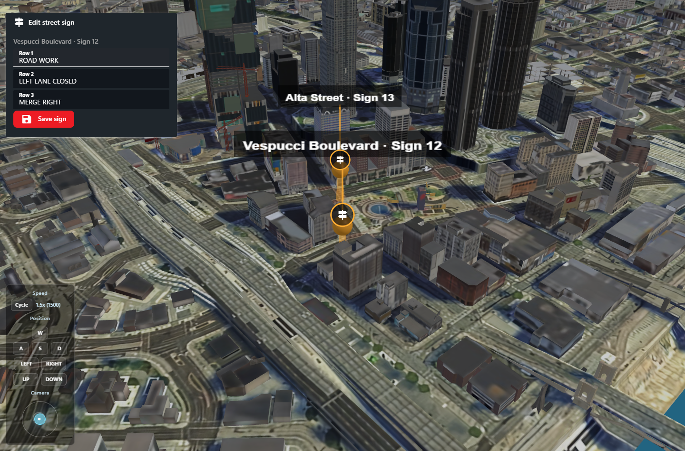

# Smart Signs: Live Map Editor

Attach an Integration Panel to a custom blip to show interactive controls when a user clicks the blip. The same renderer, state API, action queue, and acknowledgments used by layout panels also work in the map's blip menu, in both 2D and 3D views.

This example defines one reusable editor, publishes one instance per sign, and adds a blip pointing to that exact instance. CAD renders three text inputs and a **Save sign** button. No script or HTML runs inside CAD; your server-side integration handles each action.



*Local CAD preview using sample sign data.*

## 1. Define the sign editor

Send the following body to `PUT /v2/integration-panels/smart-signs` using [Set Panel](../set-panel.md). All SDKs expose `setIntegrationPanelV2`.

```json
{
  "definition": {
    "schemaVersion": 1,
    "key": "smart-signs",
    "name": "Edit street sign",
    "icon": "signpost",
    "surfaces": [],
    "body": [
      { "type": "text", "text": "$state.location", "appearance": "muted" },
      { "type": "input", "id": "line1", "label": "Row 1", "value": "$state.line1" },
      { "type": "input", "id": "line2", "label": "Row 2", "value": "$state.line2" },
      { "type": "input", "id": "line3", "label": "Row 3", "value": "$state.line3" },
      {
        "type": "button", "label": "Save sign", "icon": "save", "appearance": "primary",
        "action": {
          "id": "sign.save",
          "values": { "line1": "$inputs.line1", "line2": "$inputs.line2", "line3": "$inputs.line3" }
        }
      }
    ]
  }
}
```

`surfaces: []` keeps these individual editors out of the layout's Add Window list. It does not prevent explicit blip references. Use a separate overview panel, such as `smart-signs-overview`, with `surfaces: ["dispatch", "police"]` and a repeated list for the full sign management window. Publish changes to both the overview state and the affected editor instance.

## 2. Publish the sign's current text

Use [Set State](../set-state.md), `PUT /v2/integration-panels/servers/1/panels/smart-signs/instances/sign-12/state`:

```json
{
  "state": {
    "location": "Vespucci Boulevard · Sign 12",
    "line1": "ROAD WORK",
    "line2": "LEFT LANE CLOSED",
    "line3": "MERGE RIGHT"
  }
}
```

State is a full replacement. Send all three rows each time the sign changes, including changes made in-game. Connected editors receive the published values live. New state revisions replace local unsaved edits, so publish when authoritative sign data changes rather than continuously resending unchanged state.

## 3. Attach the editor to a blip

Use Sonoran.Net **0.1.40 or newer** for the typed `BlipDisplayDataV2.PanelKey` and `.InstanceKey` properties. Lua, JavaScript, and Python accept these fields through their existing v2 blip helpers.

Use [Create Blip](../../emergency/map/create-blip.md), `POST /v2/emergency/servers/1/blips`:

```json
{
  "coordinates": { "x": 235, "y": -1080 },
  "subType": "SMART_SIGN",
  "icon": "signpost",
  "color": "#ffad33",
  "tooltip": "Vespucci Boulevard · Sign 12",
  "data": [{ "panelKey": "smart-signs", "instanceKey": "sign-12" }]
}
```

Each `data` entry can contain ordinary `title`/`text` information or a `panelKey`/`instanceKey` reference. An optional `title` on a panel entry overrides its menu heading. If `panelKey` is present, that entry renders the panel instead of `text`. Multiple entries render in array order.

| Field | Meaning |
| --- | --- |
| `panelKey` | Exact registered panel key, not its display name. |
| `instanceKey` | Exact instance on the blip's selected server; defaults to `default` when omitted. |
| `title` | Optional heading override. |

Panel and instance keys use 2–80 lowercase letters, digits, dots, underscores, or hyphens and start with a letter or digit. Publish the definition and instance before using the blip. Missing definitions or instances show an unavailable message; CAD never substitutes another sign's instance. The existing community/server permissions for Integration Panels still apply. `surfaces` controls layout placement, not authorization.

To change the reference, [Update Blip](../../emergency/map/update-blip.md) with a complete replacement `data` array. To remove all menu content, send `"data": []`. To remove only a panel, resend the ordinary information entries you want to retain. Unrelated blip PATCH fields leave `data` unchanged.

## 4. Apply Save actions in your integration

Poll [Actions](../poll-actions.md) for `smart-signs` on server 1. A Save action includes:

```json
{
  "panelKey": "smart-signs",
  "serverId": 1,
  "instanceKey": "sign-12",
  "actionId": "sign.save",
  "values": {
    "line1": "ROAD WORK",
    "line2": "RIGHT LANE CLOSED",
    "line3": "MERGE RIGHT"
  }
}
```

The event also contains its event ID, cursor, actor, creation time, and expiry. Use `instanceKey` to select the sign. Save includes the displayed defaults for untouched fields and preserves deliberate empty strings. Inputs without an `action` collect edits locally; the button sends all three rows together.

1. Validate the actor, sign, allowed action, text lengths, and supported characters against your game resource's rules.
2. Apply the change to the sign in-game. Handle repeated event delivery idempotently using the event ID.
3. [Acknowledge](../acknowledge-action.md) the event as successful or failed, with a useful message.
4. On success, publish the complete resulting state for `sign-12` and your overview panel.

The menu's request-sent message confirms queue submission, not in-game completion. CAD displays the integration's acknowledgment through its existing action notification. Acknowledging does not publish state automatically. The integration must poll/process actions within their 60-second lifetime.

## Capacity

One editor definition can currently have **100 instances per server**. This example therefore supports 100 independently addressed sign editors per panel/server. Larger deployments need separate panel keys or a future increase to the instance limit. The existing 50 active panels per community, rate limits, and payload limits remain unchanged.
