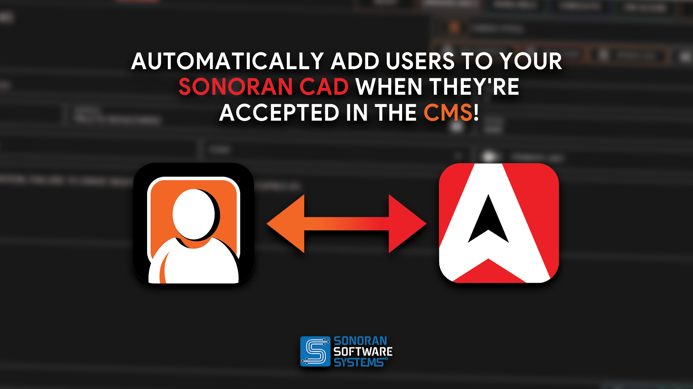

# Discord Bot Integration

<figure><figcaption></figcaption></figure>

### Getting Started

Get started with SonoranBot today by inviting it to your Discord:


[Getting Started](https://app.gitbook.com/s/gJnyZgUQPWpA5p9njAAR/tutorials/getting-started)


### CAD Integration

Learn more about SonoranBot's CAD integration features:


[Sonoran CAD Integration](https://app.gitbook.com/s/gJnyZgUQPWpA5p9njAAR/tutorials/sonoran-cad-integration)


### Settings

Configure SonoranBot's settings in your server:


[Settings](https://app.gitbook.com/s/gJnyZgUQPWpA5p9njAAR/tutorials/usage/settings)


### Commands

Reference a list of bot commands:


[Commands](https://app.gitbook.com/s/gJnyZgUQPWpA5p9njAAR/tutorials/usage/commands)


### Generate a permission code in CAD

In **Administration > Accounts > Permission Keys**, open **Bot permissions**. Select page, administrative, and per-template record permissions in the builder, then copy the generated code for your bot role mapping. This builds a code; it does not directly change account permissions.

Use **Edit selected fields on others' records** with template fields marked **Allow limited editing** for restricted updates. **Edit any** grants full editing access instead. See [Granting Account Permissions](../tutorials/getting-started/permissions.md#record-editing-permissions) before changing an existing role mapping.
