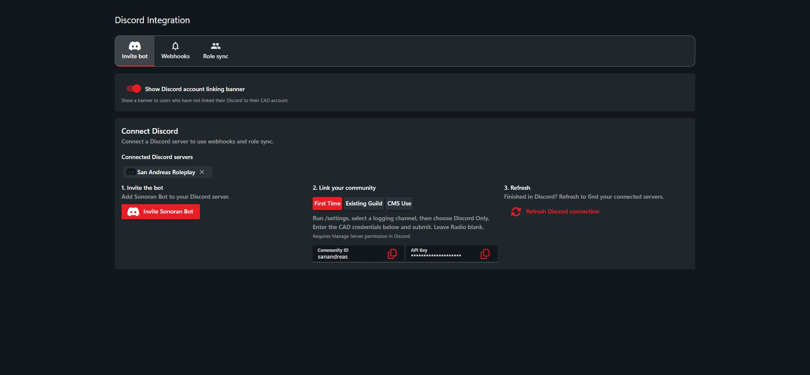

# Discord

Connect your Discord server once, then set up role sync or notifications in CAD.

## 1. Connect your server

You need **Manage Server** in Discord to invite and set up the bot.

1. Open **Administration > Advanced > Discord Integration > Invite bot**.
2. Select **Invite Sonoran Bot** and choose your Discord server.
3. In Discord, run `/settings`. Choose a logging channel, select **Discord Only**, and enter the **Community ID** and **API Key** shown in CAD. Leave Radio blank if you do not use it.
4. Return to CAD and select **Refresh Discord connection**. Your server appears under **Connected Discord servers**.

<figure><figcaption>
Connect your server from the Invite bot tab.
</figcaption></figure>

**Already using the bot?** Run `/settings > API Settings > Change CAD Setup` to link this CAD community, then refresh in CAD.

**Using CMS?** Follow the **CMS Use** setup instructions in CAD, then manage [CAD permissions in CMS](https://docs.sonoransoftware.com/cms/integration-capabilities/sonoran-cad-sync).

Webhooks and Role sync unlock when a connected server appears. Use **Invite bot** to add another server or the **×** beside a server to disconnect it.

## 2. Choose what to set up


[Role sync](discord/role-sync.md)



[Webhooks](discord-webhooks.md)



[Discord Rich Presence](discord-rich-presence.md)


For other bot features, see the [Sonoran Bot guides](https://docs.sonoransoftware.com/bot/tutorials/getting-started).
