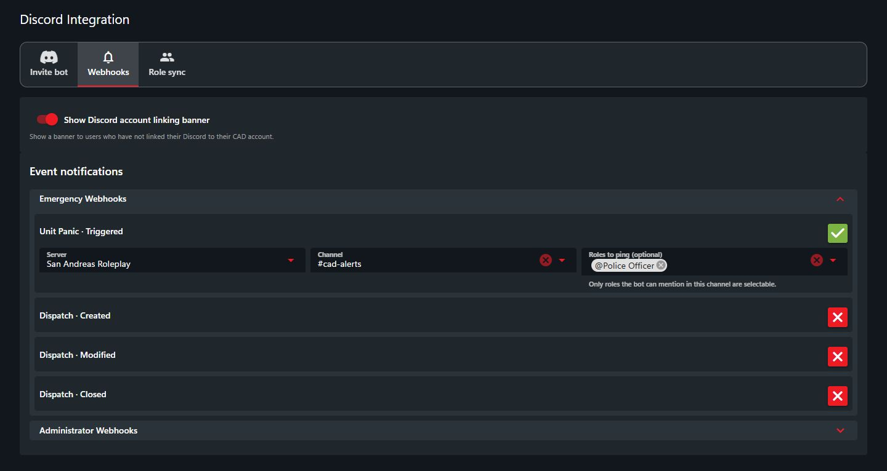

# Webhooks

Send CAD alerts to Discord, including panic alerts, call updates, record changes, and account activity.

## Set up notifications

1. [Connect your Discord server](discord-bot-integration.md).
2. Open **Administration > Advanced > Discord Integration > Webhooks**.
3. Expand an event group and turn on the events you want.
4. Choose the **Server** and **Channel** for each event.
5. Optionally choose **Roles to ping (optional)**. Changes save automatically.

<figure><figcaption>
Choose a channel for each notification.
</figcaption></figure>

To stop a notification, turn off that event. The bot must have permission to view and send messages in the selected channel.
