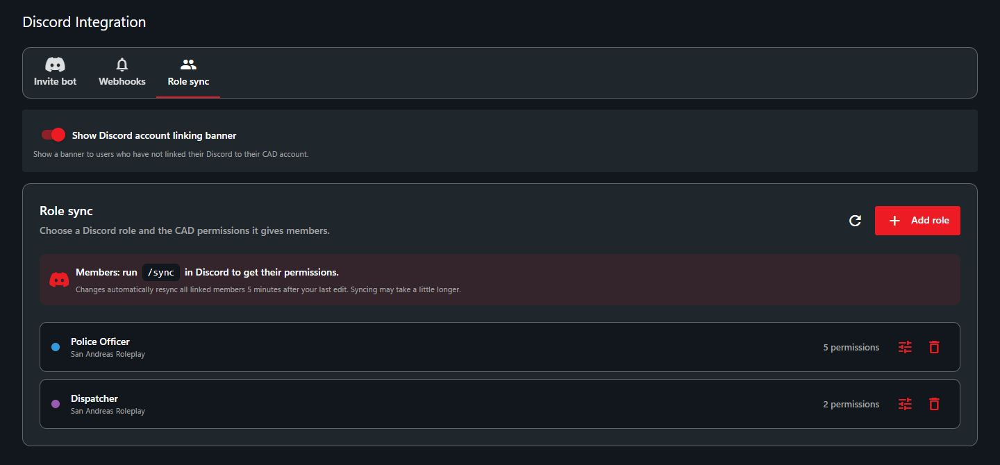
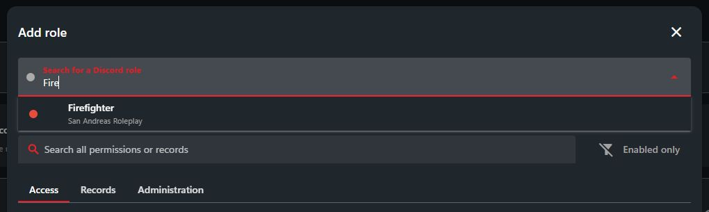
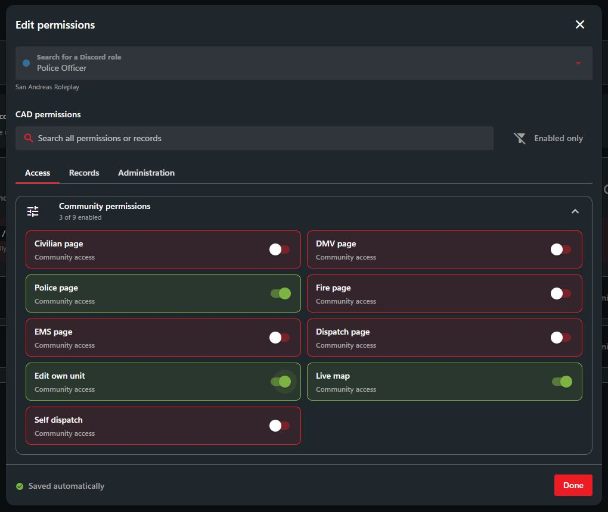
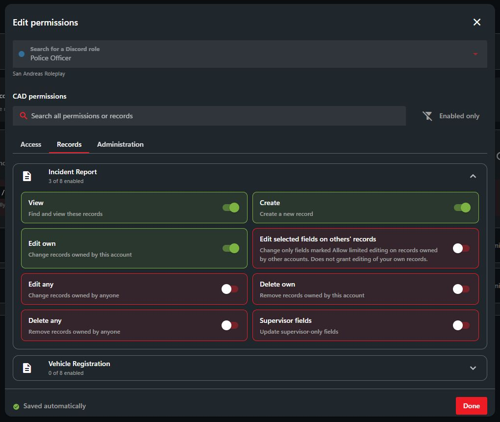

# Role sync

Give members CAD permissions through their Discord roles.

## 1. Connect Discord

Follow [Connect your server](../discord-bot-integration.md#1-connect-your-server), then open **Administration > Advanced > Discord Integration > Role sync**. You can also select **Set up role sync** in **Administration > Accounts**.

<figure><figcaption>
Each role shows its Discord server and assigned permissions.
</figcaption></figure>


If this community uses Sonoran CMS, configure [CAD permissions in CMS](https://docs.sonoransoftware.com/cms/integration-capabilities/sonoran-cad-sync). CAD role mapping is disabled for CMS-managed communities.


## 2. Add a role

1. Select **Add role**.
2. Type a role name and select it. Check the role color and server name.
3. Choose permissions under **Access**, **Records**, and **Administration**.
4. Wait for **Saved automatically**, then select **Done**.

<figure><figcaption>
Choose the role from the correct Discord server.
</figcaption></figure>

<figure><figcaption>
Choose the permissions this role gives members.
</figcaption></figure>

Under **Records**, expand a template to choose what members can view, create, edit, or delete. See [Account permissions](../../tutorials/getting-started/permissions.md#record-permissions) for permission details.

<figure><figcaption>
Set permissions separately for each record template.
</figcaption></figure>

## 3. Sync members

1. Members join your CAD community.
2. Members run `/sync` in Discord. If their account needs linking, the bot shows them how.

After a mapping changes, all linked members automatically resync **5 minutes after your last edit**. Finishing the sync may take a little longer.

Members receive the combined permissions from all their mapped roles. Sync replaces their CAD permissions, including permissions assigned manually or through a key.

## Edit or remove a mapping

1. Select the **Edit permissions** icon beside a role to change its permissions. Changes save automatically.
2. To remove a mapping, select the **Remove role** icon and confirm. This removes the mapping, not the Discord role.
