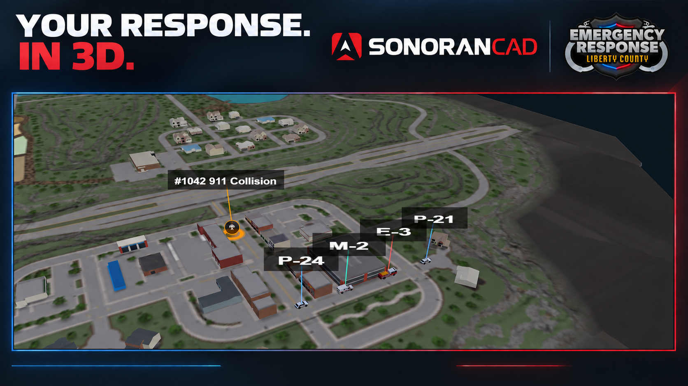
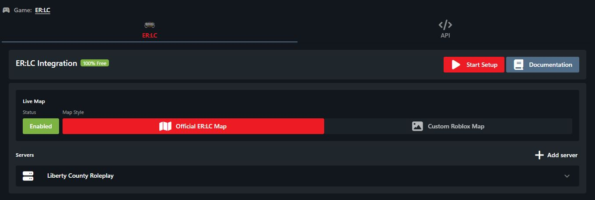
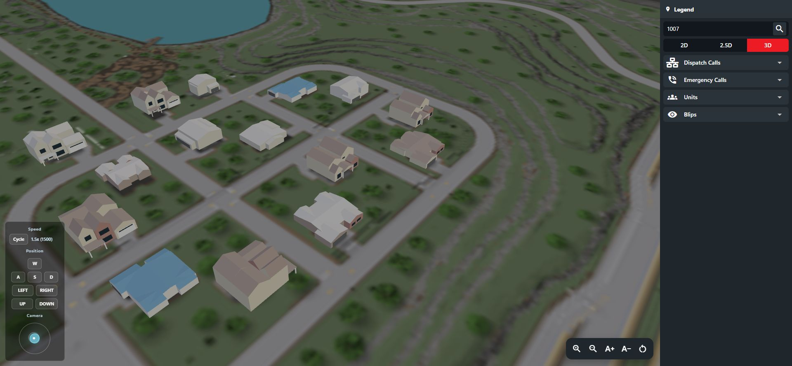
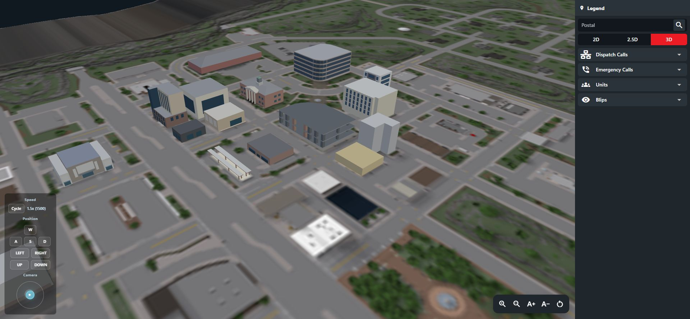
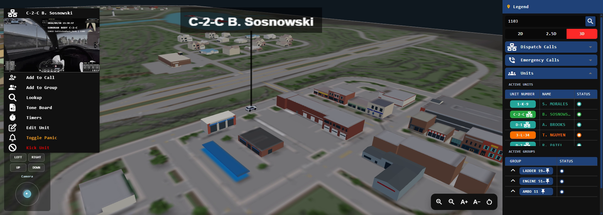
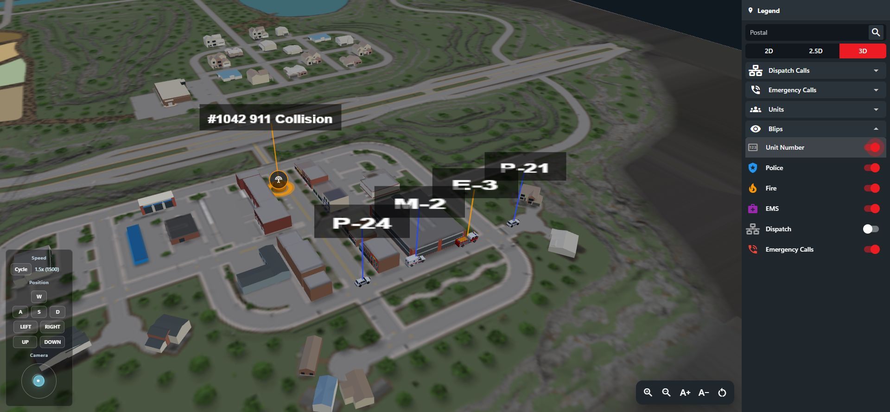
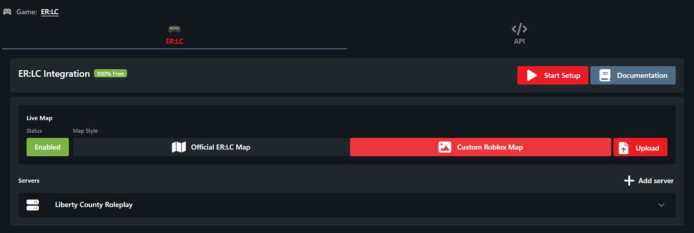

# 3D Live Map

## ER:LC Live Map

Sonoran CAD includes an interactive 2D and 3D live map that displays unit locations, bodycams, emergency calls, dispatch calls, and more in real time.

<figure><figcaption></figcaption></figure>

## Configuring the Live Map

Configuring the Live Map

1. Open **Admin** > **Advanced** > **In-Game Integration**.
2. Confirm the community's **Game** is **ER:LC**, then open the **ER:LC** tab.
3. If your server is not linked yet, complete the [ER:LC setup](getting-started.md) using your private server's API key.
4. In the **Live Map** section, set **Status** to **Enabled** and select **Official ER:LC Map** under **Map Style**.

Changes on the ER:LC tab save automatically. You do not need to upload a map image or GLB to use the official ER:LC map.

<figure><figcaption>
Enable the official ER:LC live map in the integration settings.
</figcaption></figure>

## CAD Permission Requirements

In order to appear on the live map, players must have a [linked Roblox account](getting-started.md#linking-your-roblox-account).

In order to access the live map, players must have the **Live Map** permission.

## Usage

### Accessing the Live Map

Accessing the Live Map

The live map can be found in the task bar by searching, or going to **Unit Management** > **Live Map**

Additionally, you can select the map pin icon on any unit, emergency call, or dispatch call that has a location from in-game to open the map and zoom to their location.

### Using the Live Map

#### 2D and 3D Mode

Change the map view from 2D, 2.5D, or 3D via the top right.

#### Searching Postal Codes

Enter a postal code, such as **1007**, in the **Postal** field at the top of the legend. Press **Enter** or select **Search** to center the map on that location. Postal search works in 2D, 2.5D, and 3D.

If a code is not found, the field displays an inline error. Check the code and try again.

<figure><figcaption>
Search for a postal code from the map legend.
</figcaption></figure>

In **2D** and **2.5D**, the label button beside the mode controls shows or hides postal codes and street names together.

#### Exploring the 3D Map

Zoom in to inspect buildings and roads, and use the movement and camera controls to change your view. The new ER:LC map is being modeled in stages, so detail varies by area.

<figure><figcaption>
A closer look at the downtown area.
</figcaption></figure>

New map geometry loads automatically when you open the map. An active map also checks for updates approximately every five minutes.

#### Unit Blips

Units will appear on the map if they have a [linked Roblox account](getting-started.md#linking-your-roblox-account) and are active on the CAD police, fire, EMS, or dispatch page.

Click on a unit to access dispatch calls, lookups, the tone board, timers, and other options.

If the unit is streaming a [bodycam](bodycam.md#via-live-map), its live video appears at the top of the unit menu. Click the video preview to open the dedicated bodycam viewer. This works in 2D, 2.5D, and 3D.

<figure><figcaption>
View a unit's live bodycam directly from its map blip.
</figcaption></figure>

Expand **Blips** in the legend to choose which unit and emergency-call categories appear. Use the text-size controls to adjust blip size.

Supported teams use police, fire, EMS, or DOT models. When the API does not report vehicle occupancy, the team's vehicle model is used. A character model is used when on-foot status is explicitly reported.

<figure><figcaption>
Service vehicles beside a sample dispatch call.
</figcaption></figure>

#### Emergency Calls

When an [emergency call is made from in-game](emergency-calls.md) a blip will appear on the map. Select the blip to view the call and open it in your call editor.

#### Dispatch Calls

Dispatch calls created from an [in-game emergency call](emergency-calls.md) or an [in-game traffic stop](traffic-stops.md) will automatically have location data showing a blip on the map. Select the call blip to open it in the editor or close it.

## Roblox Custom Maps

Roblox Custom Maps

Sonoran CAD allows any Roblox game to also send and update live map positions.

* [ER:LC](getting-started.md)
  * Select **Official ER:LC Map** for the maintained map and automatic geometry updates.
* [Maple County | Fall Update](https://www.roblox.com/games/8416011646/Maple-County-FALL-UPDATE)
  * Requires a custom map upload from the game

To upload a custom live map for Roblox

* Open **Admin** > **Advanced** > **In-Game Integration** > **ER:LC**.
* Under **Live Map**, select **Custom Roblox Map** and use **Upload** to upload your map image. Custom map images require **Pro**.

<figure><figcaption>
Custom map image uploads are separate from the official ER:LC map.
</figcaption></figure>

For Roblox Developers

Maple County has recently added Sonoran CAD live map access to their Roblox game mode.\
To do the same for your game:

1. Send Unit Location API updates with the `coordinate` `x` and `y` values
2. Convert (if needed) your `coordinate` `x` and `y` values so that the top left of your map image is `{0,0}`
3. Export your square map as a PNG and upload it under **Admin** > **Advanced** > **In-Game Integration** > **ER:LC** > **Live Map** > **Custom Roblox Map** > **Upload**. Make sure the image coordinates match the coordinates your integration sends.

For more help, reach out to our [support team](https://support.sonoransoftware.com).

