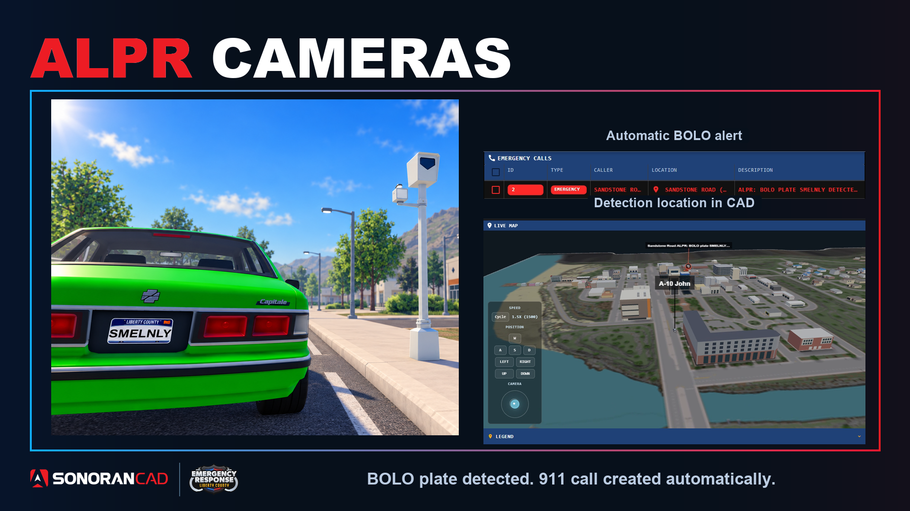

# ALPR Cameras

When a vehicle with an active BOLO plate passes through a configured camera's range, Sonoran CAD creates a 911 call with its location and vehicle details.

<figure><figcaption></figcaption></figure>

## Setup

1. [Connect your ER:LC server](getting-started.md).
2. In **Admin > Integrations**, open **ALPR Cameras**, select your server, and enable ALPR.
3. Select **Apply default cameras**, or **Place camera** to add your own. Drag cameras to move them and adjust their detection radius.
4. Create an active BOLO record with the vehicle's license plate.

Camera settings save automatically. You can customize the 911 description, call expiry, and repeat detection cooldown.
