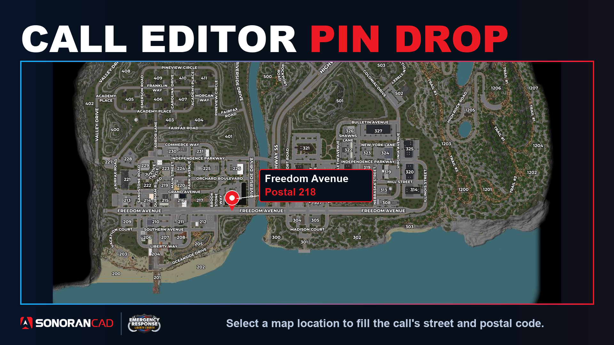
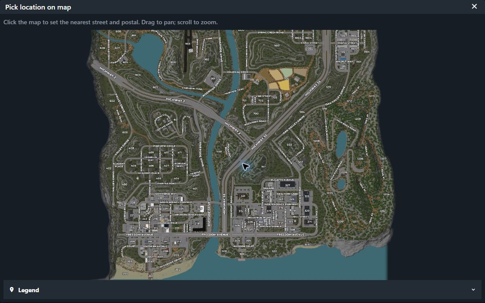
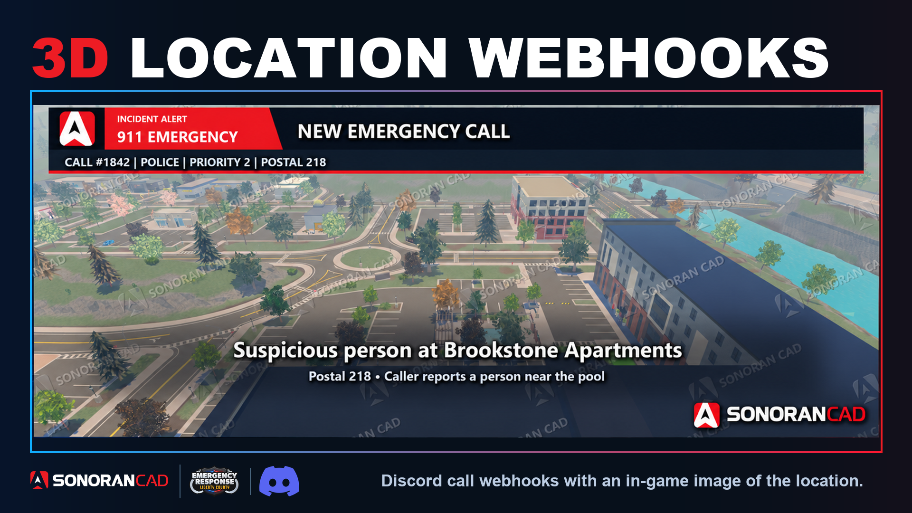

# Call Editor Pin Drop

Drop a pin instead of typing an address. Select a location on the 2D ERLC map and Sonoran CAD fills the nearest street name and postal code in your dispatch call.

### 1. Check ERLC mode

Make sure your CAD community is in **ER:LC** mode under **Administration → Advanced → In-Game Integration**.

<figure><figcaption></figcaption></figure>

### 2. Open the map

Create or edit a dispatch call. Select the **pin icon** inside the **Address** field to open the 2D map picker.

<figure><figcaption></figcaption></figure>

### 3. Select the location

Drag to pan and scroll to zoom. Open **Legend** to access the map controls, including the **map labels** button to show or hide street and postal labels.

Click the call's location. The map closes and fills the **Address** and **Postal** fields.

## Use the ERLC street list

The type-to-filter **Address** field is also pre-configured with the full list of ER:LC's street and trail names. These [custom street names](../../tutorials/customization/addresses-and-street-names.md) can be re-applied under **Administration → Advanced → In-Game Integration → ER:LC**. In **Addresses**, select **Use ER:LC street list**.

<figure><figcaption></figcaption></figure> <figure><figcaption></figcaption></figure>

## Send the location to Discord

You can also enable [ERLC 3D Location Webhooks](location-notifications.md) to include an aerial location image with emergency and dispatch call webhooks.

<figure><figcaption></figcaption></figure>
