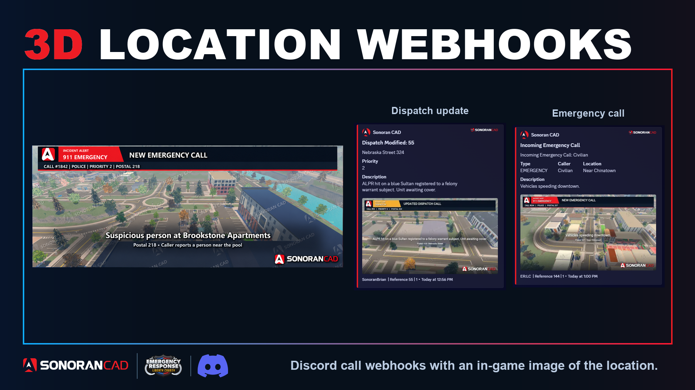

# 3D Location Webhooks

See the call and its location together in Discord. Notifications include the call details and a watermarked aerial image when a matching location image is available.

Before you start, [connect Sonoran Bot to your CAD community](https://docs.sonoransoftware.com/bot/tutorials/getting-started). For in-game 911 calls, complete [ERLC setup](https://docs.sonoransoftware.com/cad/integration-plugins/erlc/getting-started) too.

### 1. Check ERLC mode

Make sure your CAD community is in **ER:LC** mode under **Administration → Advanced → In-Game Integration**.

<figure><figcaption></figcaption></figure>

### 2. Choose your notifications

Open **Administration → Advanced → Discord Integration**. Enable the events you want:

* **Emergency Call · Created** — new 911 calls.
* **Dispatch · Created** — new dispatch calls.
* **Dispatch · Modified** — updated dispatch calls.

### 3. Pick a channel

Choose your Discord **Server** and **Channel** for each enabled event. Changes save automatically.

For the 3D aerial images, [dispatch calls must have a postal code set](call-editor-pin-drop.md). In-game 911 calls already include the required location information.

<figure><figcaption></figcaption></figure>

## Webhook Examples

<figure><figcaption></figcaption></figure> <figure><figcaption></figcaption></figure>

