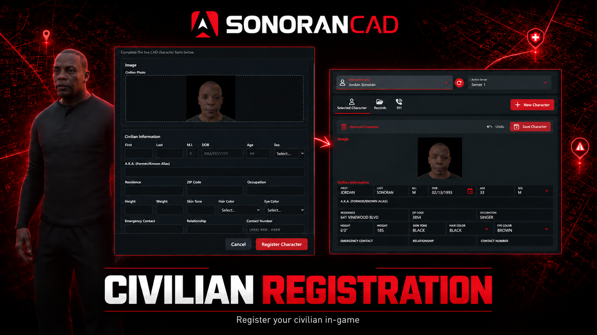
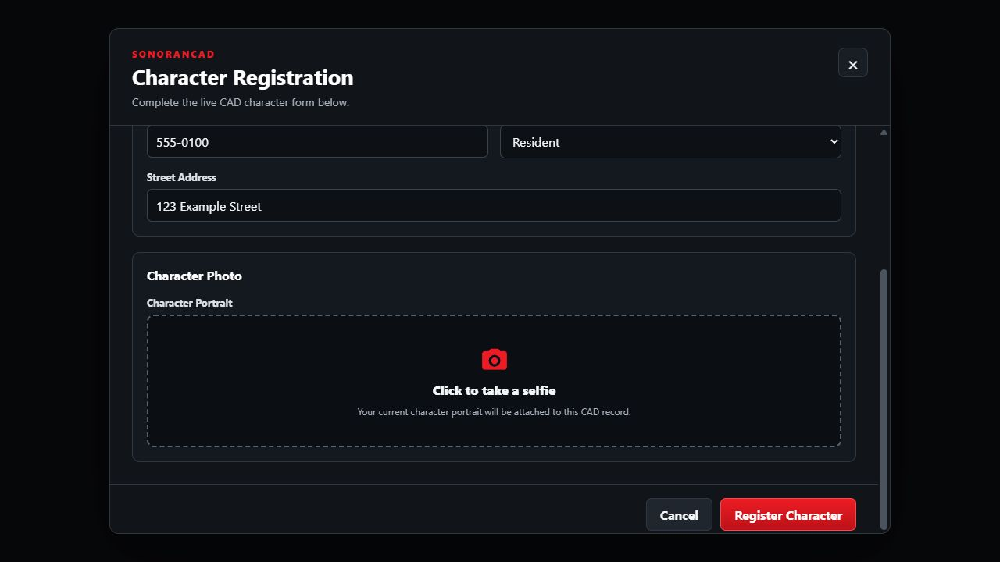

# Civilian Registration (CivReg)

<figure><figcaption></figcaption></figure>

Civilian Registration makes character creation from in-game simple.

For **standalone (menu) based servers**, a registration window with your custom character record form is shown with a single button to generate a character selfie.

For **framework servers** with [DB sync](../../database-sync-and-merge/), this submodule syncs in-game selfies/mugshots to the existing _automatic_ character records.

## Activation Guide

### 1. Download and Install the Resource


This submodule is already **enabled by default** when installing the [Sonoran CAD FiveM resource](../fivem-installation/).


### 2. Configure the Submodule

Open `sonorancad/configuration/civreg_config.lua`. Keep `enabled = true` and `templateId = 7` for civilian character registration.

### 3. Optional: Configure Database Sync Mode

If both **Database Sync** and its **Character** mapping are enabled in CAD, CivReg uses database mode automatically.

Run the [database sync AI configuration tool](../../database-sync-and-merge/#3.-automatic-ai-setup) _**after**_ starting the civilian registration submodule. This will automatically map any `image` field in your character record to the newly generated `sonoran_mugshot` database column.

<details>

<summary>Advanced: SQL Information</summary>

On every start in database mode, CivReg runs `ADD COLUMN IF NOT EXISTS` to add a nullable `sonoran_mugshot MEDIUMTEXT` column. `MEDIUMTEXT` is required because a base64 portrait can exceed the 65,535-byte capacity of MySQL `TEXT`.

The standard database targets are:

| Framework | Character table | Character ID column | Portrait column   |
| --------- | --------------- | ------------------- | ----------------- |
| QBCore    | `players`       | `citizenid`         | `sonoran_mugshot` |
| ESX       | `users`         | `identifier`        | `sonoran_mugshot` |


In database mode, CivReg does not create a second character through the CAD API. If the database migration cannot run, portrait updates stop and the server reports `ERR-CR-106`.


If your framework uses a customized table or character ID column, update `databaseSync.qbCore` or `databaseSync.esx` in `civreg_config.lua`. Keep the portrait column named `sonoran_mugshot`, then use that column in the CAD field mapping.

</details>

### 4. (Optional) Customize Your Character Template

In CAD, open **Admin > Customization > Custom Records** and review the civilian character template. See [Creating Custom Record and Report Types](../../../tutorials/customization/creating-custom-record-and-report-types.md) for editing fields and sections. Add an editable **Image** field if players should attach a selfie, and make that field required if a portrait is mandatory.

In your database sync mapping configuration, the image field must be mapped to the `sonoran_mugshot` column that the CivReg plugin will automatically add to your players table. The [database sync AI configuration tool](../../database-sync-and-merge/#3.-automatic-ai-setup) will set this up for you automatically.

In standalone mode, templates are cached for **60 seconds** by default. After saving a template change, allow the cache to expire, then close and reopen `/civreg` to load the updated form. An already-open form does not refresh automatically.

### 5. (Optional) Configure Optional Autofill and Portrait Uploads

For identity autofill, follow [Framework Autofill](civilian-registration.md#framework-autofill). For templates with image fields, review [Portrait Uploads](civilian-registration.md#portrait-uploads) and the image size limit.

## Player Guide

### Standalone Mode

<details>

<summary>Register a Character in Standalone Mode</summary>

1. Run `/civreg`, or your server's configured registration command.
2. Fill out the character record form. Click on any **image** fields to take an automatic selfie.
3. Select **Register Character** to create the record. Users can optionally [use `/link` in-game](../link-user-in-game.md) to assign the character to their CAD account in the civilian panel.

</details>

<details>

<summary>Take a Character Selfie</summary>

In standalone mode, finish loading your character and any appearance changes, then click an **image** field to take a fresh selfie. Avoid changing characters or clothing while the photo is being taken. If the capture fails, wait until your appearance has finished loading and click the image field again.

The portrait shows your character without masks, hats, glasses, ear accessories, or neck accessories. Those items stay on your in-game character; you do not need to remove or re-equip them for the photo.

<figure><figcaption><p>Scroll to an image field and select Click to take a selfie to capture your current in-game character.</p></figcaption></figure>

</details>

### Framework Autofill

<details>

<summary>Configure Framework Autofill</summary>

Autofill is optional. Players can complete the registration form without a framework. To prefill supported identity values:

1. Configure and enable [Framework Support (ESX/QBCore)](framework-support-esx-qbcore-and-auto-fines/).
2. Start the supported framework before Sonoran CAD and set `usingQBCore` appropriately in `frameworksupport_config.lua`.
3. Match `autofillFieldIds` in `civreg_config.lua` to your character template's **Field Mapping ID** values.
4. Restart Sonoran CAD and open a new registration form while playing a loaded framework character.

The left-hand keys describe the identity values supplied by the framework. The right-hand strings identify the destination fields in CAD:

```lua
autofillFieldIds = {
    first = "first",
    last = "last",
    dob = "dob",
    sex = "sex",
    height = "height",
    phone = "phone",
    nationality = "nationality"
},
```

For example, if your first-name field has the custom Field Mapping ID `givenName`, change only that entry to `first = "givenName"`. These mappings control autofill; they do not create or rename template fields.

| Identity value | Default destination | Notes                                                                                                                   |
| -------------- | ------------------- | ----------------------------------------------------------------------------------------------------------------------- |
| First name     | `first`             | Available framework first name.                                                                                         |
| Last name      | `last`              | Available framework last name.                                                                                          |
| Date of birth  | `dob`               | Dates supplied as `YYYY-MM-DD` or `YYYY/MM/DD` are converted when the CAD field uses `MM/DD/YYYY`.                      |
| Sex            | `sex`               | Values `0`, `m`, or `male` become `M`; `1`, `f`, or `female` become `F`. Match your template's choices to those values. |
| Height         | `height`            | Copied as supplied; the submodule does not convert height units.                                                        |
| Phone number   | `phone`             | Filled when the framework supplies a supported phone value.                                                             |
| Nationality    | `nationality`       | Filled when available from the framework.                                                                               |

Only values supplied by the framework and mapped to an existing template field are prefilled. Missing values leave the template's default or an empty field for the player to complete. Prefilled fields remain editable unless marked read-only in CAD. These autofill settings apply to the API-mode form. Database mode updates only the `sonoran_mugshot` column; your existing CAD DB Sync mappings supply the remaining character fields.

</details>

### Database Sync Mode

<details>

<summary>Update a Character Portrait in Database Sync Mode</summary>

If your community has database sync enabled for civilian records, the CivReg submodule will automatically switch into database sync mode on startup.

1. Select the character you want to play in **QBCore or ESX** and finish spawning into the server.
2. Allow the character's face, clothing, and accessories to finish loading. CivReg waits for **10 seconds with no appearance changes** before taking a fresh portrait. Clothing changes during this wait restart it, so the photo may take longer than 10 seconds after joining.
3. The portrait is saved to that framework character's database record for CAD to display through your existing DB Sync image mapping.

The portrait excludes masks, hats, glasses, ear accessories, and neck accessories while leaving those items on your in-game character. If you switch characters or change your appearance during capture, the new photo is discarded and the previously saved portrait is kept.

You do not need to run `/civreg` in this mode; it displays a reminder that registration and portraits are automatic. Selecting a character on the **CAD civilian page** does not take a new portrait. To retry an automatic capture, reselect the character in your server's character menu and let it fully load again.

</details>

### Portrait Uploads

New portraits are saved directly with the character data. You do not need to set up a public image address or host the photos separately. The default maximum photo size is **1 MiB**; if a photo is rejected, retake it and review the displayed error with your server administrator.

### Updating from URL-Based Portraits

Existing CAD records may still use an older image URL. Keep the original files in `filestore/civreg` and their public address available while those records use them. Updating the resource does not replace those saved links automatically.

## Configuration Reference

<details>

<summary>Configuration Reference</summary>

Edit `sonorancad/configuration/civreg_config.lua` and restart the resource after changes.

| Option                                  | Default               | Description                                                                                                                                        |
| --------------------------------------- | --------------------- | -------------------------------------------------------------------------------------------------------------------------------------------------- |
| `enabled`                               | `true`                | Enables civilian registration.                                                                                                                     |
| `commandName`                           | `"civreg"`            | Chat command without the leading `/`. Changing it changes the command players use.                                                                 |
| `templateId`                            | `7`                   | CAD character template ID. Keep `7` for civilian registration; selecting a different record type changes what is submitted to CAD.                 |
| `templateCacheSeconds`                  | `60`                  | Shared template cache duration in seconds. `0` disables caching; frequent requests can hit the CAD template endpoint's rate limit.                 |
| `maxSelfieBytes`                        | `1024 * 1024`         | Maximum decoded size of each base64 portrait upload: 1 MiB by default.                                                                             |
| `databaseSync.qbCore.tableName`         | `"players"`           | QBCore character table updated in database mode.                                                                                                   |
| `databaseSync.qbCore.characterIdColumn` | `"citizenid"`         | QBCore column matched to the DB Sync character ID.                                                                                                 |
| `databaseSync.esx.tableName`            | `"users"`             | ESX character table updated in database mode.                                                                                                      |
| `databaseSync.esx.characterIdColumn`    | `"identifier"`        | ESX column matched to the DB Sync character ID.                                                                                                    |
| `autofillFieldIds`                      | Mapping shown above   | Maps supported framework identity values to CAD Field Mapping IDs.                                                                                 |
| `notificationOverride`                  | `"none"`              | Uses the global notification choice when `none`. Supported overrides listed in the configuration are `ox_lib`, `lation_ui`, `pnotify`, and `chat`. |
| `language`                              | English strings below | Customizes command help, form labels, and the success notification.                                                                                |

</details>

## Troubleshooting

<details>

<summary>Troubleshooting</summary>

| Problem                                                  | What to check                                                                                                                                                                                                             |
| -------------------------------------------------------- | ------------------------------------------------------------------------------------------------------------------------------------------------------------------------------------------------------------------------- |
| The command is unavailable                               | Confirm `civreg` is installed, the active configuration is named `civreg_config.lua`, `enabled` is `true`, and you are using the configured `commandName`. Restart the resource after configuration changes.              |
| `/civreg` does not open the form                         | When CAD character database sync is enabled, this is expected. The command explains that registration and portraits are automatic. Select your character in QBCore or ESX to start an automatic portrait capture.          |
| Database mode reports `ERR-CR-106`                       | Start QBCore or ESX and `oxmysql` or `mysql-async` before `sonorancad`. Confirm the configured character table and ID column exist, and allow the database user to alter and update that table.                           |
| The portrait column exists but CAD shows no image        | In the CAD character DB Sync mapping, map `sonoran_mugshot` to an **Image** field. Confirm the character ID mapping matches `citizenid` or `identifier`, then reselect the character in-game and let it fully load.          |
| Selecting a CAD character does not refresh its portrait  | This is expected in DB Sync mode. Portrait capture starts when you select and spawn as your QBCore or ESX character in-game. Selecting a record in CAD does not take a photo.                                              |
| The portrait is delayed or still shows an older appearance | Allow 10 seconds after the character's appearance stops changing. CivReg waits up to one minute for a character to be ready; if it cannot capture a valid new photo, the previous portrait remains. Reselect the character in-game to retry. If this keeps happening, ask your server administrator to check that the clothing or appearance resource finishes loading correctly. |
| The player is asked to link CAD                          | Complete [Link User In-Game](../link-user-in-game.md) with the intended CAD account, then retry.                                                                                                                          |
| Repeated commands do nothing                             | Requests have a three-second cooldown. In API mode, a form already open will not reopen; close the current form and wait before retrying.                                                                                 |
| Template changes are missing                             | Save the template in CAD, wait for `templateCacheSeconds` to pass, then reopen the form.                                                                                                                                  |
| Autofill is missing or incorrect                         | Check that Framework Support is enabled, the framework character is loaded, and each destination Field Mapping ID exists. Review date formats, sex choices, and height units.                                             |
| A field or section is missing                            | Review its dependency rules and whether the field is supervisor-only.                                                                                                                                                     |
| A field cannot be edited                                 | Check read-only settings and whether the field is an automatically managed field such as a random value or ID.                                                                                                            |
| Selfie capture fails                                     | Wait for the intended character and appearance to finish loading, then click the image field again without changing clothing or switching characters. If it persists, confirm the Sonoran CAD resource is up to date. For support, ask an administrator to enable Sonoran CAD debug logging, repeat the issue, and collect the player's F8 output and server console output. |
| A portrait is rejected as invalid or too large           | Retake it and review the displayed error. Check `maxSelfieBytes` for the decoded size limit.                                                                                                                              |
| A portrait is missing from an older URL-based CAD record | Open its saved URL externally. Check the original public route and that the file still exists in `filestore/civreg`. See [Updating from URL-Based Portraits](civilian-registration.md#updating-from-url-based-portraits). |

</details>
