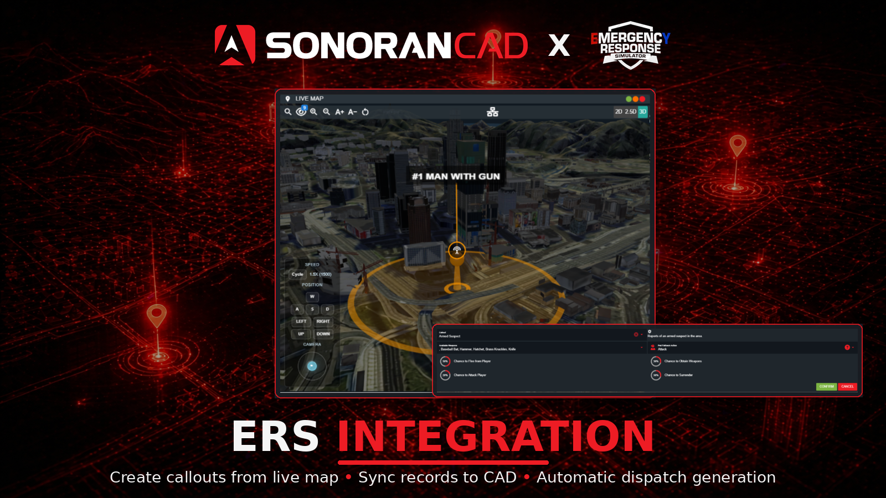
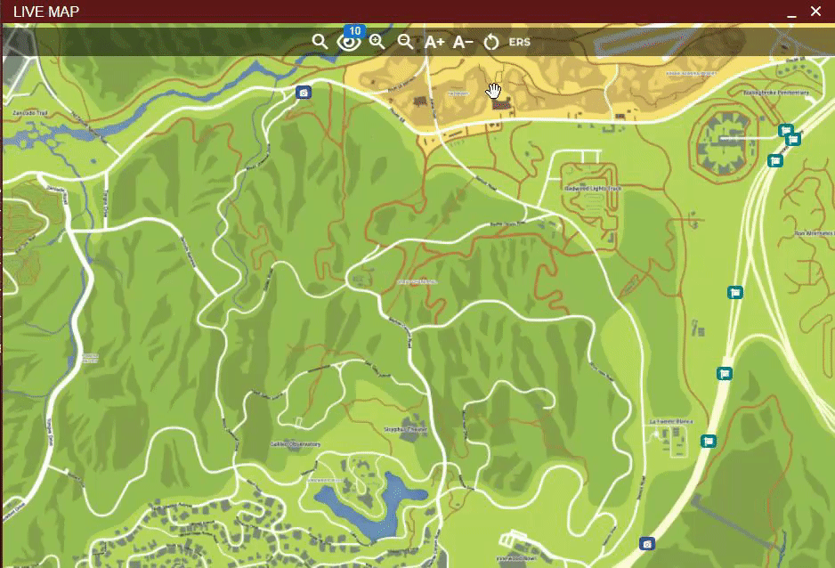

# Emergency Response Simulator (ERS)

<figure><figcaption><p>Sonoran CAD x ERS</p></figcaption></figure>

## What is Emergency Response Simulator?

Emergency Response Simulator is a paid, third-party script for FiveM.

This advanced (co-op) PVE roleplay game mode simulates emergency service calls, where you as emergency service worker have to respond to. Whether you are a medic, firefighter, tow service operator or police officer, there is always something to do. With finetuned callouts you’ll never get bored of driving around in your service vehicle. Rush to high-priority, dangerous calls, or handle routine tasks like warning a speeder. Each callout is unique, with random outcomes that keep you curious and engaged every time you respond to an emergency.

[ERS can be purchased from Nights Software.](https://store.nights-software.com/category/ersgamemode)

## Activation Guide

### 1. Download and Install the Resource


This submodule is included with the [Sonoran CAD FiveM resource](../fivem-installation/). Enable it using the configuration step below.


Night ERS `1.8.16` or newer is required. Start `night_ers` before `sonorancad` where possible. If ERS starts later or is restarted, the integration reconnects automatically.

### 2. Adjust the Configuration

Open `sonorancad/configuration/ersintegration_config.lua` and set `enabled = true`, then restart `sonorancad` after saving your changes.

The main options are whether to create 911 calls (`create911Call`), create dispatch calls when players accept ERS callouts (`createEmergencyCall`), and automatically attach additional accepting units (`autoAddCall`).

### 3. Ensure Players are Linked

Players must [link their CAD account](../link-user-in-game.md) and have an active CAD unit before accepting callouts. To receive ERS callouts assigned from CAD, they must also be on an ERS shift with a service selected.

### 4. Update CAD Record Templates

The ERS submodule comes with three record templates (character, license and vehicle registration).

Importing and using these record templates will ensure ERS callout character, license, and vehicle registration records are automatically generated.

These records can be located in the `/sonorancad/submodules/ersintegration/SonoranCAD Records` directory.

<figure><figcaption><p>ERS Integration - SonoranCAD Custom Records</p></figcaption></figure>


The `Civilian` and `Vehicle Registration` are default records. If you've modified them, it's recommended to replace them with the provided versions to ensure proper data import.


To import in Sonoran CAD, navigate to `Admin -> Customization -> Custom Records -> Import`.\
Open each JSON file and copy/paste the contents into the CAD.

<figure><figcaption><p>Sonoran CAD - Import Record</p></figcaption></figure>

### 5. Check the Connection

Run `sonorancad ers` in the **server console**. It shows whether ERS is running, whether its callout list has reached CAD, and the reason for the most recent failure. Check that the integration is running and the callout catalog says `synced to CAD` before testing callouts from the live map.

If a check fails, use the [troubleshooting steps below](#troubleshooting). The integration retries loading and sending the callout list automatically.

## Configuration

ERS Integration is highly configurable to allow for custom records and calls. All default configuration will work with the provided CAD records seamlessly. It is only recommended to edit if you are experienced with [custom records](../../../tutorials/customization/creating-custom-record-and-report-types.md).

### Default Configuration

<details>

<summary>ersintegration_config.lua</summary>

```lua
--[[
    Sonoran Plugins

    Plugin Configuration

    Put all needed configuration in this file.
]]
local config = {
    enabled = false,
    pluginName = "ersintegration", -- name your plugin here
    pluginAuthor = "SonoranCAD", -- author
    configVersion = "1.4",
    -- put your configuration options below
    DOBFormat = "en", -- Make sure this matches | en: dd/mm/yyyy | us: mm/dd/yyyy | iso: yyyy/mm/dd
    clearRecordsAfter = 30, -- Clear records after this many minutes (0 = never)
    create911Call = true, -- Create a 911 call when an ERS callout is created
    createEmergencyCall = true, -- Create an emergency call when an ERS callout is accepted
    callPriority = 2, -- Priority of the call created in CAD (1-3) | Only used if createEmergencyCall is true
    callCodes = {
        ['Stolen_motorbike'] = '10-22'
    }, -- Call codes for each ERS callout type | Only used if createEmergencyCall is true
    autoAddCall = true, -- Automatically add members to the call when an ERS callout is accepted
    customRecords = {
        civilianRecordID = 7, -- Record ID for civilian records
        civilianValues = {
            -- Configurable mapping for SonoranCAD replaceValues.
            -- The key is what SonoranCAD expects and the value is either:
            --    • A string that matches a key in pedData, or
            --    • A function that returns a value based on pedData.
            --    • Left side of mapping is the SonoranCAD field mapping ID from Custom Records, right side is the ERS field.
            ["first"] = "FirstName",
            ["last"] = "LastName",
            ["dob"] = "DOB",
            ["age"] = function(pedData)
                return returnAgeFromDobString(pedData.DOB)
            end,
            ["sex"] = "Gender",
            ["residence"] = "Address",
            ["zip"] = "PostalCode",
            ["phone"] = "Phone",
            ["skin"] = "Nationality",
            ["img"] = "ProfilePicture"
            -- Add more keys as needed:
            -- email = "Email"  -- Example: if pedData.Email exists.
        },
        vehicleRegistrationRecordID = 5, -- Record ID for vehicle registration records
        vehicleRegistrationValues = {
            -- Configurable mapping for SonoranCAD replaceValues.
            -- The key is what SonoranCAD expects and the value is either:
            --    • A string that matches a key in pedData, or
            --    • A function that returns a value based on pedData.
            --    • Left side of mapping is the SonoranCAD field mapping ID from Custom Records, right side is the ERS field.
            -- Registration Information
            ["status"] = function(vehicleData)
                if vehicleData.stolen then
                    return "STOLEN"
                elseif not vehicleData.mot then
                    return "EXPIRED"
                else
                    return "VALID"
                end
            end,
            ["_wsakvwigt"] = function(vehicleData)
                if vehicleData.stolen then
                    return "STOLEN"
                elseif not vehicleData.mot then
                    return "EXPIRED"
                else
                    return "VALID"
                end
            end,
            ["_imtoih149"] = function(vehicleData)
                return os.date("%m/%d/%Y", os.time() + (60 * 60 * 24 * 365)) -- +1 year from now
            end,
            -- Civilian Information
            ["first"] = function(vehicleData)
                return vehicleData.owner_name:match("^(%S+)")
            end,
            ["last"] = function(vehicleData)
                return vehicleData.owner_name:match("%s(.+)$")
            end,
            -- Vehicle Information
            ["plate"] = "license_plate",
            ["model"] = "model",
            ["color"] = function(vehicleData)
                if vehicleData.color_secondary and vehicleData.color_secondary ~= "" then
                    return vehicleData.color .. ", " .. vehicleData.color_secondary
                else
                    return vehicleData.color
                end
            end,
            ["year"] = "build_year",
            ["type"] = function(vehicleData)
                local classMap = {
                    [0] = "SEDAN", [1] = "SEDAN", [2] = "SUV", [3] = "SUV",
                    [4] = "COUPE", [5] = "COUPE", [6] = "OFFROAD", [7] = "TRUCK",
                    [8] = "MOTORCYCLE", [9] = "MARINE", [16] = "AIRCRAFT"
                }
                return classMap[vehicleData.vehicle_class] or "SEDAN"
            end,
        -- Add more keys as needed:
        -- owner = "Owner"  -- Example: if pedData.Owner exists.
        },
        licenseRecordId = 4, -- Record ID for license records
        licenseTypeField = "7eddab31daf4a0182", -- Field ID for license type
        licenseTypeConfigs = {
            DRIVER = {
                type = "DRIVER",
                is_valid = "License_Car_Is_Valid",
                license = "License_Car",
            },
            MOTORCYCLE = {
                type = "MOTORCYCLE",
                is_valid = "License_Bike_Is_Valid",
                license = "License_Bike",
            },
            BOAT = {
                type = "BOAT",
                is_valid = "License_Boat_Is_Valid",
                license = "License_Boat",
            },
            PILOT = {
                type = "PILOT",
                is_valid = "License_Pilot_Is_Valid",
                license = "License_Pilot",
            },
            CDL = {
                type = "CDL",
                is_valid = "License_Truck_Is_Valid",
                license = "License_Truck",
            },
        },
        licenseRecordValues = {
            -- License Information
            ["252c4250da9421cbd"] = function(pedData, ctx)
                return pedData[ctx.is_valid] and "VALID" or "SUSPENDED"
            end,
            ["878766af4964853a7"] = function(pedData, ctx)
                return pedData[ctx.is_valid] and "VALID" or "EXPIRED"
            end,
            ["_54iz1scv7"] = function(pedData, ctx)
                if pedData[ctx.license] == "Expired" then
                    return os.date("%m/%d/%Y", os.time() - (60 * 60 * 24 * math.random(1, 365))) -- Within the last year
                end

                return os.date("%m/%d/%Y", os.time() + (60 * 60 * 24 * math.random(1, 365))) -- Within a year
            end,
            -- Civilian Information
            ["first"] = "FirstName",
            ["last"] = "LastName",
            ["mi"] = "", -- No M.I. mapped
            ["dob"] = "DOB",
            ["age"] = function(pedData)
                return returnAgeFromDobString(pedData.DOB)
            end,
            ["sex"] = "Gender",
            ["residence"] = "Address",
            ["zip"] = "PostalCode",
        },
        boloRecordID = 3, -- Record ID for BOLO records
        boloRecordValues = {
            ['_olgxdruc3'] = 'bolo_description'
        },
        warrantRecordID = 2, -- Record ID for warrant records
        warrantDescription = '_avb6wvgyi', -- Field ID for warrant description
        warrantFlags = '_hlshajq0f' -- Field ID for warrant flags
    }

}

if config.enabled then Config.RegisterPluginConfig(config.pluginName, config) end

function returnAgeFromDobString(dobString)
    local day, month, year

    if config.DOBFormat == "en" then -- dd/mm/yyyy
        day = tonumber(dobString:sub(1,2))
        month = tonumber(dobString:sub(4,5))
        year = tonumber(dobString:sub(7,10))

    elseif config.DOBFormat == "us" then -- mm/dd/yyyy
        month = tonumber(dobString:sub(1,2))
        day = tonumber(dobString:sub(4,5))
        year = tonumber(dobString:sub(7,10))

    elseif config.DOBFormat == "iso" then -- yyyy/mm/dd
        year = tonumber(dobString:sub(1,4))
        month = tonumber(dobString:sub(6,7))
        day = tonumber(dobString:sub(9,10))
    else
        errorLog("Unsupported DOB format: " .. tostring(config.DOBFormat))
    end

    local today = os.date("*t")
    local age = today.year - year

    if today.month < month or (today.month == month and today.day < day) then
        age = age - 1
    end

    return tostring(age)
end

```

</details>

### Configuration Values

<details>

<summary>Default Configuration Values</summary>

<table><thead><tr><th>Value</th><th width="113">Type</th><th>Description</th></tr></thead><tbody><tr><td><code>DOBFormat</code></td><td><code>string</code></td><td>Language code for the DOB format. Available options can be found in the configuration file</td></tr><tr><td><code>clearRecordsAfter</code></td><td><code>integer</code></td><td>Number of minutes to clear records after | 0 to never delete</td></tr><tr><td><code>create911Call</code></td><td><code>bool</code></td><td>Create a 911 call when an ERS callout is created</td></tr><tr><td><code>createEmergencyCall</code></td><td><code>bool</code></td><td>Create an emergency call when an ERS callout is accepted</td></tr><tr><td><code>callPriority</code></td><td><code>integer</code></td><td>Priority of the call created in CAD (1-3)</td></tr><tr><td><code>callCodes</code></td><td><code>array</code></td><td>Call codes for each ERS callout type. | Left side is the callout ID and right side is the corresponding 10 code</td></tr><tr><td><code>autoAddCall</code></td><td><code>bool</code></td><td>Automatically add members to the call when an ERS callout is accepted</td></tr><tr><td><code>customRecords</code></td><td><code>array</code></td><td>Array of record customization for CAD records. Please see comments in file for more information on record customization</td></tr></tbody></table>

</details>

## Features

### Live Map Callout Generation

Dispatchers can use the live map to create a new ERS callout at a specific location.

Drag-and-drop the `ERS` icon from the toolbar to a location on the map. Clicking the new ERS map icon will allow you customize the callout and settings.

<figure><figcaption><p>Sonoran CAD: ERS Callout Creation</p></figcaption></figure>

### Record Lookups

Use ERS to request a person's information or a vehicle's information. When ERS returns that information, the integration creates the corresponding CAD records for lookups. Accepting a callout alone does not create every person and vehicle record for that call.

### Automatic Call Generation and Assignment

#### ERS to CAD

1. With `create911Call` enabled, an ERS callout offer creates a mapped 911 call in CAD.
2. A linked player with an active CAD unit accepts the callout **inside ERS**.
3. With `createEmergencyCall` enabled, Sonoran CAD creates the dispatch call and attaches that player's unit. With `autoAddCall` enabled, additional players who accept the same callout are attached to that call too.


Using `/dn respond` on a Sonoran dispatch notification does not accept the callout inside ERS. Use ERS's own callout controls to accept it.


#### CAD to ERS

1. A dispatcher attaches another online unit to that ERS-generated dispatch call in Sonoran CAD.
2. The integration sends the matching callout to that player's ERS session.
3. The player can see and continue the callout in-game.

This only applies to dispatch calls generated by the ERS integration. The player must be online, linked to Sonoran CAD, and on an ERS shift with a service selected.

### Call Locations and Postals

ERS calls use your [Sonoran CAD postals](postals.md) when available, including custom postal files. If that lookup is unavailable, the integration tries your postal resource when using resource mode, then a postal supplied by ERS. A call can still be created with `Unknown postal` if none are available.

If postals differ between CAD and the game, check that the CAD postal settings use the map data your community expects.

## Troubleshooting

Start with `sonorancad ers` in the **server console**. It shows enabled features, connection status, callout-list status, and the last failure so you can check the part that is failing.

| Problem | What to check |
| --- | --- |
| The integration is disabled or ERS is not started | Set `enabled = true` in `ersintegration_config.lua`, restart `sonorancad` after changing it, and confirm `night_ers` is started. |
| The ERS version is too old | Update Night ERS to `1.8.16` or newer and restart it. Older versions are blocked. An unverified version is a warning; confirm your installed ERS version before continuing. |
| Callouts are missing from the CAD live map | Confirm ERS has callouts enabled and loaded. If the callout list could not be sent to CAD, check the CAD connection and configured server ID. The integration retries automatically. |
| A 911 call appears, but no dispatch call appears | Enable `createEmergencyCall`, link the accepting player to CAD, and have them clock in with a CAD unit before accepting the callout inside ERS. |
| A unit assigned in CAD does not receive the ERS callout | Confirm the player is in game, linked to CAD, and on an ERS shift with a service selected. The CAD call must have been generated by this integration. |
| Calls work, but person or vehicle lookups do not | Request the information through ERS first. Check the imported CAD record templates and any record configuration issues reported by `sonorancad ers`. Database Sync communities also need the option below. |
| A record is rejected because a value already exists | Check the relevant CAD template's unique fields, such as a plate number. Correct the duplicate value or template setup; a failed record does not necessarily mean call creation is broken. |

If the issue continues, give [Sonoran support](https://support.sonoransoftware.com) the action that failed and the error code shown. When support supplies an ID, run `sonorancad support <id>` in the server console. The report includes ERS connection and failure details. Support may also request `sonorancad getclientlog <playerId>` for a player who did not receive a callout.

## Limitations

### Database Sync

When a community uses database sync, all record lookups run against that community’s external database. The ERS integration automatically creates characters and vehicles in the CAD database through the API, so these records must be included alongside the external database results.

To enable this, turn on [**Include CAD API records in DB Sync lookups**](../../database-sync-and-merge/#2.-combine-api-and-db-sync-records).
