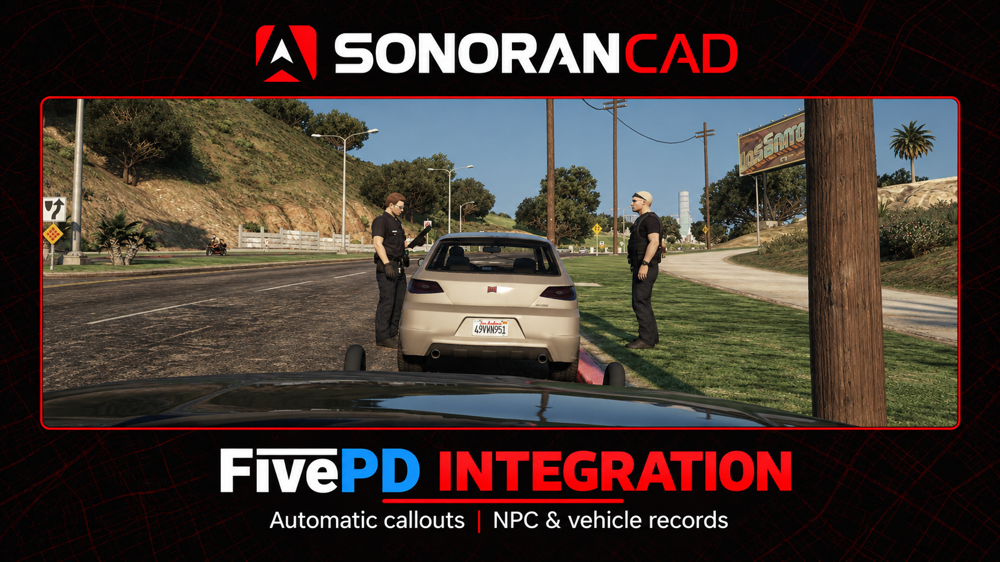

# FivePD (Legacy, Unsupported)

<figure><figcaption><p>FivePD integration - illustrative promotional artwork</p></figcaption></figure>


**FivePD 1.5.x has gone years without updates or support from its developers.** We have integrated as much as we can using its available API and source material, without support from the FivePD developers. Further functionality and compatibility fixes are limited by what FivePD exposes.

This CAD integration is **unofficial, unsupported, and not maintained**, and is provided as-is for existing FivePD servers. Sonoran Software support does not troubleshoot it, and future compatibility updates are not planned. It has not been verified in a live FivePD session.


FivePD is listed with the FiveM submodules for discovery, but is installed as a **separate resource and a FivePD plugin DLL**. It is not bundled with Sonoran CAD and does not go in `sonorancad/submodules/`.

## Features

| In FivePD | In Sonoran CAD |
| --- | --- |
| Accept a callout | Creates a shared dispatch call and attaches the responding officer. Other officers accepting the same callout join that CAD call. |
| NPCs and vehicles become available during an accepted callout | Automatically imports discoverable callout entities, including later spawns. |
| Make a traffic stop | Imports the stopped vehicle, driver, and passengers. |
| Arrest an NPC | Imports the NPC's records. |
| Complete a callout or request a service | Adds completion or service-request notes to the imported CAD call. |

NPC imports include civilian information, available driver/hunting/weapon licenses, and warrant text. Vehicle imports include plate, owner, model, color, and registration status. NPC portraits are not imported.

Successful imports are deduplicated across officers on the same server. Four officers encountering the same NPC or vehicle do not create four copies. Records and calls are automatically deleted by CAD after **60 minutes** by default; an entity encountered again after expiry can be imported again.

## Requirements

- An existing FivePD **1.5.x** installation using FivePD API **1.3.0**.
- [SonoranCADFiveM](../fivem-installation/) **4.0.119 or newer**, configured for your community.
- CAD API access for dispatch calls and custom records.
- Officers [linked to CAD](../link-user-in-game.md), with an active CAD unit and on duty in FivePD.

## Installation

### 1. Download the Integration

Download **sonoran_fivepd.zip** from the [latest release](https://github.com/Sonoran-Software/sonoran_fivepd/releases/latest). Use the installation ZIP, not GitHub's source-code download. The DLL is already compiled.

### 2. Copy the Two Components

| From the ZIP | Destination |
| --- | --- |
| The entire `sonoran_fivepd` folder | Your server's `resources` directory. Keep the folder name `sonoran_fivepd`. |
| `put_in_fivepd_plugins/SonoranPlugin.net.dll` | The `plugins` folder inside your existing FivePD resource: `fivepd/plugins/SonoranPlugin.net.dll`. |


**Both components are required.** Starting the standalone resource without placing the DLL in FivePD will not import callouts or records. Keep FivePD's own API DLLs in place and do not install duplicate copies of this plugin DLL.


### 3. Review the Configuration

Open `sonoran_fivepd/config.lua`. Automatic callout imports and civilian, vehicle, license, and warrant records are enabled by default. The mappings match CAD's default record templates; customized communities should check [Record Mappings](#record-mappings).

The resource uses your existing Sonoran CAD configuration and its bundled v2 API client. No additional API key is needed.

### 4. Set the Start Order

In `server.cfg`:

```cfg
# Start CAD through its configuration, not a direct resource ensure.
exec sonorancad.cfg
ensure fivepd
ensure sonoran_fivepd
```

Restart the server and reconnect. Go on duty in CAD and FivePD, then accept a callout or make a traffic stop. Allow time for queued records to appear.

## Configuration

| Setting in `config.lua` | Default / behavior |
| --- | --- |
| `automaticCalloutRecords` | `true`: discover NPCs and vehicles in accepted callouts. Traffic-stop and arrest imports are separate triggers. |
| `deleteAfterMinutes` | `60`: CAD deletes imported calls and records after this interval. Accepts whole numbers from `1` to `1440`. |
| `records.<category>.enabled` | Enables or disables civilian, vehicle, license, or warrant imports. |
| `callouts`, `completionNotes`, `serviceNotes` | Enable dispatch calls and the corresponding notes. |
| `acePermission` | Empty by default. Set an ACE such as `sonoran_fivepd.use` and grant it to your officer group to restrict access further. |

### Record Mappings

Default record type IDs are civilian `7`, vehicle `5`, license `4`, and warrant `2`.

1. In CAD's **Admin** area, open **Custom Records** and select a template. The number beside its name is its `recordTypeId`.
2. Click the destination field, then open **Advanced -> Mapping -> Field Mapping ID** in the field settings panel. Scroll the panel if necessary.
3. Copy that ID into the corresponding key in `records.<category>.fields` in `config.lua`. Keep the right-hand FivePD field name or mapping function. Change `recordTypeId` if your template uses a different number.
4. Restart `sonoran_fivepd`. Existing imported records are snapshots; mapping changes apply to subsequent creations, not records already present.

For example, the default license **Type** mapping is:

```lua
['7eddab3-1daf-4a01-82'] = 'LicenseType',
```

<figure><figcaption><p>Copy the field's mapping ID into the plugin configuration. Example uses default templates, not player data.</p></figcaption></figure>

Copy IDs exactly, including underscores. Do not rename CAD's field IDs just to match the plugin. The supplied license `fieldAliases` handles default IDs with and without hyphens; remove those aliases if replacing them with custom IDs. Dropdown values must also match your template's options.

Fishing licenses are not in CAD's default license Type dropdown. Add `FISHING` to that dropdown and `Fishing = 'FISHING'` to `records.license.types` to import them. Dates are copied from FivePD; use a mapping function if your CAD template requires a different format.

For communities using database sync, enable **Include CAD API records in DB Sync lookups**, described under **Combine API and DB Sync Records** in the [database sync guide](../../database-sync-and-merge/README.md), so imported FivePD records can appear alongside external database results.

## Limitations and Troubleshooting

- **Automatic discovery depends on the callout.** Entities must exist and be networked on the officer's client. Custom callouts that hide entities inside helper objects, static fields, or computed properties may need the fallback commands: `/fivepdcadped` for the nearest NPC within 5 metres, or `/fivepdcadvehicle` for the nearest vehicle within 15 metres.
- **No world-wide scanning.** Only accepted callouts and the encounter triggers above are imported. Merely generating or offering a callout does not create a CAD call. This integration does not create FivePD callouts from CAD or sync CAD edits back into FivePD.
- **Completion adds a note; it does not close the CAD call.** Dispatch manages the call's status. Service notes do not dispatch CAD units.
- **Deduplication lasts until expiry**, including across server/resource restarts. It matches NPC identity fields and normalized vehicle plates, with separate tracking for each applicable record category. It does not continuously update existing records.
- **Busy servers may see a delay.** Writes are paced; stale queued work or work from disconnected officers is discarded. CAD API limits still apply.
- **Nothing appears?** Check both installation destinations, resource startup, account linking, and duty status. Look for `[sonoran_fivepd]` in the server and client F8 consoles. For missing fields, check mapping IDs and dropdown options.

## Downloads and Source

- [Installation ZIP](https://github.com/Sonoran-Software/sonoran_fivepd/releases/latest)
- [Repository and configuration reference](https://github.com/Sonoran-Software/sonoran_fivepd)
- [PolyForm Noncommercial license](https://github.com/Sonoran-Software/sonoran_fivepd/blob/main/LICENSE)
