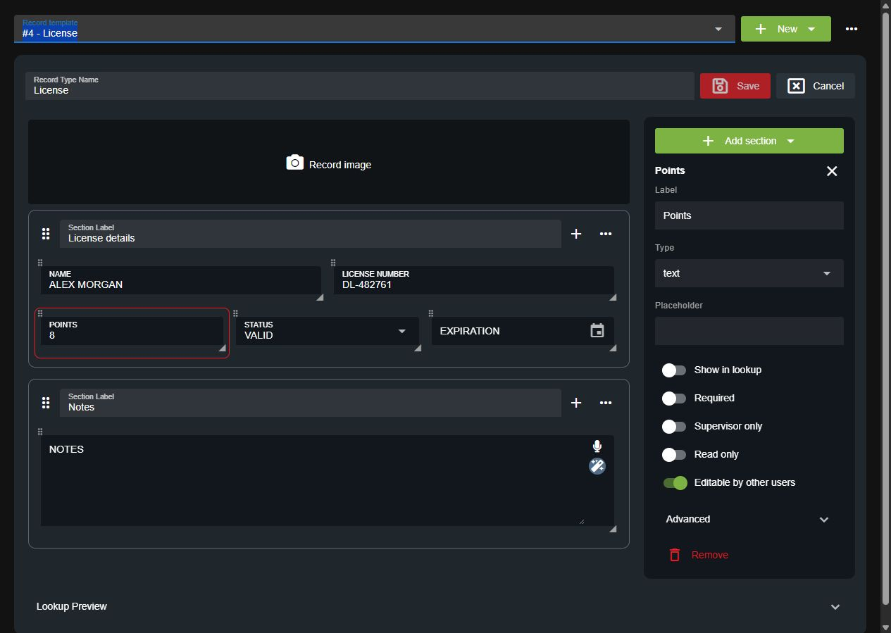
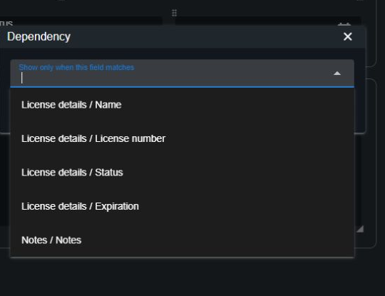

# Creating Custom Record and Report Types

Build forms for your community's licenses, records, and reports in **Administration > Customization > Custom Records**. Available record types and limits depend on your [subscription](../../pricing/faq/).

## Open or Create a Template

Use **Record template** to search for an existing template, or select **New** and choose a record type. Enter its **Record Type Name**.

<figure><figcaption>
Select a field in the preview to edit its settings.
</figcaption></figure>

## Arrange the Form

* **Add a section:** Select **Add section**, then choose a custom or premade section.
* **Add a field:** Use the **+** button beside a custom section's label.
* **Edit a field:** Click it in the preview. Change its label, type, and options in the panel on the right.
* **Move fields or sections:** Drag their grip handles to reorder them.
* **Resize a field:** Drag its lower corner to change its width.
* **Add a record image:** Click the image area to select an image.

Open a section's **...** menu for its settings:

| Setting | What it does |
| --- | --- |
| Search Civilians | Lets the person filling out the record find a character and import their details into the section. |
| Search Vehicles | Lets them find a vehicle and import its details. |
| Enable Duplicate | Lets them add another copy of the section while filling out a record. |
| Duplicate section | Adds another copy to the template now. |
| Copy | Copies the section; use the **Paste** button in the side panel to insert it. |
| Dependency | Shows the section only when a selected field matches a condition. |

Search imports require matching field IDs. See [Linking Vehicle and Character Searches](#linking-vehicle-and-character-searches).

## Field Settings

| Setting | What it does |
| --- | --- |
| Show in lookup | Shows this field's label and value in record search results. Enable it on at least one field. |
| Required | Requires a value before the record can be submitted. |
| Supervisor only | Requires **Supervisor fields** permission for this record template in addition to an editing permission. Unit identifier status does not grant it. |
| Read only | Prevents users from changing the field manually. |
| Allow limited editing (previously Editable by other users) | Opts this field into **Edit selected fields on others' records**. Edit own and Edit any do not require field opt-in. |
| Unique value | Prevents duplicate values within this template, where supported. Found under **Advanced**. |

### Editing Other Users' Records


This editing model requires a backend whose permission catalog includes `edit.selected` and the updated permission editor. See [record editing permissions](../getting-started/permissions.md#record-editing-permissions) for rollout and existing-community guidance.


To let officers update only license points or status:

1. Select the license template and click **Points** in the preview.
2. Enable **Allow limited editing**. Repeat for **Status** if needed.
3. Turn it off on fields they should not change, such as the license holder's name.
4. Save the template.
5. In [account permissions](../getting-started/permissions.md), grant the officer **Police page** access and **View** and **Edit selected fields on others' records** for the license template. Ensure no permission key or role mapping also grants **Edit any**, which allows full editing. Add **Edit own** separately if needed.

The officer can then open another account's license from a lookup and save changes to the allowed fields. These rules apply regardless of which panel opens the record. Read-only fields stay protected. Supervisor-only fields also require **Supervisor fields** permission.

To change a field automatically based on its value, use [Record Automations](record-automations.md).

### Field Types

| Type | Use |
| --- | --- |
| Text / Text area | Short values or longer notes. |
| Select / Checkboxes | A dropdown or a list of selectable options. Add each option in the field settings. |
| Date / Time | Dates and times. Read-only date and time fields fill automatically on new records. |
| Random | Generates a value using the field's formatting mask. |
| Image / Label | An image or static text. |
| Address | Suggestions from your [imported street names](addresses-and-street-names.md). |
| Status | The record's available status choices. |
| Unit information | Automatically fills details such as unit number, name, rank, agency, or department. |

Premade sections provide additional controls, including flags and linked records. Flags appear as alerts in lookups.

### Linked Records

Add a linked records section to connect related records and reports.

### Formatting and Field Mapping IDs

Expand **Advanced** for formatting and the **Field Mapping ID**. A formatting mask controls the expected input:

* `#`: Number.
* `S`: Letter.
* `X`: Letter or number.

For example, `###` accepts three digits, and `(###) ###-####` formats a phone number.

Keep field mapping IDs stable after the template is in use. They connect saved values, search imports, dependencies, and integrations to the correct fields.

## Dependencies

Show a field or section only when another field meets a condition.

1. For a field, open **Advanced > Dependency**. For a section, open **... > Dependency**.
2. Select the controlling field by name. Type to filter the list.
3. Choose **Equal**, **Not Equal**, or **Contains**.
4. Select or enter the values that should make the field or section appear.

<figure><figcaption>
Select the controlling field without copying its mapping ID.
</figcaption></figure>

Clear the selected field to remove the dependency. Close the dependency editor and save the template to keep your changes.

## Save the Template

The editor shows **Unsaved changes** when the template has changed. Select **Save** to apply them; Save is disabled when there are no changes. **Cancel** closes the editor without saving the pending edits.

Members also need [permissions for the template](../getting-started/permissions.md) before they can view, create, edit, or delete its records. Records are available through [record lookups](../records-management/searching-for-records.md); reports are available in the **Reports** center.

## Updating Old Records with New Preview Fields

If you enable **Show in lookup** after records have already been created, open **Template actions (...) > Rebuild lookup previews** to refresh their search-result summaries.

Keep the same field mapping IDs so saved values can be matched. Rebuilding is available once every ten minutes. Database-synced records stay up to date without this step.

## Linking Vehicle and Character Searches

For **Search Civilians** or **Search Vehicles** to populate a custom section, its field mapping IDs must match the corresponding fields in your character or vehicle template.

### Civilian Field UIDs

Default character field IDs include:

`first`, `last`, `mi`, `dob`, `age`, `sex`, `aka`, `zip`, `occupation`, `height`, `weight`, `skin`, `hair`, `eyes`, `emergencyContact`, `emergencyRelationship`, `emergencyContactNumber`, and `residence`.

### Vehicle Field UIDs

Default vehicle field IDs include:

`type`, `plate`, `make`, `model`, `color`, and `year`.

Select each destination field and check **Advanced > Field Mapping ID**. If your community changed the source template's IDs, use those current IDs instead.

## Common Issues

**The template has no fields enabled for preview:** Enable **Show in lookup** on at least one useful field, such as name, plate, or license number.

**An officer cannot edit a field:** Check page access, **View**, and an editing permission for the template. For limited editing of another account's record, check **Edit selected fields on others' records** and **Allow limited editing** on the field. **Edit any** permits full editing without field opt-in; **Edit own** applies only to the account's records. Check **Read only** and **Supervisor only** as well.

**A template change is blocked by an automation:** Update or disable the [automation](record-automations.md) that uses the affected field, then save the template again.

To export or import a template, open **Template actions (...)**. See [Sharing Custom Records](sharing-custom-records.md).
