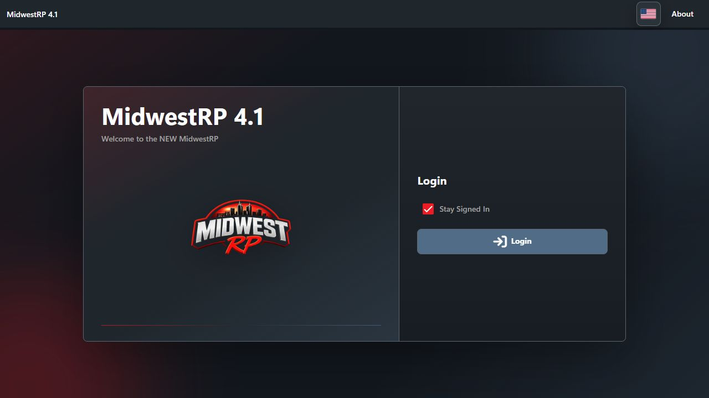
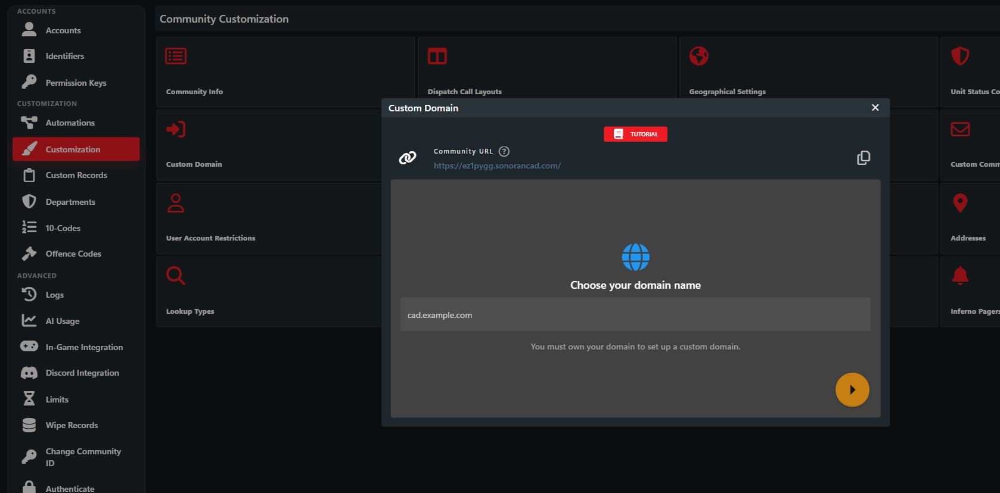

# Custom Domain & Vanity URLs

Share your CAD with a free vanity URL based on your community ID, or connect a domain you own. Either link opens your community's login page. When members log in through the link, Sonoran CAD automatically joins them to your community and takes them directly there.



## Free Vanity URL

Your free vanity URL uses your community ID: `https://your-community-id.sonorancad.com`. For example, the ID `mwrpdev` gives you `https://mwrpdev.sonorancad.com`.

In Sonoran CAD, open **Administration > Customization > Custom Domain** to copy your community URL. You can also find it beside your community ID in the API key section. Vanity URLs are free and require no DNS changes. Share the link wherever you [invite users](../getting-started/inviting-users-to-your-cad.md); people who sign in or register through it are joined to your community automatically.

<figure><figcaption>Copy your free community URL from Custom Domain.</figcaption></figure>

## Use Your Own Domain

A custom domain displays your CAD login page at a domain or subdomain you own. It also supports [custom branding](custom-emails.md) for signups and password recovery emails.

## DNS Record Method (Recommended)


**If you are unsure how to add a DNS record, you will need to contact your domain registrar.**


### 1. Enter your Desired Domain

In **Custom Domain**, enter a domain or subdomain you own, such as **example.com** or **cad.example.com**.

### 2. Add DNS Records


When updating or changing an existing DNS record the changes may not be visible until public cache expires. Depending on your DNS provider, this can be anywhere from a **few minutes to 24-48 hours**.\
\
You can try running `ipconfig /flushdns` in a Windows CMD window and restarting your browser. Otherwise, you can test with other browsers/devices/users while you wait.


In your domain registrar’s DNS management panel, add two CNAME records using the name and content provided in Sonoran CAD, and add one TXT record to verify domain ownership.

<figure><figcaption></figcaption></figure>

#### DNS Example


**Cloudflare Users:** Be sure to have the **DNS record proxy DISABLED** - and set to `DNS Only`.


The example below shows the `TXT` record verifying the community ID, and two CNAME records verifying domain ownership.

<figure><figcaption></figcaption></figure>

### 3. View your Custom Login Page

Users can now visit this custom domain to view the CAD with a custom login page, including receiving your [branded emails](custom-emails.md) for signups and password recovery messages.

## iFrame Method

If you are unable to use the [DNS method](custom-login-page.md#dns-record-method-recommended), you can also host an HTML page that renders the CAD in an iFrame.

### 1. Download the HTML File

[You can download a ZIP of the HTML page here.](https://sonoransoftware.com/tutorials/sonorancad/index.zip)

### 2. Edit the HTML File

Replace `YOUR_COMMUNITY_ID_HERE` in the `index.html` file with your [community ID](../getting-started/finding-your-community-id-and-authentication-code.md).

.png>)

### 3. Host the HTML File

Now that you've saved the custom URL inside of the HTML file, you can host this with your own domain on your own web server. Users can now register and access your CAD from your custom domain, and will even receive your [custom branded emails](custom-emails.md) for account actions.

## In-Game Tablet

If you wish to use a custom login page when using the [in-game Tablet resource](/broken/pages/-MCu5Pqlq4KeXD2LHoVt), you can set a convar in your server.cfg.\
\
The easiest way to show your [custom login page](custom-login-page.md) is to use a query string.

`"https://sonorancad.com/#/?comid=YOUR_COMMUNITY_ID_HERE"`

Simply replace `YOUR_COMMUNITY_ID_HERE` in the URL with your [community ID](../getting-started/finding-your-community-id-and-authentication-code.md).\
EX: `https://sonorancad.com?comid=midwestrp`

Add the following to your server.cfg **before** starting the tablet resource:

```
setr sonorantablet_cadUrl "YOUR_URL_HERE"
```

Fill in with your actual URL above with the comid you want.
