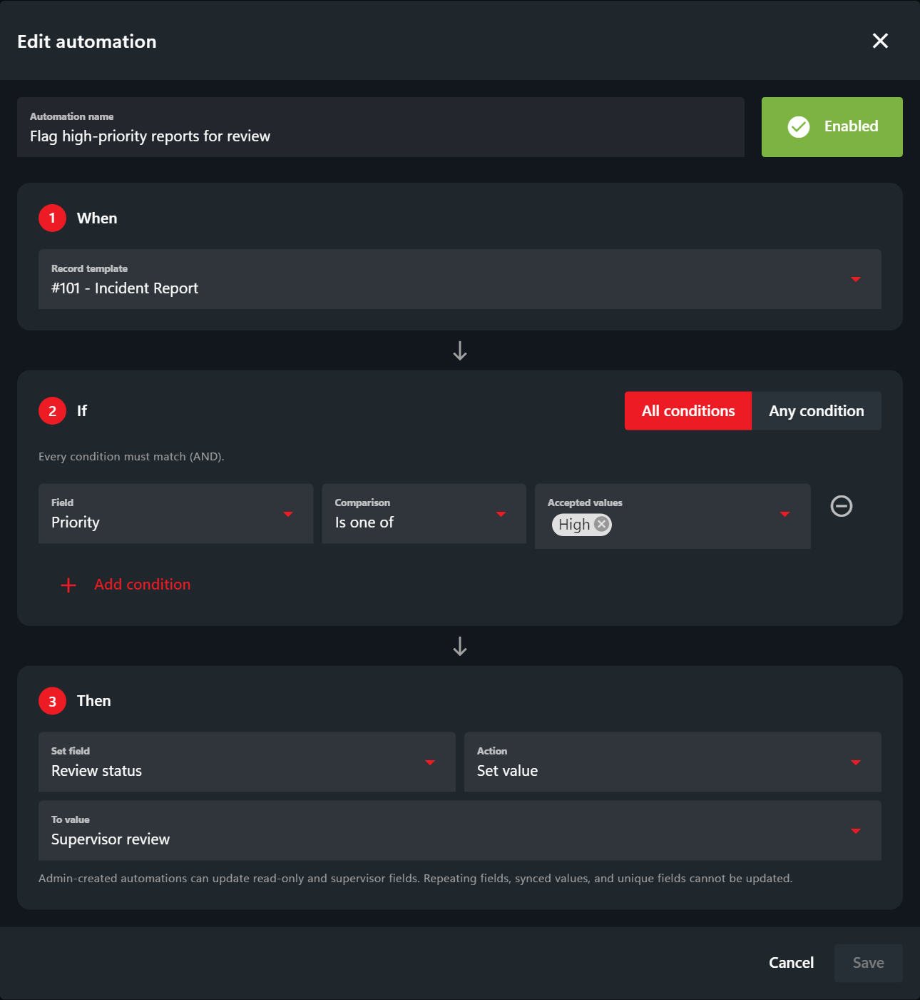
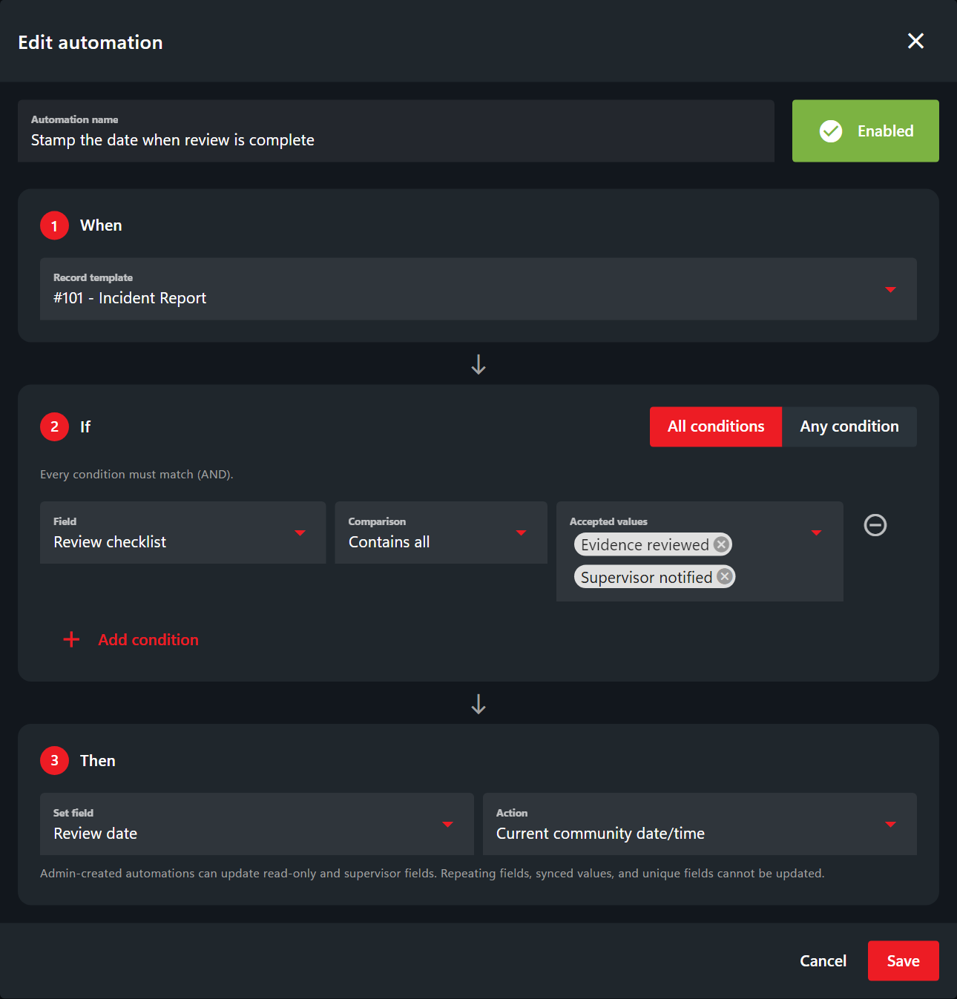

# Record Automations

Record automations apply a field change when a saved record meets your conditions. For example, mark a high-priority incident report for review, change a license's custom status when its points exceed a limit, or stamp a review date when a checklist is complete.

Open **Administration > Customization > Automations**. Your account needs the **Customize community** permission. These rules are separate from [dispatch automations](../dispatching/automations.md), which control unit statuses and timers.

## Create an automation

1. Select **Add automation**, enter a descriptive name, and leave **Enabled** on.
2. Under **When**, select the record template. You can type to filter the template and field dropdowns.
3. Under **If**, choose a field, comparison, and accepted value. Use **Add condition** for additional checks. **All conditions** requires every check to match; **Any condition** requires at least one. A rule supports 1–20 conditions in one group.
4. Under **Then**, choose the field to update, the action, and any required value.
5. Select **Save**. Create or edit a test record, save it, then reopen it to confirm the result.

In this example, saving an Incident Report with **Priority = High** changes **Review status** to **Supervisor review**. Both choices already exist in the template. A custom license status such as `SUSPENDED` likewise needs to be an option in a custom select field; built-in status fields keep their predefined statuses.

### Example: Suspend a License at Eight Points

Use a license template with a **Points** field and a **Status** dropdown containing **Valid**, **Suspended**, and **Expired**.

* **When:** License.
* **If:** Points is **At least** `8`.
* **Then:** Set Status to **Suspended**.

## Let Officers Update License Points

Allow officers to edit the points on another person's license so their changes can trigger the automation. These steps require the [selected-field editing model](../getting-started/permissions.md#record-editing-permissions), included in CAD 3.44.1:

1. Open **Administration > Customization > Custom Records** and select the license template.
2. Click **Points** in the preview and enable **Allow limited editing** in the field settings. Leave **Read only** off.
3. Keep **Allow limited editing** off for fields officers should not change, such as the license holder's name. Select **Save**.
4. In [account permissions](../getting-started/permissions.md), give officers **Police page** access and **View** and **Edit selected fields on others' records** for that license template. Remove **Edit any** from all permission sources for roles that should only edit selected fields. If Points is marked **Supervisor only**, they also need **Supervisor fields** permission.

Officers can now look up a civilian's license, update **Points**, and save. With the example automation enabled, saving eight or more points sets **Status** to **Suspended**. The Status field only needs **Allow limited editing** enabled if officers should also change it manually.

For more field settings, see [Editing Other Users' Records](creating-custom-record-and-report-types.md#editing-other-users-records).

## Available Fields

| Field | Conditions | Actions |
| --- | --- | --- |
| Text, text area, and number | Text equality/inequality, numeric comparisons, empty/not empty | Set a value; clear an optional field |
| Select and built-in status | Is one of / is not one of the selected values; empty/not empty | Set an existing option; clear an optional select field |
| Checkboxes | Contains any, all, or none of the selected choices; empty/not empty | Replace, add, or remove selections; clear an optional field |
| Date and time | Equals, does not equal, before/after, on or before/after, empty/not empty | Set a date/time, use **Current community date/time**, or clear an optional field |
| Image | Empty/not empty | Set an HTTP(S) image URL; clear an optional field |

Text and select comparisons ignore letter case. Numeric comparisons require a plain number without commas or exponent notation. A blank, missing, or malformed value does not pass a numeric comparison. Use explicit **Is empty** checks for empty values; a missing field is not considered an empty field. **Contains none (not empty)** requires at least one existing checkbox selection.

This example stamps **Review date** when the record is saved with both **Evidence reviewed** and **Supervisor notified** checked. Current date/time uses the [community timezone](community-branding-and-info.md), or UTC when unset. If those conditions still match on a later save, the date is stamped again. Time passing by itself does not run an automation.

## Field restrictions

Conditions and actions use supported fields in non-repeating custom sections. Generated identifiers, random fields, address fields, unit-information fields, labels, and fields without a unique field UID are unavailable.

Administrator-created actions can update **Read only** and **Supervisor only** fields. Those settings still restrict manual editing. Actual database-synced values and unique fields cannot be action targets; editable local overlay fields on merged records can be updated when the merged record is saved. A native field's old database-mapping flag alone does not exclude it.

Required fields cannot be cleared. Removing the final selection from a required checkbox field prevents the save from applying the automation changes.

## How Rules Behave

- Rules run when native records or civilians are created or edited, including API saves, and when editable database-merge overlays are saved.
- Each rule changes one field on the record being saved. Conditions use the submitted values; one automation's action does not trigger another automation.
- A matching rule applies its action on every save. If its conditions do not match, it leaves the field unchanged. There is no automatic restoration to an earlier value.
- Saving, disabling, or deleting a rule does not update existing records retroactively or undo previous changes.
- External database changes, direct SQL updates, template maintenance, and elapsed time are not triggers. Rules do not schedule jobs, total values across records, or perform external actions.

## Change or Disable a Rule

Use a rule's **Enabled/Disabled** button to pause it, the pencil to edit it, or the trash button to delete it. A community supports up to 100 rules. Only one enabled rule may update a particular field on a particular template; edit or disable the conflicting rule first.

If you need to remove a template or change a field/option used by an enabled rule, update or disable that rule first. Labels can change because rules identify fields by UID. If another administrator has changed a rule while your editor is open, close the editor and refresh before trying again.

If a field is unavailable, check its type, section, UID, and target restrictions above. If the panel reports that database setup is required, contact Sonoran support; this is CAD service setup, not a change to your game-server database.
