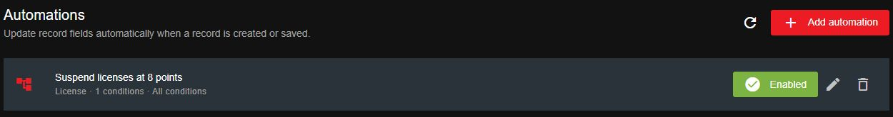
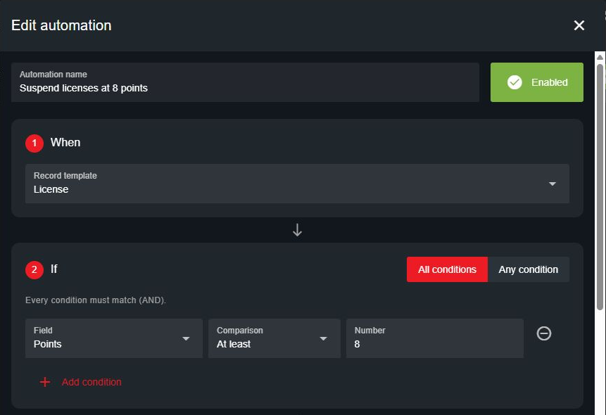
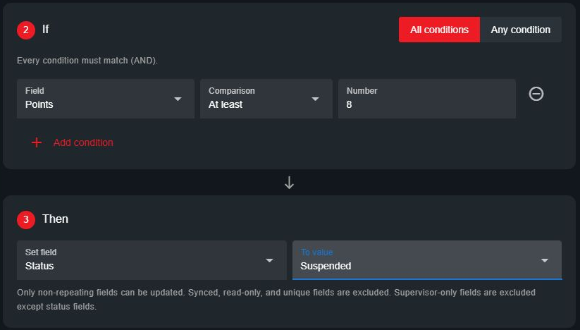

# Record Automations

Automations set a field when a record is created or saved. For example, set a license to **Suspended** when its points reach eight.

Open **Administration > Customization > Automations**. You need the administrative **Customization** permission to manage rules.

<figure><figcaption>
Enable, edit, or delete a rule from the Automations panel.
</figcaption></figure>

## Create an Automation

1. Select **Add automation** and enter a name.
2. Under **When**, select the record template.
3. Under **If**, choose a field, comparison, and value. Use **Add condition** for additional checks.
4. Choose **All conditions** if every check must match, or **Any condition** if one match is enough.
5. Under **Then**, choose the field to update and its new value.
6. Leave the rule **Enabled** and select **Save**.

### Example: Suspend a License at Eight Points

Use a license template with a **Points** field and a **Status** dropdown containing **Valid**, **Suspended**, and **Expired**.

* **When:** License.
* **If:** Points is **At least** `8`.
* **Then:** Set Status to **Suspended**.

<figure><figcaption>
Choose the template and the condition that triggers the change.
</figcaption></figure>

<figure><figcaption>
Choose the field and value to apply when the condition matches.
</figcaption></figure>

## Let Officers Update License Points

Allow officers to edit the points on another person's license so their changes can trigger the automation:

1. Open **Administration > Customization > Custom Records** and select the license template.
2. Click **Points** in the preview and enable **Editable by other users** in the field settings. Leave **Read only** off.
3. Keep **Editable by other users** off for fields officers should not change, such as the license holder's name. Select **Save**.
4. In [account permissions](../getting-started/permissions.md), give officers **Police page** access and **View** and **Edit any** for that license template. If Points is marked **Supervisor only**, they also need **Supervisor fields** permission.

<figure><figcaption>
Enable Editable by other users on the Points field, then grant officers Edit any for the license template.
</figcaption></figure>

Officers can now look up a civilian's license, update **Points**, and save. With the example automation enabled, saving eight or more points sets **Status** to **Suspended**. The Status field only needs **Editable by other users** enabled if officers should also change it manually.

For more field settings, see [Editing Other Users' Records](creating-custom-record-and-report-types.md#editing-other-users-records).

## How Rules Behave

* Rules run on new records and record updates, including API saves. Existing records are checked when next saved.
* A matching rule overwrites its target field. If it does not match, the field stays unchanged. Lowering points below eight does not automatically restore a suspended license.
* Rules check the submitted values together; one rule's changes do not trigger another rule during that save.
* Blank fields do not match a condition, including **Does not equal**.
* Only one enabled rule can update a particular field on a template.

## Available Fields

Conditions support text, text area, number, select, and status fields in custom sections that cannot be duplicated. Text comparisons ignore capitalization. Numeric comparisons require a number; dropdown comparisons use the selected options.

The **Set field** menu excludes synced, read-only, unique, and database-mapped fields. Supervisor-only fields are also excluded, except status fields.

## Change or Disable a Rule

Select the pencil icon to edit a rule. Select **Enabled** to disable it without deleting it, or use the trash icon to remove it. Neither action reverses changes already made to records.

Before removing or changing a field used by an enabled rule, update or disable that rule. If CAD reports an invalid automation while saving a record, review the rule's selected fields and values.

For unit status changes on call attachment, see [Dispatch Automations](../dispatching/automations.md).
