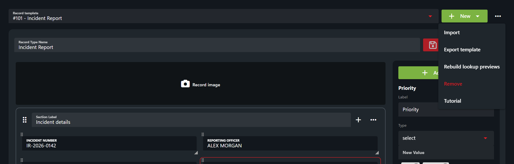

# Sharing Custom Records

## Export a Template

1. Open **Administration > Customization > Custom Records**.
2. Select the template in **Record template**.
3. Open **Template actions (...) > Export template** to download its JSON file.

## Import a Template

1. Open **Template actions (...) > Import**.
2. Select **JSON**. In the web app, choose the downloaded `.json` file. The current desktop app retains a paste prompt: open the file as text and paste its JSON there.
3. Review the imported template in the [visual record editor](creating-custom-record-and-report-types.md), make any changes, and select **Save**.

Review [account permissions](../getting-started/permissions.md) for the imported template before members use it.

Importing loads the template into the editor; review and save it before use. Configure [record automations](record-automations.md) separately.
