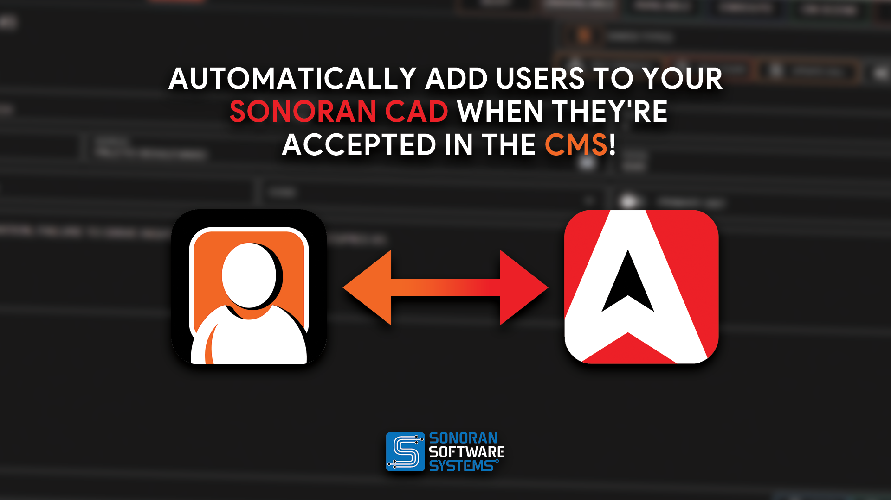

# Inviting Users to Your CAD

## Invitation Options

Share your free vanity URL or your own custom domain to bring members straight to your community. When they log in through either link, Sonoran CAD automatically joins them to your community. Members can also join manually with your community ID.

### Share Your Vanity URL (Free)

Your vanity URL is `https://your-community-id.sonorancad.com`. For example, a community with the ID `mwrpdev` can share `https://mwrpdev.sonorancad.com`.

Copy your community URL from **Administration > Customization > Custom Domain** and share it with new members. They can sign in or register there, join your community automatically, and go directly to your CAD without selecting it from a community list. There is no DNS setup or additional cost.

### [Sonoran CMS Auto-Join](https://info.sonorancms.com/why-choose-sonoran-cms/why-choose-sonoran-cms)

[Sonoran CMS](https://info.sonorancms.com/why-choose-sonoran-cms/why-choose-sonoran-cms) can automatically add and remove accounts on your Sonoran CAD.

<figure><figcaption>
Sonoran CAD x Sonoran CMS - Account Auto-Join
</figcaption></figure>

### Use Your Own Custom Domain

If you have a domain of your own, you can connect it to your CAD instead. See the custom domain and vanity URL guide:


[Custom Domain & Vanity URLs](../customization/custom-login-page.md)


### Manually Join with a Community ID

If you cannot share a vanity URL or custom domain, users can [create an account](registering-your-account.md), and enter in your community ID in the "Join Community" popup.\
Users can search using your community ID and can press the "Join" button to add your community.\
\
From there, users can select your community card in the "My Communities" section to log into your CAD. 

<figure><figcaption></figcaption></figure>


Forgot your community ID?

You can find this in your admin panel under Advanced > Limits > Community ID

