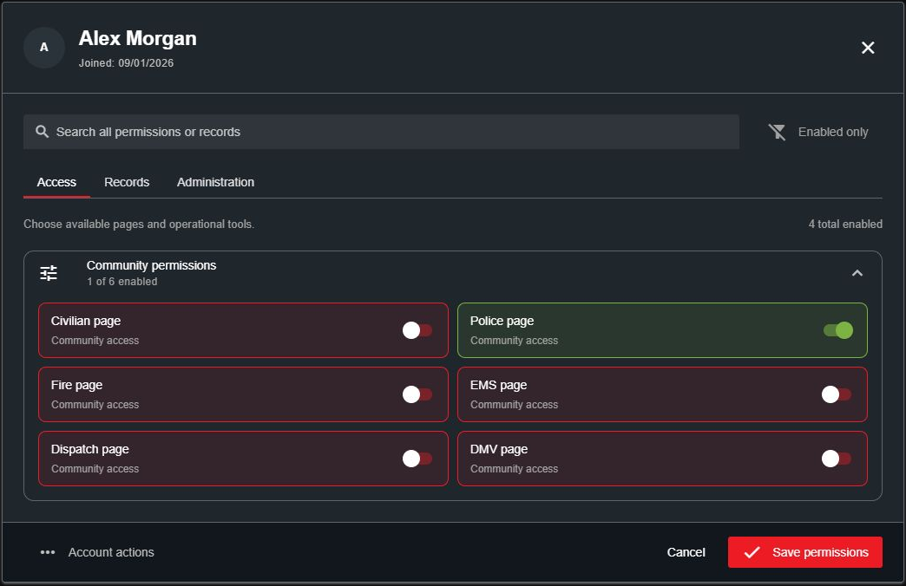
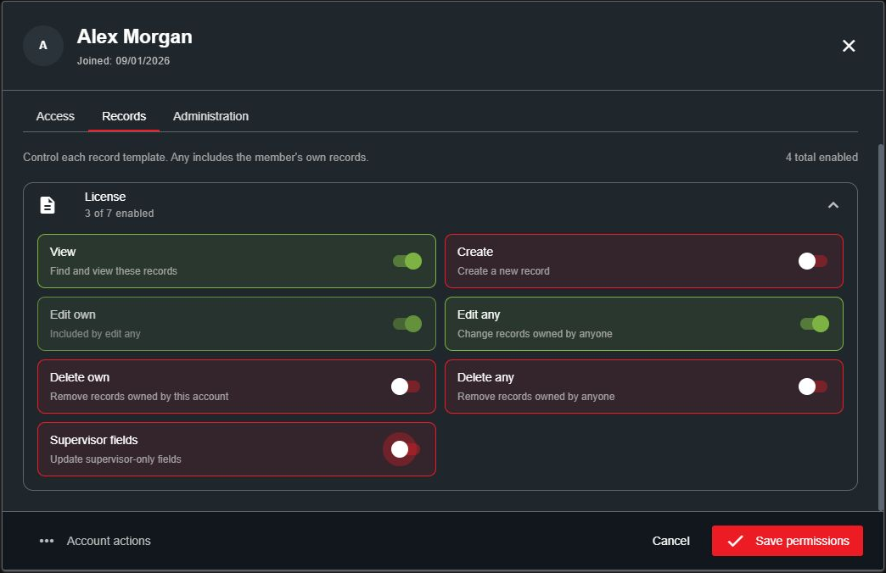
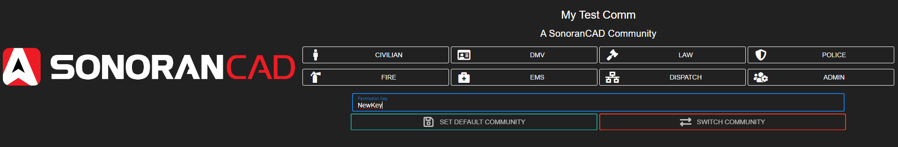

# Granting Account Permissions

Give members access manually, through permission keys, or with role sync from [Sonoran Bot](https://docs.sonoransoftware.com/bot/tutorials/sonoran-cad-integration) or [Sonoran CMS](https://docs.sonoransoftware.com/cms/integration-capabilities/sonoran-cad-sync).

## Manually Granting Permissions

1. Open **Administration > Accounts**.
2. Find the member and select their account. Use the **Pending** filter for members without permissions.
3. Choose permissions, then select **Save permissions**.

<figure><figcaption>
Choose the pages and tools a member can use.
</figcaption></figure>

The editor has three tabs:

* **Access:** Community pages and operational tools.
* **Records:** Permissions for each of your community's record templates.
* **Administration:** Account management and other administrative tools.

Click a permission card to enable or disable it. Use **Search permissions** to find a setting or template, and **Enabled only** to review the permissions already selected.

An account is **Active** when it has at least one permission, and **Pending** when it has none. Bans are managed separately under **Account actions**.

## Record Permissions

Open **Records** and expand a template. Permissions apply to that template, so a member can edit licenses without receiving the same access to arrest reports or other records.

<figure><figcaption>
Choose the actions allowed for each record template.
</figcaption></figure>

| Permission | Allows the member to |
| --- | --- |
| View | Find and view records of this type. |
| Create | Create a record of this type. |
| Edit own | Edit records owned by their account. |
| Edit any | Edit records owned by any account, including their own. |
| Delete own | Delete records owned by their account. |
| Delete any | Delete records owned by any account, including their own. |
| Supervisor fields | Update fields marked supervisor-only, alongside the required record editing permission. |

Page access and record permissions work together. For example, give an officer **Police page** access, **View**, and **Edit any** for licenses. In the [custom record editor](../customization/creating-custom-record-and-report-types.md#editing-other-users-records), enable **Editable by other users** only on fields the officer should change, such as points or status.

## Permission Keys

### Create a Key

Open **Administration > Permission Keys**, select **+**, enter a key name, and choose its permissions using the same editor. Save the key and share it with the intended members.

### Apply a Key

Members enter the key in the community menu. Keys are case-sensitive, so they must enter the exact capitalization.

The **Bot permissions** button in the Permission Keys panel creates a configuration code for [Sonoran Bot role mapping](https://docs.sonoransoftware.com/bot/tutorials/sonoran-cad-integration). That code is not a key members can redeem.

## Role Sync

When using Sonoran Bot or CMS to manage access, update permissions in the role or rank mapping. A later sync can overwrite manual changes made directly in CAD.
