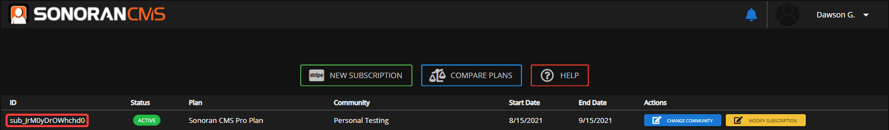
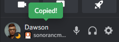
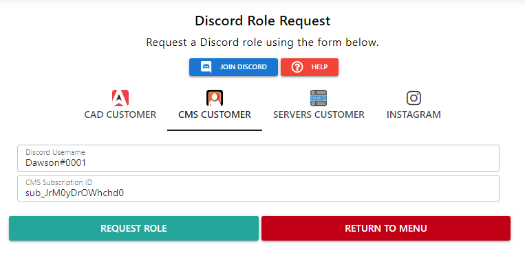

# Request Discord Role

See the guide below for claiming the `Customer`role in our Discord.

#### Customer Lobby 

The `Customer` role grants users access to the #customer-lobby channel.

#### 1. Retrieve your Subscription ID 

In the Sonoran CMS billing center, copy the subscription ID from the subscriptions table:

#### 2. Retrieve your Discord Tag 

In Discord, click your username to copy your Discord tag.

#### 3. Enter your Information 

On our [support website](https://support.sonoransoftware.com/), select the "Discord Role" button, select CMS Customer and paste in your information.

