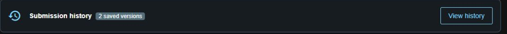
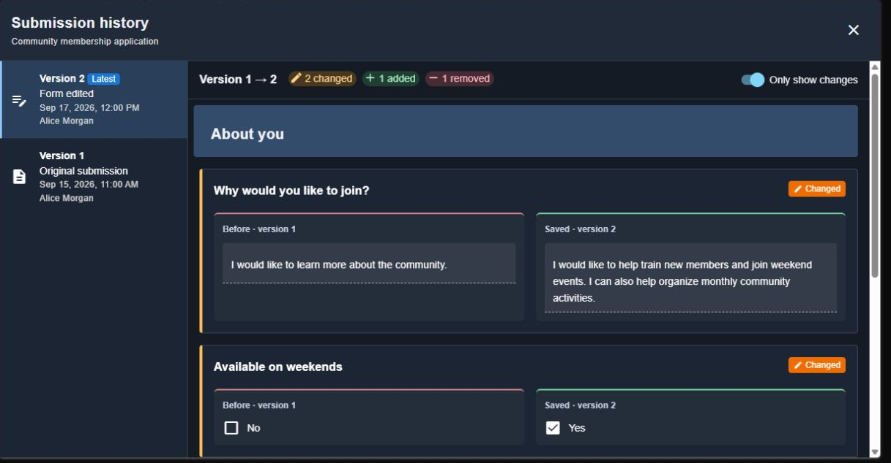
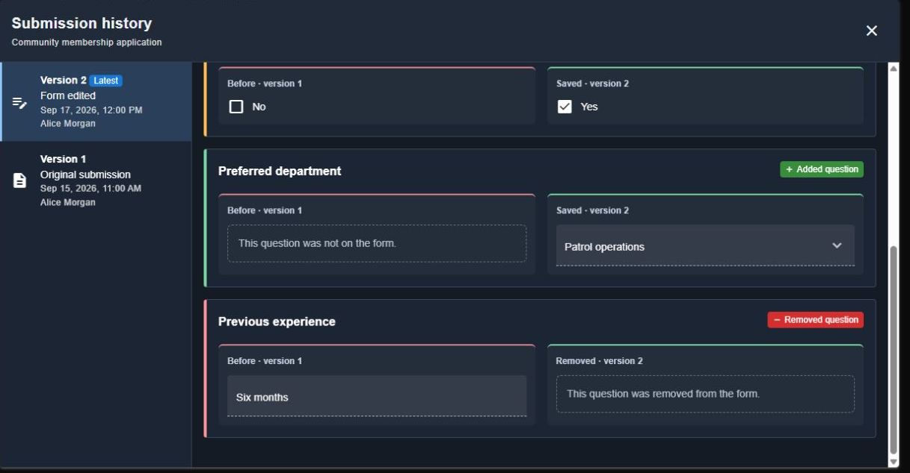

# Revision History

Submitted forms keep a history of saved versions. When a submission is edited, the previous version stays available. Saved revisions cannot be edited or deleted through CMS.

## Open Revision History

1. Open a [form submission](form-submissions.md).
2. Select **View history** in the **Submission history** panel.
3. Select a version from the list on the left. On mobile, use the **Saved version** dropdown.

<figure><figcaption>
Open history from a submitted form.
</figcaption></figure>

The latest version opens first. Each version lists its date and editor, when available.

## Compare Changes

Selecting an edited version compares it with the previous saved version. For example, **Version 1 → 2** shows what changed when version 2 was saved.

**Only show changes** is enabled by default. Turn it off to include unchanged questions and view the full form.

<figure><figcaption>
The previous answer appears under Before; the selected version's answer appears under Saved.
</figcaption></figure>

| Label | Meaning |
| --- | --- |
| **Changed** — amber | The answer, question, or question settings changed. |
| **Added question** — green | The question was added to this submission. |
| **Removed question** — red | The question was removed. Its previous answer remains visible. |
| **Unchanged** — gray | The question is unchanged. Shown when Only show changes is off. |

<figure><figcaption>
Added and removed questions remain in their form section for comparison.
</figcaption></figure>

Select **Original submission** to view the answers as they were first submitted. Viewing a version does not restore it or change the current submission.

## What Is Included?

Revision history tracks the submitted form's questions and answers. Comments, stage changes, and notification settings are separate from this history.

Forms that existed before revision history was enabled start with a **First available version**. Edits made before that point are unavailable.

History uses the submission's existing viewing permissions. It does not grant permission to edit the form.

*Screenshots use fictional names and sample answers.*
