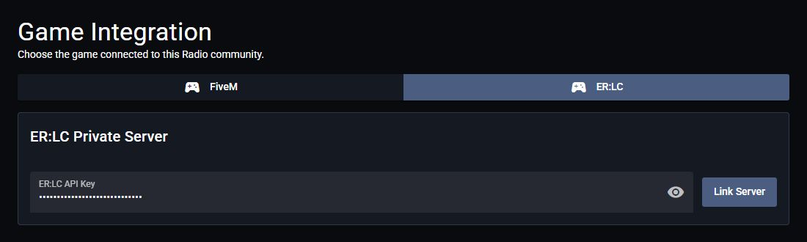
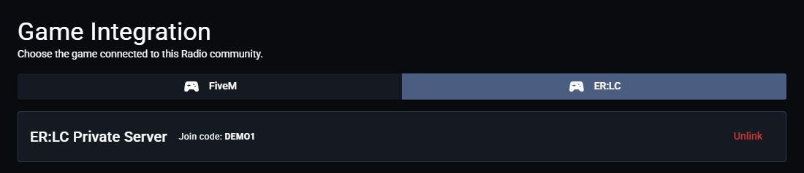
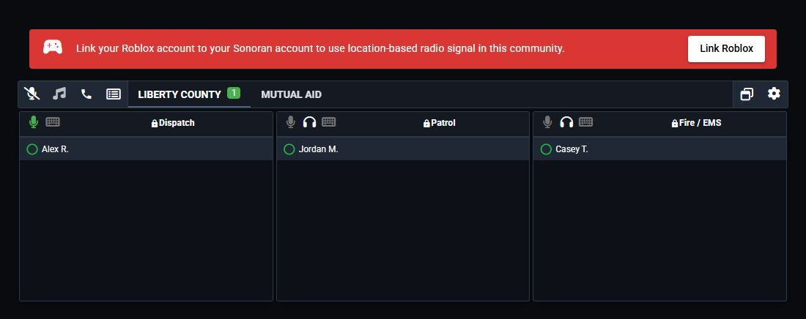

# ER:LC Setup

## Before You Begin

You need an ER:LC private server with the **API Pack** upgrade and permission to customize your Radio community.

## 1. Get Your ER:LC API Key

1. In ER:LC, open **Menu** > **Servers** > **Owned Servers**.
2. Select your private server. If needed, purchase **Upgrade Packs** > **API Pack**.
3. Join the server and open **Server Info** > **Edit Server Settings**.
4. Under **ER:LC API**, select **Edit** and copy the key.

Keep your API key private.

## 2. Link the Private Server

1. Open your Radio community.
2. Navigate to **Customize** > **Game Integration** > **ER:LC**.
3. Paste the key into **ER:LC API Key** and select **Link Server**.
4. Confirm that **ER:LC Private Server** displays your server's join code.

<figure><figcaption>
Enter your private-server API key to connect ER:LC.
</figcaption></figure>

<figure><figcaption>
The join code appears once the server is linked.
</figcaption></figure>

## 3. Link Your Roblox Account

Each player must link the Roblox account they use in ER:LC to receive location-based signal.

1. Sign in to Radio and open the linked community or standalone radio view.
2. Select **Link Roblox** in the red banner above the radio panel.
3. Sign in to Roblox and authorize the link.
4. Return to Radio. The banner disappears when the linked account is detected.

<figure><figcaption>
The banner appears above the radio panel for players who have not linked Roblox.
</figcaption></figure>

Already linked Roblox through another Sonoran product? You can use that existing link.

## 4. Add Coverage and Start Playing

1. [Place virtual signal towers](../../usage/in-game-radio/erlc-signal-towers.md).
2. Join the linked ER:LC private server.
3. Connect to your Radio channel in the desktop app and [open the overlay](../../usage/desktop-overlay.md#open-the-overlay).

Replace the API key or disconnect the server

1. Select **Unlink** and confirm.
2. To reconnect, enter the new API key and select **Link Server**.

Live player positions and signal updates stop while the server is unlinked.

