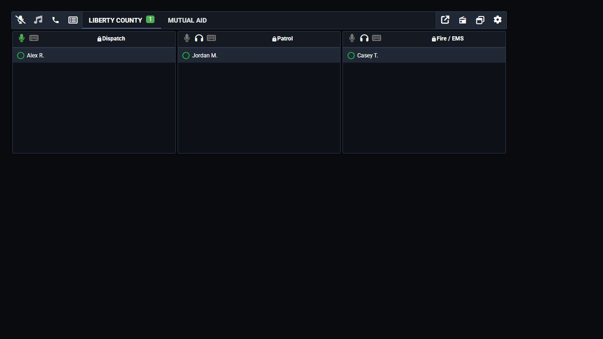

# Install and Connect

## Requirements

* Arma 3 version 2.12 or newer
* [CBA_A3](https://steamcommunity.com/sharedfiles/filedetails/?id=450814997)
* The Sonoran Radio Arma 3 mod on the server and every player's computer
* The [Sonoran Radio desktop app](../../../download-the-app.md) on each player's Windows computer

## Install the Mod

1. Subscribe to the Sonoran Radio Arma 3 mod and CBA_A3 in Steam Workshop.
2. Add both mods to your dedicated server's mod list.
3. Add both mods to the launcher preset shared with players.
4. Load **CBA_A3** before **Sonoran Radio** on the server and player computers.

## Connect the Desktop Overlay

1. Open the Sonoran Radio desktop app.
2. Join your community and connect to a channel.
3. Select **Open Overlay** (the arrow leaving a square).
4. Join the Arma mission with both mods enabled.

<figure><figcaption>
Select the arrow leaving a square to open your radio overlay.
</figcaption></figure>

Use the desktop app's push-to-talk controls. For overlay hotkeys, resizing, and frames, see [Desktop App & Overlay](../../usage/desktop-overlay.md).

## Add Signal Coverage

Follow [Signal Towers and Repeaters](signal-towers-and-repeaters.md) to place towers in the mission. Then move within a tower's range and check the overlay's signal bars.

Do I need TFAR or ACRE?

No. CBA_A3 is the required dependency. Avoid loading a second radio system if you do not want overlapping controls.

Having trouble connecting? See [Arma 3 Troubleshooting](troubleshooting.md).
