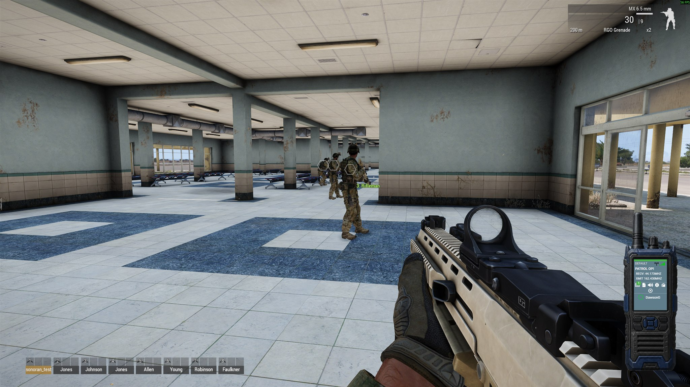
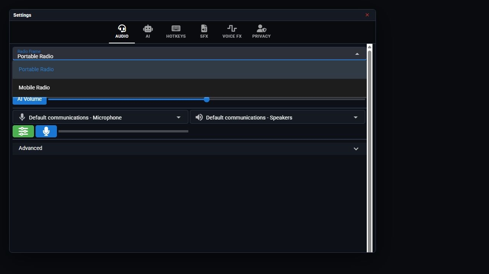

# Radio Items and Team Frames

Equip a radio item to use the desktop frame assigned to it by your community.

## Included radio items

| Display name | Item class | Default frame |
| --- | --- | --- |
| Sonoran Radio (BLUFOR) | `SonoranRadio_Item_BLUFOR` | ARMA 3 BLUFOR |
| Sonoran Radio (OPFOR) | `SonoranRadio_Item_OPFOR` | ARMA 3 OPFOR |

<figure><figcaption><p>The desktop radio overlay remains visible and usable while playing Arma 3.</p></figcaption></figure>

New Radio communities registered with **ARMA 3** selected include the two example desktop frames and mappings. Existing communities can map these classes to an existing frame or create new frames.

<details>
<summary>Select a frame manually</summary>

1. Open **Settings** > **Audio** on the desktop overlay.
2. Open **Radio Frame** and select a community frame.

<figure><figcaption><p>Choose a frame in the desktop overlay settings.</p></figcaption></figure>

Equipping a mapped Arma radio item selects its assigned frame automatically.

</details>

## Give a player a radio

1. Open the player loadout in Eden or Zeus Arsenal.
2. Search for **Sonoran Radio (BLUFOR)** or **Sonoran Radio (OPFOR)**.
3. Equip the intended radio item.

<details>
<summary>Give a radio using mission scripts</summary>

In a unit's Eden initialization field, use Arma's [`linkItem`](https://community.bohemia.net/wiki/linkItem) command:

```sqf
this linkItem "SonoranRadio_Item_BLUFOR";
```

To give yourself the BLUFOR item from the Arma Debug Console, select **Local Exec** and run:

```sqf
player linkItem "SonoranRadio_Item_BLUFOR";
```

For OPFOR, replace the class name with `SonoranRadio_Item_OPFOR`.

</details>

The item name does not automatically follow the unit's side. Mission makers must give each player or loadout the desired BLUFOR or OPFOR item.


Give a player only one intended radio item at a time. An assigned radio takes priority; otherwise the first detected radio in the inventory is reported.


## Map an item to a desktop frame

1. Open the Sonoran Radio admin panel.
2. Navigate to **Customization** > **Desktop Frames**.
3. Select the frame that should represent the team or inventory item.
4. In **ARMA Item Class Names**, enter the exact `CfgWeapons` class name and press Enter to create a chip.
5. Select **Save**.
6. Close and reopen the desktop overlay on player computers so it downloads the updated frame list.

Class matching is case-insensitive. Assign each item class to one frame.

Uploading new custom frame artwork requires a Pro subscription.

Changes to frame mappings appear after the player reopens the overlay. Equipping a mapped radio switches the frame within a few seconds. If an item has no mapping, the current frame stays selected.

<details>
<summary>Custom inventory items</summary>

Any custom item that inherits Arma's `ItemRadio` is detected automatically. Add its `CfgWeapons` class name to the desired frame in the admin panel.

For an inventory system that does not inherit `ItemRadio` or use Arma's assigned radio slot, call the client-side override when the custom radio is used:

```sqf
["my_mod_field_radio"] call sonoran_radio_fnc_setActiveRadioItem;
```

Clear the override and return to automatic detection with:

```sqf
[""] call sonoran_radio_fnc_setActiveRadioItem;
```

</details>
