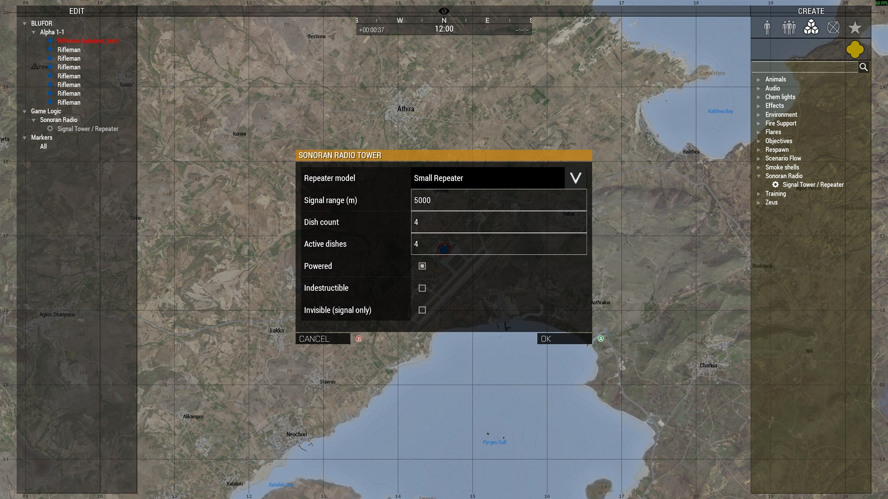

# Signal Towers and Repeaters

Place towers to provide radio coverage for your mission. Players use the strongest available tower signal in the [desktop overlay](../../usage/desktop-overlay.md).

## Place a tower in Eden

1. Open the mission in Eden Editor.
2. Select **Systems (F5)** > **Modules** > **Sonoran Radio**.
3. Place **Signal Tower / Repeater** at the desired location.
4. Configure its settings in the module attributes.
5. Optionally synchronize the module to an existing map or editor object.

When synchronized to a physical object, that object becomes the tower. Its antenna position is calculated from the top of its model, and destroying it disables the signal.

Use a unique **Tower ID** when mission scripts need to update the tower later. A blank ID is safe for editor-only towers because the mod generates one.

## Place a tower in Zeus

1. Open Zeus during the mission.
2. Select **Modules** > **Sonoran Radio** > **Signal Tower / Repeater**.
3. Click the desired location on the map or in the world.
4. Complete the **Sonoran Radio Tower** dialog and select **OK**.

<figure><figcaption><p>Configure the repeater model, signal range, dishes, power, damage, and visibility before placing the tower.</p></figcaption></figure>

Double-click the Sonoran Radio module to change its settings during the mission.

Deleting the module unregisters its signal and removes any physical object that the module spawned.

<details>
<summary>Tower settings</summary>

| Setting | Default | Behavior |
| --- | ---: | --- |
| Repeater model | Small Repeater | Selects the physical Arma object to spawn. Ignored for invisible or synchronized towers. |
| Signal range | 5,000 m | Maximum coverage radius. Valid values are 1 to 100,000 meters. |
| Dish count | 4 | Total tower capacity. Valid values are 1 to 16. |
| Active dishes | 4 | Working capacity. May be 0 and cannot exceed the dish count. |
| Powered | On | An unpowered tower provides no signal. |
| Indestructible | Off | Prevents the physical tower object from taking damage. |
| Invisible (signal only) | Off | Uses the module position without spawning or using a physical object. |

### Physical tower models

| Zeus label | Arma class name |
| --- | --- |
| Small Repeater | `Land_TTowerSmall_1_F` |
| Tall Repeater | `Land_TTowerSmall_2_F` |
| Large Radio Tower | `Land_TTowerBig_1_F` |

<figure><figcaption><p>The Large Radio Tower physical preset in-game.</p></figcaption></figure>

</details>

## Invisible towers

Enable **Invisible (signal only)** before confirming the module. Coverage originates from the module position, but no physical tower is spawned.

An invisible tower cannot be damaged because there is no physical object. Disable it by editing the module and clearing **Powered**, or remove it by deleting the module.

## Destructible towers

Leave **Indestructible** disabled and place a physical model. Normal Arma damage can then destroy the object. When the object is killed or deleted, the server turns the tower off and sets its active dishes to zero, removing its coverage.

To restore a destroyed physical tower, replace or recreate the module/object. Mission scripts can also register a replacement object and restore its state through the [Mission Maker API](mission-maker-api.md).

## Signal Coverage

Signal weakens with distance. Inactive dishes and obstructing terrain reduce coverage. Unpowered towers, towers with no active dishes, and towers outside your range provide no signal.

## Community signal settings

An administrator controls **Enable ARMA 3 bridge** and **ARMA 3 signal integration** under **Community Customizations → Game Integrations → ARMA 3**. These apply community-wide and are not player settings.

Mod version 0.3.3 or newer no longer exposes Sonoran CBA settings. Calculation defaults are fixed: a 1-second update interval, a 0.02 minimum quality change, and a 0.35 terrain-blocking multiplier. Turning off community signal integration stops Radio from applying that calculated quality; it does not remove towers.

A mission with no registered Sonoran towers starts with zero signal quality. Existing terrain scenery does not automatically create Sonoran coverage. Place a powered Sonoran tower module to begin coverage.

## Admin tower diagnostics

A logged-in or voted server administrator can run:

```text
#sonoranradio debugmode on
#sonoranradio debugmode off
```

This toggles the tower debug display and signal logging. It is a diagnostic tool, not a player override for community settings.
