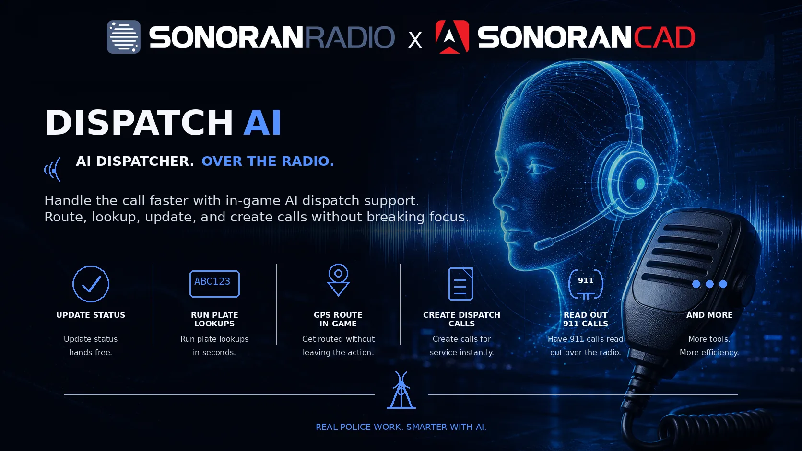
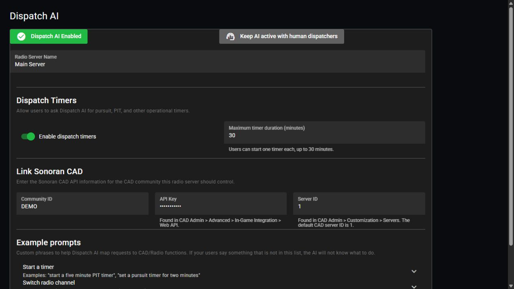

# Dispatch AI

Dispatch AI helps you control Sonoran Radio and work with Sonoran CAD by voice. Change channels, manage scanned channels, set timers, review your current CAD call, and more while playing.

<figure><figcaption></figcaption></figure>


Dispatch AI is in public beta. Usage limits depend on your community's [subscription](../../pricing/pricing-faq/standalone-pricing.md#dispatch-ai); a free tier is available.


## Common Setup

Complete this setup once for each Radio server using Dispatch AI. **The current setup requires a linked Sonoran CAD community, including for radio commands.**

1. In Sonoran CAD, open **Admin** > **Advanced** > **In-Game Integration** > **Web API**. Copy the community ID and API key.
2. In CAD, open **Admin** > **Customization** > **Servers** and note the server ID. The default is `1`.
3. In Radio's admin panel, open **Customization** > **Dispatch AI**. Select a Radio server or use **+** to create one.
4. Under **Link Sonoran CAD**, enter the CAD community ID, API key, and server ID. Fields save automatically when you leave them.
5. Toggle **Dispatch AI Enabled** on.
6. Sign in to Radio with your Sonoran account, join that Radio server, and connect to a channel. Use the same account in CAD for actions involving your unit.

<figure><figcaption>
Configure Dispatch AI for the selected Radio server.
</figcaption></figure>

## Using the AI

Hold push-to-talk and start your request with **Dispatch**, the default wake word. For example: “Dispatch, switch me to TAC 1.” Wait for the AI's response before making another request.

When the first user connects, allow a few seconds for the “Dispatch Online” announcement.

Wake words and hotkeys

1. Open **Settings** > **AI** to configure your wake word. Use the microphone button to record a custom wake word.
2. For a manual trigger in the web or desktop app, open **Settings** > **Hotkeys** and set **AI Toggle**.
3. Hold push-to-talk, activate the AI, and speak your request.

Listen for the activation beep. Say the wake word near the start of your transmission.

<figure><figcaption></figcaption></figure>

FiveM players can also use the [in-game AI keybind](dispatch-ai/fivem.md#setup).

## Radio Commands

These commands work across games, including **FiveM, ER:LC, and Arma 3**. Use the channel names configured by your community.

| Action | Example |
| --- | --- |
| Change your primary transmit channel | “Dispatch, switch me to TAC 1.” |
| Move another connected user | “Dispatch, move A-12 to Dispatch.” |
| Add a scanned channel | “Dispatch, add Fire to my scanned channels.” |
| Remove a scanned channel | “Dispatch, remove Fire from my scanned channels.” |
| Hear your current channels | “Dispatch, what channel am I on?” |

Channel changes respect community access permissions. Moving another user requires permission to move clients. Include the group name when several channels have the same name, or answer the AI's clarification.

## Timers

Ask for a timer by duration and, optionally, a purpose. Dispatch AI tells you when it expires.

| Action | Example |
| --- | --- |
| Start a timer | “Dispatch, set a timer for five minutes.” |
| Start a named timer | “Dispatch, start a two-minute PIT timer.” |
| Cancel your timer | “Dispatch, cancel my timer.” |

You can have one active timer in the Radio server. Starting another replaces it. Timers must be at least 10 seconds and no longer than the community's configured maximum, up to 30 minutes.

Configure community timer limits

1. Open **Customization** > **Dispatch AI** and select the Radio server.
2. Under **Dispatch Timers**, turn **Enable dispatch timers** on or off.
3. Set **Maximum timer duration (minutes)** from `1` to `30`. Leave the field to save.

The default maximum is 30 minutes. See the [setup screenshot](#common-setup) for these controls.

## Sonoran CAD Commands

CAD actions use the community and server linked in [Common Setup](#common-setup). Be on duty with the appropriate unit selected in CAD when asking about your status or current call.

Review your current call

Ask the AI to repeat the details of the CAD dispatch call you are attached to.

“Dispatch, repeat my current call.”

You can also ask about the latest call or give a short correction to a recent request, such as “Dispatch, actually, the plate is ABC124.” Be specific if several calls or units could match.

Status, lookups, and panic

| Action | Example |
| --- | --- |
| Update your status | “Dispatch, A-10, mark me available.” |
| Update another unit's status | “Dispatch, set B-11 to 10-8.” |
| Run a plate lookup | “Dispatch, run the plate ABC123.” |
| Run a name lookup | “Dispatch, check John Doe.” |
| Toggle panic | “Dispatch, toggle my panic status.” |

Use your community's configured status codes. Lookup results are sent to CAD with a brief radio response.

Create and manage calls

| Action | Example |
| --- | --- |
| Create a call | “Dispatch, show me out on traffic with a blue sedan, plate ABC123.” |
| Attach to a call | “Dispatch, attach me to the robbery in progress.” |
| Attach another unit | “Dispatch, attach B-11 to my call.” |
| Add a note | “Dispatch, add a note to my call: the vehicle is white.” |
| Detach yourself | “Dispatch, clear my call.” |
| Close the call | “Dispatch, close my call.” |

New calls use your unit's location when available unless you specify another location. Including a plate in a new call also runs a plate lookup.

Unit groups

“Dispatch, add me and B-11 to group Ladder 12.”

“Dispatch, clear my unit group.”

Use the unit number or name to identify other units.

## Game-Specific Features

The shared commands above apply across games. Choose your game for additional setup and integrations.

<table data-view="cards"><thead><tr><th></th><th></th><th data-hidden data-card-cover data-type="files"></th><th data-hidden data-card-target data-type="content-ref"></th></tr></thead><tbody>
<tr><td><strong>FiveM</strong></td><td>Emergency call readouts, GPS routing, and automatic arrival status.</td><td><a href="../../.gitbook/assets/game-cards/fivem.png">FiveM</a></td><td><a href="dispatch-ai/fivem.md">fivem.md</a></td></tr>
<tr><td><strong>ER:LC</strong></td><td>Read emergency calls over the channels assigned to each map zone.</td><td><a href="../../.gitbook/assets/game-cards/erlc.png">ER:LC</a></td><td><a href="dispatch-ai/erlc.md">erlc.md</a></td></tr>
<tr><td><strong>Arma 3</strong></td><td>Use shared radio commands and timers from the desktop overlay.</td><td><a href="../../.gitbook/assets/game-cards/arma3.png">Arma 3</a></td><td><a href="dispatch-ai/arma-3.md">arma-3.md</a></td></tr>
</tbody></table>

## Customization

Community phrases and human dispatchers

Open **Customization** > **Dispatch AI** and select the Radio server.

* Expand an action under **Example prompts** to add short examples of your community's radio phrases.
* Use the human-dispatcher button to choose whether AI stays active or pauses when a dispatcher is active in CAD.

Keep example phrases short and specific.

Language, transcripts, and phrase corrections

Open **Settings** > **AI** to choose the AI language, review **Recent Transcripts**, or add **Phrase Overrides** for commonly misheard words. The AI uses the app's language by default.

<figure><figcaption></figcaption></figure>

AI volume and replies

Adjust **AI Volume** under **Settings** > **Audio**. In the AI settings, choose whether to hear replies to other users or only replies directed to you.

<figure><figcaption></figcaption></figure>

## Token Usage

View your community's usage under **Settings** > **AI** > **Token Usage**, or in the admin **Dispatch AI** panel. Limits reset on the first of each month. Once the limit is reached, further AI requests are unavailable until the reset or a subscription upgrade.

See [Dispatch AI usage limits](../../pricing/pricing-faq/standalone-pricing.md#dispatch-ai).
