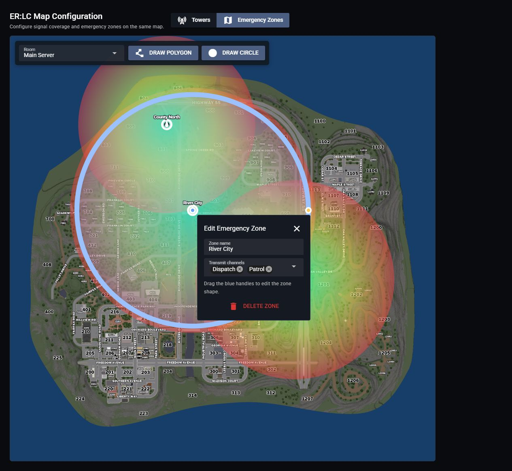

# Dispatch AI for ER:LC

Use the [shared Dispatch AI commands](../dispatch-ai.md#radio-commands) to change channels, manage scanned channels, set timers, and work with CAD through the desktop app. ER:LC also supports automatic emergency call readouts.

## Emergency Call Readouts

1. Complete the [common Dispatch AI setup](../dispatch-ai.md#common-setup).
2. [Connect your ER:LC private server to Sonoran CAD](https://docs.sonoransoftware.com/cad/integration-plugins/erlc/getting-started), including the event webhook, and enable emergency call synchronization for the desired teams.
3. Confirm that Radio's **Customization** > **Dispatch AI** links to the same CAD server receiving those calls.
4. Complete the [Radio ER:LC setup](../../game-integrations/roblox/erlc-setup.md).
5. In Radio, open **Customization** > **Game Integration** > **ER:LC**. Select **Emergency Zones** and choose the **Room** running Dispatch AI.
6. Use **Draw Polygon** or **Draw Circle** to create a zone. Select the zone and choose its **Transmit channels**.
7. Submit an ER:LC emergency call inside a zone and check that it reaches CAD and is read over the assigned channels.

<figure><figcaption>
Select the room, draw a zone, and choose which channels receive its emergency call readouts.
</figcaption></figure>

Dispatch AI creates a dispatch call, removes the original 911 call, and reads it over the zone's channels. The imported call must include coordinates inside a configured zone.

Linking ER:LC to Radio provides the Radio integration; the CAD connection imports emergency calls. Both are needed for these readouts.

A call is not being read out

1. Confirm the emergency call appears in the linked CAD server.
2. Confirm it has coordinates inside an emergency zone.
3. Check that the zone has channels assigned for the room running Dispatch AI.
4. Confirm Dispatch AI is enabled, has remaining usage, and is not paused for a human dispatcher.

## Use the AI While Playing

1. Sign in to the Sonoran Radio desktop app and join your community's Radio server.
2. [Open the overlay](../../usage/desktop-overlay.md#open-the-overlay).
3. Hold push-to-talk and say, for example, “Dispatch, switch me to Patrol.”

See [Radio Commands](../dispatch-ai.md#radio-commands), [Timers](../dispatch-ai.md#timers), and [Sonoran CAD Commands](../dispatch-ai.md#sonoran-cad-commands).
