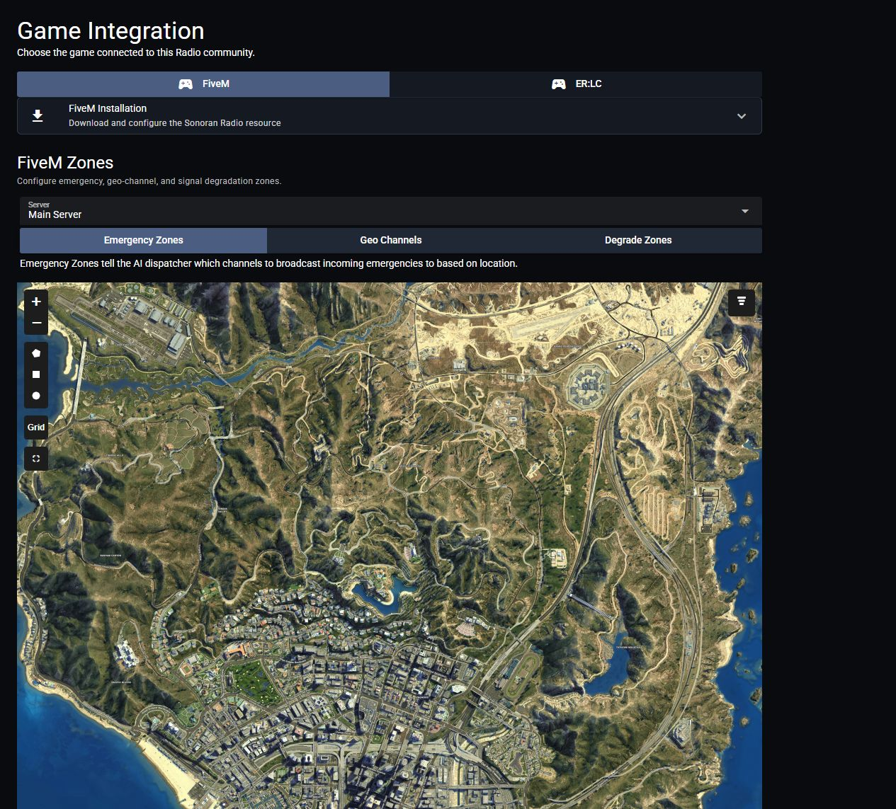

# Dispatch AI for FiveM

Use [Dispatch AI](../dispatch-ai.md) to change radio channels, manage scanned channels, set timers, and work with CAD. FiveM also supports emergency call readouts and in-game GPS routing.

## Setup

1. Complete the [common Dispatch AI setup](../dispatch-ai.md#common-setup).
2. Install the [FiveM Radio resource](../../getting-started/installing-the-in-game-resource.md).
3. Sign in to the in-game radio with your Sonoran account. For CAD actions, use that account in CAD or complete the in-game `/link` flow.
4. Use the wake word while transmitting, or configure the FiveM AI keybind in the radio settings.

<figure><figcaption>

</figcaption></figure>

## Emergency Call Readouts

1. Connect the intended CAD server in Radio's **Customization** > **Dispatch AI**.
2. Open **Customization** > **Game Integration** > **FiveM**.
3. Under **FiveM Zones**, select the **Server** running Dispatch AI, then select **Emergency Zones**.
4. Draw a zone and select it to assign the channels that should receive calls in that area.
5. Generate a 911 call in the linked CAD server with coordinates inside a zone.

Dispatch AI creates a dispatch call, removes the original 911 call, and reads it over the zone's assigned channels. Calls without coordinates or outside the zones are not read automatically.

<figure><figcaption>

</figcaption></figure>

## GPS Routing

| Destination | Example |
| --- | --- |
| Postal code | “Dispatch, route me to postal 123.” |
| Dispatch call | “Dispatch, route me to the robbery call.” |
| Another unit | “Dispatch, route me to unit B-11.” |

Postal routing requires **Nearest Postal** or another resource supporting `/postal <id>`. Routing to a unit uses that unit's available CAD coordinates.

Automatic en-route and on-scene status

With **Nearest Postal v1.5.4 or newer**, AI GPS routing can set your CAD status to en-route and then on-scene when you arrive.

Configure `Config.autoOnSceneStatus` in the [Radio resource configuration](../../getting-started/installing-the-in-game-resource.md#configuration-options).

For channel changes, timers, and current-call readbacks, see the [shared commands](../dispatch-ai.md#radio-commands).
