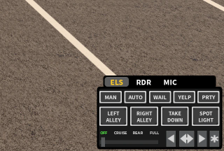

# ER:LC Frame Changes

The Sonoran Radio desktop overlay can automatically display your selected frame's Vehicle layout when ER:LC's **ELS controller** is visible in the bottom-right corner of the Roblox window. When the controller is absent, it displays the On-foot layout.

<figure><figcaption>
The bottom-right ELS controller identifies the Vehicle layout even when emergency lights are off.
</figcaption></figure>


This feature identifies the visible ELS controller. Civilian vehicles and other vehicles without that controller use the On-foot layout, even while you are seated. Keep the controller visible to use the Vehicle layout.


## Configure the community

1. In the Radio panel, open **Customize** > **Game Integration** and select **ER:LC**.
2. Follow [Configure frames and variants](./#configure-frames-and-variants) to save **On-foot** and **Vehicle** layouts in **Customize** > **Overlay**.

After an administrator saves frame changes, close and reopen any overlay that is already running so it downloads the updated frames and variants.

ER:LC frame detection uses local screen access and does not require an ER:LC API key or a linked Roblox account. [Private-server and Roblox account linking](../../game-integrations/roblox/erlc-setup.md) configure location-based radio signal separately.

## Enable detection on your computer

1. Open ER:LC in the Roblox player and start the Sonoran Radio **desktop app**.
2. Open your Radio community, connect to a channel, and select the **Overlay** tab beside **Dispatch**. See [Open the Overlay](../desktop-overlay.md#open-the-overlay).
3. Open the overlay's **Radio Settings** > **Audio** and select the desired radio frame.
4. In **ER:LC vehicle detection**, turn on **Use screen detection**.
5. Leave **Roblox window** on **Find Roblox window automatically**, or select the correct Roblox player window if more than one is open. Use **Refresh Roblox windows** if it is missing.
6. Enter a vehicle with an ELS controller and keep the controller visible. Allow a few seconds for the radio to confirm the change. Exit the vehicle to check that the On-foot layout returns.

Emergency lights and sirens can be on or off. The detector checks the controller's presence, and confirms repeated readings to avoid switching layouts from a single capture.

Detection preferences are saved on each computer. The desktop app checks window images locally; screen images are not saved or uploaded.

## Allow screen access on macOS

If macOS blocks access, **ER:LC vehicle detection** displays permission guidance:

1. Select **Open System Settings**.
2. Open **Privacy & Security** > **Screen & System Audio Recording**. Older macOS versions call this **Screen Recording**.
3. Enable **Sonoran Radio**.
4. Fully quit and reopen Sonoran Radio, then reopen the overlay.
5. Return to **ER:LC vehicle detection** and select **Check access** if needed. For first-time access, this button can request permission from macOS.

If access is restricted by your Mac's administrator, ask them to enable it. If the settings button cannot open System Settings, navigate to the same panel manually.

## Check detection and troubleshoot

The detection status is in **Radio Settings** > **Audio** > **ER:LC vehicle detection**. The frame itself does not display a separate detection badge.

| Status or symptom | What to check |
| --- | --- |
| Off | Turn on **Use screen detection**. |
| Looking for Roblox window | Open the Roblox player and refresh the window list. Roblox Studio is not a capture target. |
| Screen recording access required | Follow the macOS permission steps above, then fully quit and reopen Radio. |
| On foot while seated | Confirm that the vehicle has a visible bottom-right ELS controller. |
| In a vehicle, but the artwork is unchanged | Confirm that the selected frame has a saved Vehicle variant, then close and reopen the overlay to load recent edits. |
| Unable to determine vehicle state or an unreadable window | Restore the Roblox window, confirm the selected capture window, and show the ELS controller clearly. |

**Last ELS controller check** shows whether the controller was found, absent, or uncertain. An unreadable capture can temporarily retain the last confirmed layout, so allow a few seconds after restoring the window before checking again.

To select a different radio design while playing, use the [previous/next-frame desktop hotkeys](./#change-frames-with-desktop-hotkeys). Automatic detection applies the current state to that frame's saved variants.
