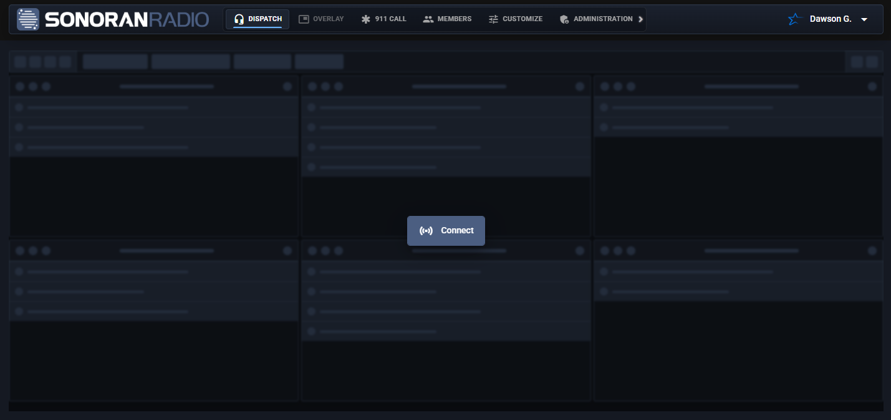
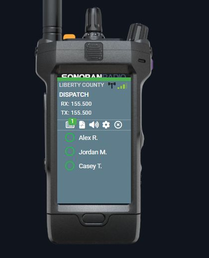
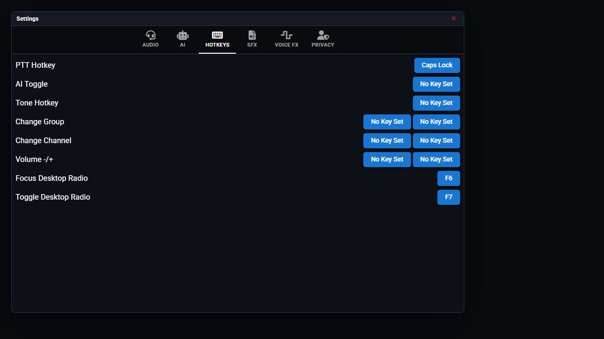

# Desktop App & Overlay

The desktop app provides an overlay for **FiveM, Arma 3, Roblox, and other games**. Keep radio controls visible while you play.

## Open the Overlay

1. [Download and open the desktop app](../../download-the-app.md).
2. Join your Radio community and connect to a channel.
3. Select the **Overlay** tab at the top, beside **Dispatch**.
4. Position the radio over your game window.

<figure><figcaption>
The Overlay tab is beside Dispatch in the top navigation. Use the desktop app to open it; the website displays it disabled.
</figcaption></figure>

On the website, the tab is disabled; its tooltip explains that the desktop app is required. The mobile app hides the tab.

To return to the main panel, use the radio's power button or **Return to Portal**.

## Game Signal

The overlay displays signal supplied by supported game integrations. For location-based signal, complete the [ER:LC setup](../game-integrations/roblox/erlc-setup.md) or [Arma 3 installation](../integrations/arma-3/install-and-connect.md), then configure that game's towers.

<figure><figcaption>
Signal bars show the coverage supplied by your game integration.
</figcaption></figure>

## Overlay Controls

Hotkeys

1. Open **Settings** > **Hotkeys** on the overlay.
2. Select the button beside **Toggle Desktop Radio** and press your preferred key to hide or show the overlay.
3. Set **Focus Desktop Radio** the same way to interact with the radio while playing in fullscreen.

Set **PTT Hotkey** to your preferred push-to-talk key.

<figure><figcaption>
Example hotkeys; choose keys that do not conflict with your game.
</figcaption></figure>

Move or resize the radio

Drag the radio body to move it. To resize the whole overlay, drag a corner, or hold **Ctrl** while dragging the body: up enlarges and down shrinks.

A brief resize hint appears when the overlay opens and when you hover or focus a resize corner. There is no permanent resize button, and hovering over the radio screen does not repeatedly show the hint.

Change the radio frame

1. Open **Settings** > **Audio** on the overlay.
2. Open **Radio Frame**.
3. Select a frame provided by your community.

<figure><figcaption>
Select a community frame from the Radio Frame dropdown.
</figcaption></figure>

Arma 3 can select a frame based on your inventory radio. See [Radio Items and Team Frames](../integrations/arma-3/radio-items-and-team-frames.md).

Upload custom desktop frames

Uploading custom frame artwork requires **Pro**.

1. In your community's admin panel, open **Customization** > **Desktop Frames**.
2. Upload the frame image.
3. Position its buttons. Drag the screen to move it or drag its corners to resize its bounds, then save. This changes the community frame layout, not just the overlay's on-screen size.

<figure><figcaption></figcaption></figure>

## Arma display and focus

Use **Fullscreen Window** in Arma's video settings so the desktop overlay can remain visible. If Arma freezes or pauses when you focus the overlay, enable **No Pause** in the Arma launcher or add `-noPause` to its launch parameters. Return focus to the game to resume game input; these options do not make the game and overlay simultaneously receive the same keyboard input.

See [Arma installation](../integrations/arma-3/install-and-connect.md) for community-wide bridge, signal, and AI-hearing settings. These controls are not in Dispatch's per-user settings.
