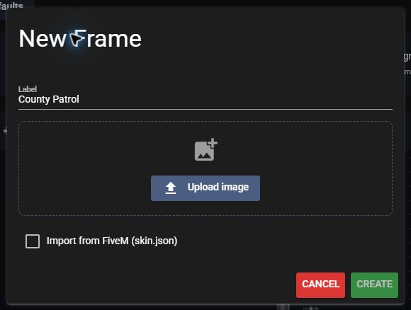
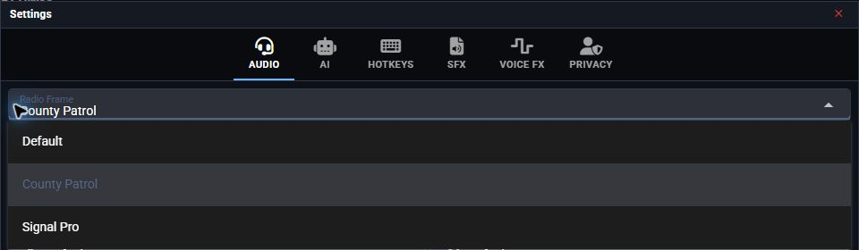

# Radio Overlay

Create your community's radio frames in **Customize > Overlay**. The same editor supplies the desktop overlay and FiveM in-game radio.

## Create a custom overlay

Uploading custom frame artwork requires **Pro**.

1. Open your community's **Customize > Game Integration** tab and select your game.
2. Open **Customize > Overlay** and select **New Frame**.
3. Enter a label, select **Upload image**, and upload your radio artwork. Select **Create**.
4. Choose a **Screen Theme** and adjust **Frame Width** as needed.
5. Drag the screen and buttons into place. Use **Add Button** for any missing controls, then select **Save changes**.

<figure><figcaption>
Name your frame and upload its artwork.
</figcaption></figure>

<figure><figcaption>
One editor for desktop and FiveM radio frames.
</figcaption></figure>

Drag a screen corner to resize it, or hold **Ctrl** while dragging a screen or button. Right-click a button to remove it. Each button action can be added once.

Use **+**, **−**, and **Fit** to zoom the preview. Preview zoom does not change the radio's saved size.

**Reset to game defaults** replaces the full frame set in the editor. Confirm the reset, then select **Save changes** to apply it. Select a game in **Game Integration** first if reset is disabled.

For FiveM frame selection and access restrictions, see [FiveM Radio Frames](in-game-radio/customizing-radio-frames.md).

## Use the desktop overlay

The desktop app keeps radio controls visible while playing FiveM, Arma 3, Roblox, and other games.

## Open the Overlay

1. [Download and open the desktop app](../../download-the-app.md).
2. Join your Radio community and connect to a channel.
3. Select the **Overlay** tab at the top, beside **Dispatch**.
4. Position the radio over your game window.

<figure><figcaption>
The Overlay tab is beside Dispatch in the top navigation. Use the desktop app to open it; the website displays it disabled.
</figcaption></figure>

On the website, the tab is disabled; its tooltip explains that the desktop app is required. The mobile app hides the tab.

To return to the main panel, use the radio's power button or **Return to Portal**.

## Game Signal

The overlay displays signal supplied by supported game integrations. For location-based signal, complete the [ER:LC setup](../game-integrations/roblox/erlc-setup.md) or [Arma 3 installation](../integrations/arma-3/install-and-connect.md), then configure that game's towers.

<figure><figcaption>
Signal bars show the coverage supplied by your game integration.
</figcaption></figure>

## Overlay Controls

Hotkeys

1. Open **Settings** > **Hotkeys** on the overlay.
2. Select the button beside **Toggle Desktop Radio** and press your preferred key to hide or show the overlay.
3. Set **Focus Desktop Radio** the same way to interact with the radio while playing in fullscreen.

Set **PTT Hotkey** to your preferred push-to-talk key.

<figure><figcaption>
Example hotkeys; choose keys that do not conflict with your game.
</figcaption></figure>

Move or resize the radio

Drag the radio body to move it. To resize the whole overlay, drag a corner, or hold **Ctrl** while dragging the body: up enlarges and down shrinks.

A brief resize hint appears when the overlay opens and when you hover or focus a resize corner. There is no permanent resize button, and hovering over the radio screen does not repeatedly show the hint.

Change the radio frame

1. Open **Settings** > **Audio** on the overlay.
2. Open **Radio Frame**.
3. Select a frame provided by your community.

<figure><figcaption>
Select a community frame from the Radio Frame dropdown.
</figcaption></figure>

Arma 3 can select a frame based on your inventory radio. See [Radio Items and Team Frames](../integrations/arma-3/radio-items-and-team-frames.md).

