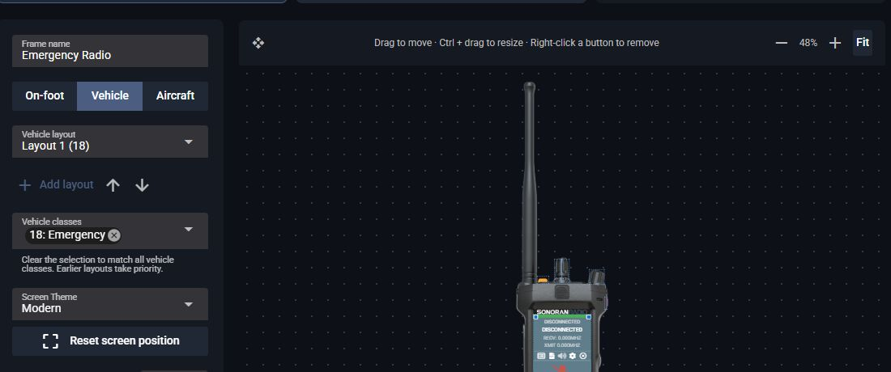

# FiveM Radio Frames

FiveM radio frames are managed in the Radio panel under **Customize > Overlay**. The same editor supplies the desktop overlay.

## Updating from local skins

When you update to the portal-managed FiveM resource, it imports the existing `sonoranradio/skins` folder automatically. The resource uploads each skin's artwork and layout, including on-foot, vehicle, aircraft, HUD, and scanner frames. It preserves the order of multiple vehicle layouts and their `vehicleClasses` rules. You do not need to upload the images or re-create the layouts yourself.

The resource renames `skins` to `skins_old` **only after** the Radio backend confirms the imported frames. If that archive name already exists, it uses a numbered name such as `skins_old_2`. Keep that folder as a backup until you have checked your frames in game.

If the import fails, the original `skins` folder stays in place and the resource retries. Check the server console for the migration warning and [contact support](https://support.sonoransoftware.com/) if it continues to fail. An unavailable Radio API also leaves the local files in place for a later attempt. The resource keeps its last successfully loaded frame data if a later refresh fails.

Existing skin folder names in `Config.frames.departments[*].allowedFrames` continue to work as aliases for imported frames. You can use the `frame:<ID>` shown in the editor for new permission entries.


The one-time import is available to Free FiveM communities. Imported frames remain usable on Free, but editing them or replacing their artwork in the panel requires Pro. Adding new custom frames also requires Pro.


Imported HUD and scanner layouts continue to display in game. The current Overlay editor exposes on-foot, vehicle, and aircraft layouts; contact support if an imported HUD or scanner layout needs a change.

## Create or edit a frame

Select **FiveM** in **Customize > Game Integration**, then follow [Create a custom overlay](../desktop-overlay.md#create-a-custom-overlay). Upload your artwork, position the screen and buttons, and select **Save changes**. Uploading new custom artwork requires **Pro**.

<figure><figcaption><p>Edit FiveM frames from the Radio panel.</p></figcaption></figure>

Use an updated FiveM resource. With your server's push URL configured, saving sends the updated frames to connected players. The resource also checks on startup and roughly every 30 seconds. If a check fails, it keeps the last successfully loaded frames and tries again.

## Set a layout for vehicle classes

The **On-foot**, **Vehicle**, and **Aircraft** layout controls appear when the community has **FiveM** selected as its game. A frame can have several vehicle layouts, each with its own image, screen, buttons, and vehicle classes.

1. In **Customize > Overlay**, select the frame you want to edit and choose **Vehicle** or **Aircraft**.
2. Select **Add layout**, or choose an existing entry from **Vehicle layout** or **Aircraft layout**.
3. Under **Vehicle classes**, select the classes that should use that layout. For example, class `18` is **Emergency**, while `15` and `16` are aircraft. Clearing all selected classes makes a vehicle layout match every class.
4. Use **Change image** and the editor controls to position its screen and buttons. Use the up and down arrows to set layout order, then select **Save changes**.

FiveM uses the **first** vehicle layout whose class list matches the vehicle. Put a layout that matches all classes after more specific layouts. Aircraft-only layouts appear under **Aircraft**; layouts with any non-aircraft class appear under **Vehicle**. The order is shared between those tabs.

<figure><figcaption><p>Choose a FiveM vehicle layout and the classes that use it.</p></figcaption></figure>

## Change your frame in game

1. Open the radio's **Settings**.
2. Select the **FiveM** tab.
3. Choose a frame from **Radio Frame**.

Only frames available to your player appear in the list.

<figure><figcaption><p>Choose a frame in Settings > FiveM.</p></figcaption></figure>

## Restrict frame access

Create and edit frames in the Radio panel's **Customize > Overlay** editor. To control which FiveM players can select each frame, configure `Config.frames` in your server's Sonoran Radio resource **config.lua**. The in-game radio only lets players choose from the frames available to them; frame setup and permission rules are not configured in that menu.

- `permissionMode = 'none'` lets everyone use all available frames.
- Use `ace`, `qbcore`, `qbox`, or `esx` to restrict frames by department permissions or job grades.
- Copy the ID shown below each frame's name in the Overlay editor into the department's `allowedFrames` list. Use the exact `frame:<ID>` value, such as `frame:2`; the frame's display name is not a permission identifier. Previously configured skin folder names still work for migrated frames.

For example, allow players with the `sonoranradio.patrol` ACE to use two community frames:

```lua
Config.frames = {
    permissionMode = 'ace',
    adminPermission = 'sonoranradio.admin',
    departments = {
        patrol = {
            label = 'County Patrol',
            permissions = {
                ace = { 'sonoranradio.patrol' }
            },
            allowedFrames = { 'frame:1', 'frame:2' }
        }
    }
}
```

Replace those IDs with your own. Grant `sonoranradio.patrol` to the players who should use the patrol frames through your server's ACE configuration. For framework permissions, use `permissions.jobs` and the allowed `grades` from the resource's example configuration. [Sonoran CMS can manage ACE permissions from community roles](https://docs.sonoransoftware.com/cms/integration-capabilities/sonoran-radio-sync).

For new permission entries, use `frame:<ID>` values. The automatic migration keeps existing folder-name entries working, so you do not need to rewrite them during the resource update.
