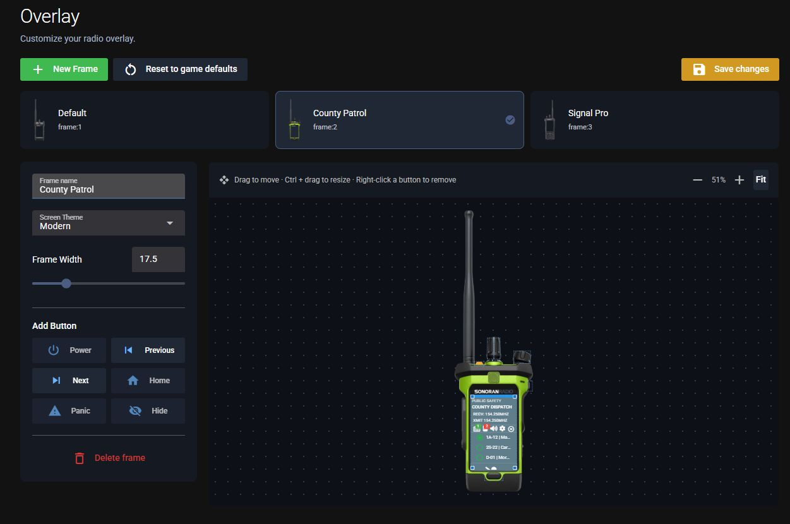
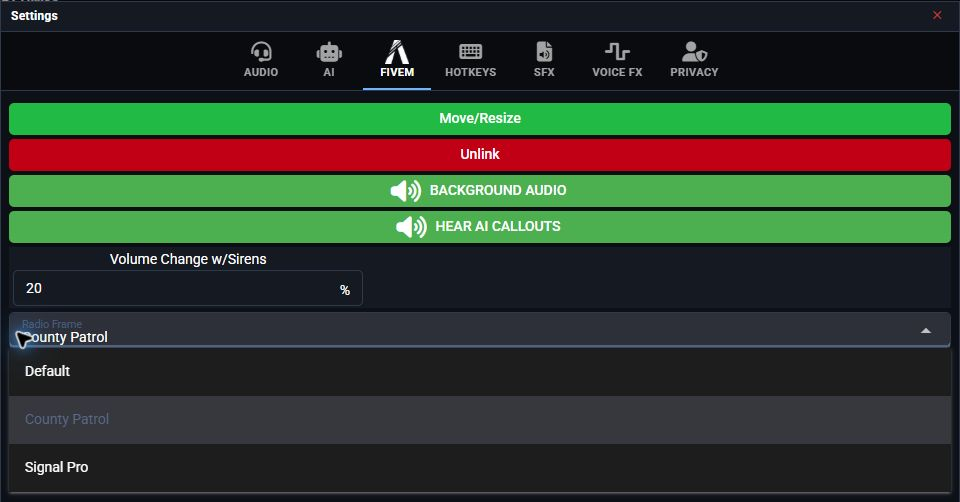

# FiveM Radio Frames

Create and edit your FiveM radio frames in **Customize > Overlay** in the Radio panel. This is the same editor used for the desktop overlay.

## Create or edit a frame

Select **FiveM** in **Customize > Game Integration**, then follow [Create a custom overlay](../desktop-overlay.md#create-a-custom-overlay). Upload your artwork, position the screen and buttons, and select **Save changes**. Uploading custom artwork requires **Pro**.

<figure><figcaption><p>Edit FiveM frames from the Radio panel.</p></figcaption></figure>

Use an updated FiveM resource. With your server's push URL configured, saving sends the updated frames to connected players. The resource also checks for changes on startup and every five minutes.

## Change your frame in game

1. Open the radio's **Settings**.
2. Select the **FiveM** tab.
3. Choose a frame from **Radio Frame**.

Only frames available to your player appear in the list.

<figure><figcaption><p>Choose a frame in Settings > FiveM.</p></figcaption></figure>

## Restrict frame access

Create and edit frames in the Radio panel's **Customize > Overlay** editor. To control which FiveM players can select each frame, configure `Config.frames` in your server's Sonoran Radio resource **config.lua**. The in-game radio only lets players choose from the frames available to them; frame setup and permission rules are not configured in that menu.

- `permissionMode = 'none'` lets everyone use all available frames.
- Use `ace`, `qbcore`, `qbox`, or `esx` to restrict frames by department permissions or job grades.
- Copy the ID shown below each frame's name in the Overlay editor into the department's `allowedFrames` list. Use the exact `frame:<ID>` value, such as `frame:2`; the frame's display name is not a permission identifier.

For example, allow players with the `sonoranradio.patrol` ACE to use two community frames:

```lua
Config.frames = {
    permissionMode = 'ace',
    adminPermission = 'sonoranradio.admin',
    departments = {
        patrol = {
            label = 'County Patrol',
            permissions = {
                ace = { 'sonoranradio.patrol' }
            },
            allowedFrames = { 'frame:1', 'frame:2' }
        }
    }
}
```

Replace those IDs with your own. Grant `sonoranradio.patrol` to the players who should use the patrol frames through your server's ACE configuration. For framework permissions, use `permissions.jobs` and the allowed `grades` from the resource's example configuration. [Sonoran CMS can manage ACE permissions from community roles](https://docs.sonoransoftware.com/cms/integration-capabilities/sonoran-radio-sync).

For panel-managed frames, use only `frame:<ID>` values in `allowedFrames`. Do not use the frame label or a local skin folder name. To migrate an existing portable frame, upload its image and use **Import from FiveM (skin.json)** when creating it in the Overlay editor, then replace the old `allowedFrames` entry with its new `frame:<ID>`.
