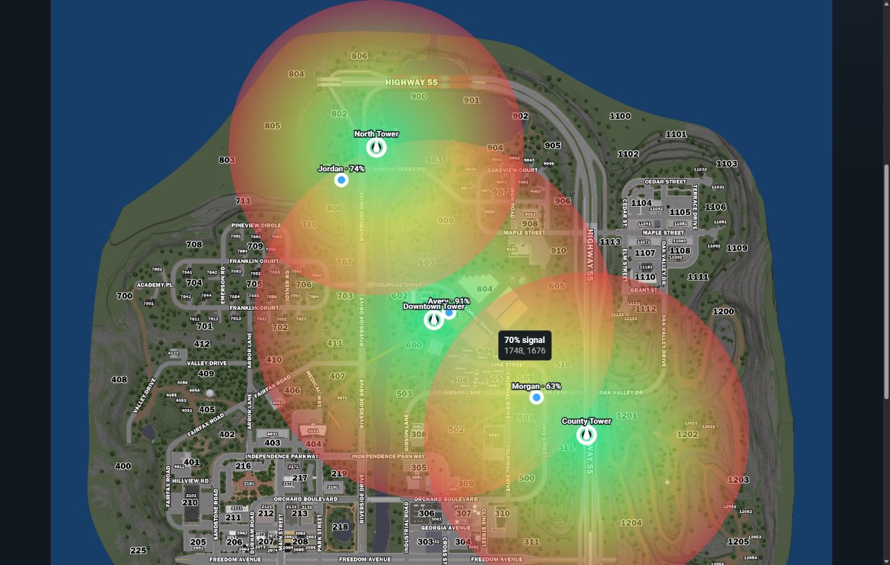

# ER:LC Towers and Emergency Zones

Virtual signal towers let ER:LC communities apply location-based signal quality without installing a game resource. Signal is strongest near a tower and gradually weakens as a player approaches the edge of its range.

## Before You Begin

Make sure that:

* The community server is set to **ER:LC** under **Customize** > **Game Integration**.
* The ER:LC private server is linked and its join code appears beside **ER:LC Private Server** if you want to preview live players and apply signal changes.
* Each player has linked the Roblox account they use in ER:LC to their Sonoran account for live signal.

If the private server is not connected yet, follow [Configure a Game Integration](../../getting-started/configure-game-integration.md#erlc).

## Open the ER:LC Tower Map

1. Navigate to **Customize** > **Game Integration**.
2. Select **ER:LC**.
3. Scroll to **ER:LC Map Configuration** below the private-server settings.

The map combines virtual towers, live players, signal coverage, and emergency zones. Use the **Towers** and **Emergency Zones** buttons to switch editing tools without switching maps.

The active mode's controls float over the top of the map. **Towers** shows **Place Tower**. **Emergency Zones** shows the **Room** selector and drawing buttons. The toolbar fits its controls and wraps on smaller screens.

## Place a Tower

1. Select **Towers**, then **Place Tower** in the map overlay.
2. Select the desired tower location on the ER:LC map.
3. In the edit menu that opens, enter a descriptive **Tower name**.
4. Set the tower's **Range** in map units.

Changes save automatically. A single left click on any tower marker opens its edit menu; no right click is needed. Drag the marker to reposition it, or select **Delete Tower** in the menu to remove it. Tower range is measured in map units, and the menu displays the tower's map X/Z coordinates.

<figure><figcaption>
Overlapping tower ranges use the strongest signal and live player markers display their current percentage.
</figcaption></figure>

## Configure Emergency Zones

1. Select **Emergency Zones** above the map.
2. Use **Room** in the map overlay to select the Radio room whose zones you want to configure.
3. Select **Draw Polygon** and place at least three points, then select **Finish Zone**; or select **Draw Circle**, then select its center and edge.
4. In the zone menu, enter a name and select the channels that can transmit from the zone.

Select an existing zone to reopen its menu. Drag the blue handles to reshape a polygon or move a circle's center; drag the yellow circle handle to change its radius. Select **Delete Zone** to remove it. Use **Cancel** to discard a shape you are still drawing.

Zones belong to the selected room. Switching rooms shows that room's zones, while towers apply to the community. Zone changes save automatically and remain visible when you return to tower editing. If saving fails, Radio displays an error and restores the last saved configuration.

## Understand Signal Coverage

Each tower displays a circular coverage overlay:

* **Green** at the tower represents the strongest signal.
* Signal gradually transitions through yellow toward **red** at the edge.
* The edge of the circle and locations outside it have no signal from that tower.
* Where tower ranges overlap, the strongest available tower signal is used.

Hover over any location on the map in **Towers** mode to preview its signal percentage. The calculation uses the straight-line distance from that point to each tower and displays the strongest resulting percentage.


Emergency zones remain visible on the ER:LC map so you can plan radio coverage around important areas.


## Live Player Positions

While the Signal Towers map is open, linked players in the connected ER:LC private server appear as blue markers with their current signal percentage. Player positions refresh every five seconds.

Each connected user's Radio signal also refreshes every five seconds. Moving closer to a tower improves signal quality; moving toward or beyond its range reduces it.

## Troubleshooting

### The Tower Editor Is Not Available

Open **Customize** > **Game Integration** and confirm that the community server is set to **ER:LC**. The ER:LC Map Configuration editor is not shown while FiveM is selected.

### The Private Server Is Not Linked

Confirm that the ER:LC private server has the API Pack, then copy a current API key from **Server Info** > **Edit Server Settings** > **ER:LC API** and select **Link Server**. If replacing an existing connection, select **Unlink** first.

### The Link Roblox Banner Still Appears

Make sure you linked the Roblox account to the same Sonoran account you use for Radio. Return to the Radio window so it can refresh your link status. The banner is shown to each unlinked user individually; another member linking their account does not clear yours.

### A Player Is Missing From the Map

Confirm that the player:

* Is currently in the linked ER:LC private server.
* Linked the correct Roblox account to their Sonoran account.
* Waited at least five seconds for the next position refresh.

### A Player Has No Signal

Confirm that at least one tower has been placed and that the player is inside a tower's range. A player who is not matched to a linked Roblox account or is not present in the connected ER:LC server cannot receive location-based signal.
