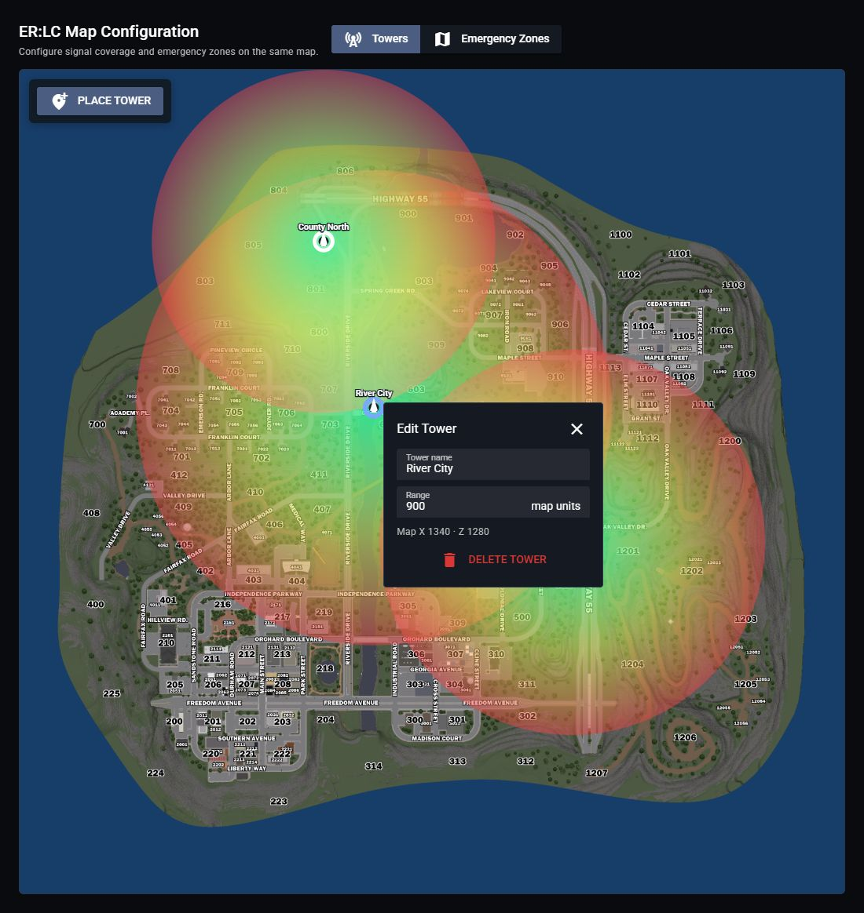
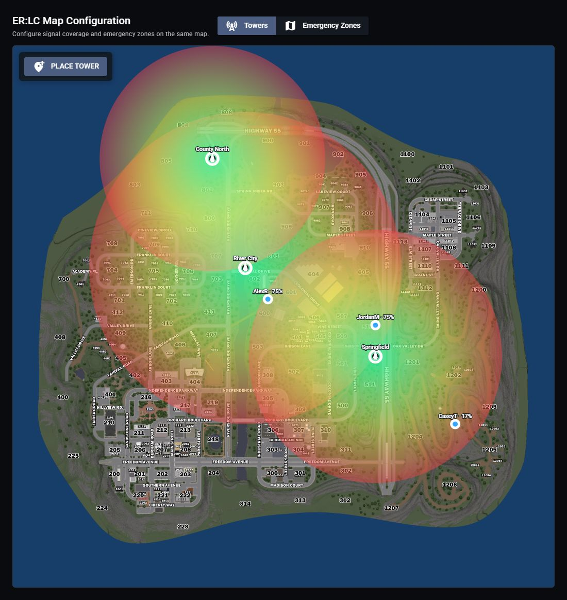

# ER:LC Virtual Towers & Live Players

First, [link your private server and Roblox account](../../game-integrations/roblox/erlc-setup.md).

## Place a Tower

1. Open **Customize** > **Game Integration** > **ER:LC**.
2. Under **ER:LC Map Configuration**, select **Towers**.
3. Select **Place Tower**, then click a location on the map.
4. Enter a **Tower name** and set its **Range**.
5. Click outside the field to finish editing. Changes save automatically.

<figure><figcaption>
Name each tower and adjust its coverage range.
</figcaption></figure>

Click a tower to edit it. Drag its marker to move it, or select **Delete Tower** to remove it.

Signal stays at 100% until you place the first tower.

## Check Signal Coverage

Green indicates stronger coverage; yellow and red indicate weaker coverage. Outside a tower's range, it provides no signal. Where towers overlap, players use the strongest available signal.

In **Towers** mode, hover over the map to preview the signal percentage at that location.

## View Live Players

Players matched to linked Roblox accounts appear as blue markers with their names and signal percentages. Join the linked ER:LC server and allow a few seconds for the map to refresh.

<figure><figcaption>
Player markers show how coverage changes across the map.
</figcaption></figure>

The [desktop overlay](../desktop-overlay.md#game-signal) displays your radio signal while playing ER:LC.

Configure emergency zones

1. Select **Emergency Zones** in the same map editor.
2. Choose the **Room**.
3. Select **Draw Polygon** and place at least three points, then select **Finish Zone**. Or select **Draw Circle**, click its center, then click its edge.
4. Enter a **Zone name** and choose **Transmit channels** in the zone settings.

Select a zone to edit it. Drag the handles to reshape it, or select **Delete Zone** to remove it. Zones belong to the selected room; changes save automatically.

A player is missing or has no signal

1. Confirm the private server is linked under **Game Integration**.
2. Confirm the player joined that ER:LC private server.
3. Link the Roblox account the player is using to their Sonoran account.
4. Make sure the player is within a tower's range.
5. Allow a few seconds for the next update.

