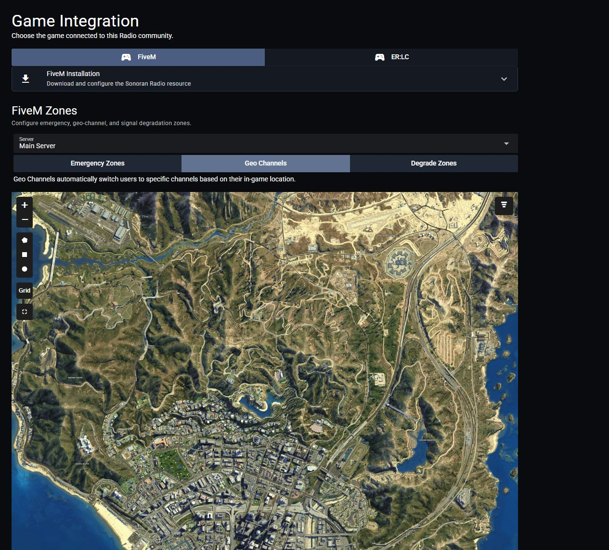

# Geo Channels

Geo channels let you define in-game zones that automatically switch your transmitting and scanned channels based on your location.

For example, entering a downtown area can automatically switch your radio to the **City** channel, while driving on the highway can switch it to the **Highway** channel.

## Creating Geo Zones

### Via Radio Panel

Geo Zones via Radio Panel

1. Open **Customization** > **Game Integration** > **FiveM**.
2. Under **FiveM Zones**, choose your **Server** and select **Geo Channels**.
3. Use the polygon, rectangle, or circle tool to draw a zone.
4. Select the zone to set its name, Z coordinates (floor and ceiling height), and channels to transmit and scan when entered.

Additionally, you can enter comma separated ACE permissions for the zone. When configured, the zone will only apply to users with those ACE permissions.

<figure><figcaption></figcaption></figure>

### Via In-Game Menu

Accessing the Menu

Open the menu with the in-game `/radiomenu` command and select `Geo Channels`

<figure><figcaption>
Sonoran Radio - In-game Menu
</figcaption></figure>

Zone Configuration Options

In the `Geo Channels` menu, you can specify which channels you want to transmit and scan upon entering, ace perms required to auto switch, add points to create a 3D zone and toggle auto switching on and off.

 

`Add Point to Zone`

* Adds another point to the 3D zone

`Undo Last Point`

* Removes the last placed point from the 3D zone

`Min Z`

* The minimum Z value (floor height) of the 3D zone

`Max Z`

* The maximum Z value (ceiling height) of the 3D zone

`Finish Zone Creation`

* Finishes the 3D zone creation and saves to the `geochannels.json` file

`Cancel Zone Creation`

* Cancels the 3D zone editor and closes the menu

`Edit Geo Zones`

* Opens the Geo Zone editor menu

`Select Zone`

* Select the zone you would like to edit

`Transmit Channels`

* The channels you will automatically join and transmit in upon entering the zone, and leave upon exiting the zone

`Scan Channels`

* The channels you will automatically join and scan in upon entering the zone, and leave upon exiting the zone

`ACE Permissions`

* The ACE permission required for the auto switch to happen upon entering/ exiting the zone. If left blank **ALL** radio users will join and exit the channel upon entering that zone

View and Remove Configured Geo Zones

Select `Edit Geo Zones` in the menu and toggle on `Show Zones`. All configured zones on the map will be displayed in green. If the config.lua's `debug` mode is set to true, all zones will also be made visible.

Use the `Select Zone` menu option to swap back and forth between zones. Your selected zone will be displayed in red.

Use the `Delete Zone` menu option to delete the selected (red) zone.

<figure><figcaption>
Degredation Zone: Visible and Selected
</figcaption></figure>

## Commands and ACE Permissions

FiveM Geo Channel Config + ACE Permissions

In the [config.lua](../../getting-started/installing-the-in-game-resource.md#updates)'s `Config.geoChannels` property allows for additional customization.

**User Toggle**

Users can use `/radio geoswitch` to toggle the auto-switcher on/off for themselves.

An optional `acePermission` can be added to restrict this command to specific users.

