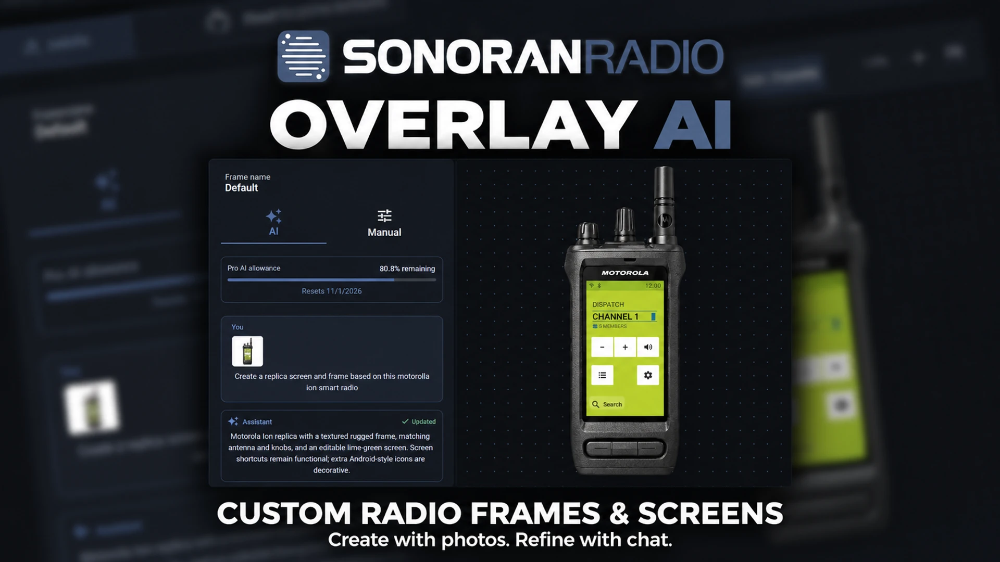

# Overlay AI

Build a radio overlay from a description or reference photos in **Customize > Overlay**. Overlay AI can generate the outer radio frame, position its screen and controls, and create an editable screen design for the desktop overlay and FiveM radio.

<figure><figcaption>
Create with photos. Refine with chat.
</figcaption></figure>

Overlay AI and the **Custom** screen editor require a **Pro** community subscription. See [View and Compare Plans](../../pricing/pricing-faq/standalone-pricing.md#overlay-ai).

## Create your first design

1. Open your community's **Customize > Overlay** page.
2. Select an existing frame, or select **New Frame**, enter a name, choose **Blank canvas**, and select **Create**.
3. Use the **AI** tab, which opens by default. Describe the radio you want, select a suggested prompt, or use **Add photos** to attach references.
4. Select **Send**. The generated design appears on the canvas.
5. Review the result and send follow-up instructions. Switch to **Manual** for direct adjustments.
6. Select **Save changes** to apply the design to your community.

AI results update the editor draft. They are not saved to your community until you select **Save changes**.

## Use reference photos

Attach up to **four PNG, JPEG, or WebP images**, each **2 MB or smaller**. Select **Add photos**, or drop images into the message area. You can add photos with the first request and with follow-up messages.

Clear, front-facing photos help the AI match the radio body and display. Include a close view of the display when its colors, icons, or labels are important.

Photos remain attached and are sent with each message until you remove them.

## Refine with chat

Describe which parts should change and which should stay the same. You can request changes to the frame, screen colors and typography, icons, labels, and control positions.

| Goal | Example message |
| --- | --- |
| Recreate a radio | “Create a replica screen and frame based on these Motorola Ion photos.” |
| Change the display | “Use the gray display background and dark text in the reference. Keep the frame unchanged.” |
| Adjust the layout | “Move the volume control to the top right and enlarge the channel name.” |
| Edit the body | “Keep this radio's shape, but make the outer case black.” |
| Add decoration | “Add a small GPS symbol and a County Patrol label that do nothing when clicked.” |

The standard radio controls retain their radio actions. Extra text and icons are decorative: they do not create new radio functions.

## Make manual adjustments

Open **Manual** to choose a **Screen Theme**. The **Custom** theme exposes these controls:

* **Colors and type** — brand text, screen and state colors, font family, and button corners.
* **Items** — select a screen item to change its visibility, size, weight, or decorative text and symbol.
* **Icon images** — choose built-in symbols or upload custom icons.
* **Share design** — export and import the custom design as JSON.

Click an item on the canvas to select it, drag it to move it, or drag its corner to resize it. Use **Editing controls** to hide selection borders and resize handles while reviewing the design. **+**, **−**, and **Fit** change the preview zoom without changing the saved radio size.

See [Radio Overlay](desktop-overlay.md#create-a-custom-overlay) for frame controls and [FiveM Radio Frames](in-game-radio/customizing-radio-frames.md) for in-game selection and access restrictions.

## Monthly AI allowance

Pro includes a monthly allowance for Overlay AI. The panel shows the percentage remaining and the next reset date. Usage depends on the work requested; generating new frame artwork uses more of the allowance than a simple screen edit.

The allowance resets on the **first of each month in UTC**. Further generation is unavailable when the remaining allowance cannot cover the next request. You can continue using the manual editor and save your existing draft.
