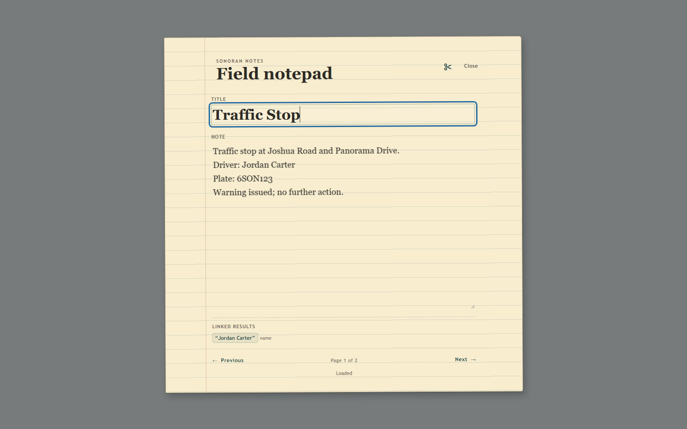

# 🗒️ Sonoran Notepad

The in-game notepad syncs directly with Sonoran CAD, keeping your notes updated between FiveM and the CAD in real time. Highlight names, license plates, and other information to run quick lookups and view NCIC results without leaving the notepad.

<figure><figcaption>
The paper interface keeps titled field notes, navigation, removal, and linked CAD results together.
</figcaption></figure>

## Features

* **In-Game Notepad** – Quickly open and edit notes without leaving FiveM.
* **Sonoran CAD Sync** – Notes automatically stay synced with your Sonoran CAD notepad.
* **Quick NCIC Lookups** – Highlight names, plates, and other information to run lookups directly from your notes.

## CAD sign-in and synchronization

The notepad syncs with the [CAD's tablet resource](https://docs.sonoransoftware.com/cad/integration-plugins/in-game-integration/available-plugins/tablet) submodule. Once signed into the tablet, add the **notepad** to your custom layout. Notes will sync between the in-game tablet and the CAD.

The notepad is still available for standalone use in-game, if not using Sonoran CAD and the tablet resource.


[installation.md](installation.md)



[usage-and-sync.md](usage-and-sync.md)

