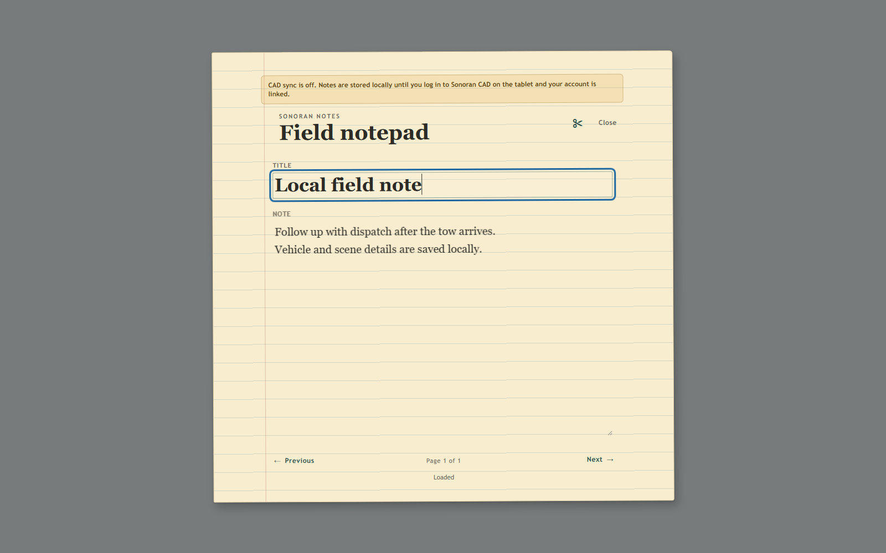

# Using and Syncing Notes

## Open and close the notepad

Run `/notepad` or press `F7` with the default configuration. Use **Close** or press `Escape` to leave the notepad.

While it is open, the player performs a writing animation with notepad and pencil props. The animation and props stop when the interface closes or the resource stops.

\<!— IMAGE HERE (writing animation) -->

## Write and navigate

Each page has a bold **Title** field and a lined **Note** area. Changes save automatically after a short pause.

* Select **Previous** to move to the preceding note.
* Select **Next** to move forward.
* Selecting **Next** on the last completed note creates a new blank page.
* Only one untouched blank page is kept at a time.
* Select the scissors control in the upper-right corner to tear out the current page.

The page indicator shows the current position and total number of notes.

<figure><figcaption></figcaption></figure>

## CAD Sync

The notepad syncs with the [CAD's tablet resource](https://docs.sonoransoftware.com/cad/integration-plugins/in-game-integration/available-plugins/tablet) submodule. Once signed into the tablet, add the **notepad** to your custom layout. Notes will sync between the in-game tablet and the CAD.

The notepad is still available for standalone use in-game, if not using Sonoran CAD and the tablet resource.

\<!— Todo IMAGE (hyperlinks, NCIC, and in-CAD view) -->

## Local-only mode

If you are not using the [CAD's tablet resource](https://docs.sonoransoftware.com/cad/integration-plugins/in-game-integration/available-plugins/tablet) submodule or are not signed into the tablet, a compact warning appears above the notebook header. Editing, page navigation, and removal continue to work.

<figure><figcaption>
The local-only warning explains why CAD sync is off without blocking the notebook.
</figcaption></figure>

Local-only changes are marked for synchronization. When the tablet later reports a linked, signed-in CAD session, Notepad sends the current local list to CAD.
