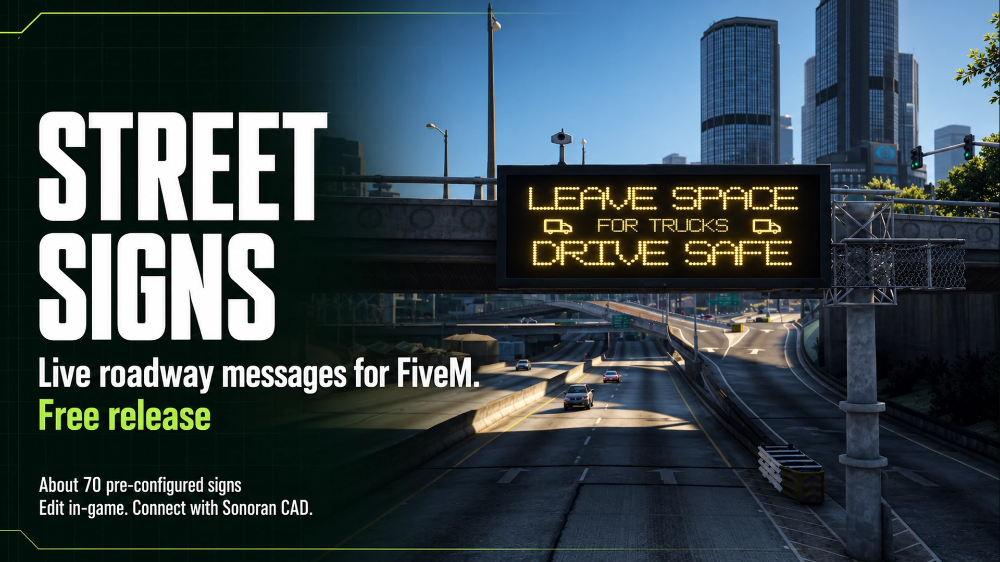
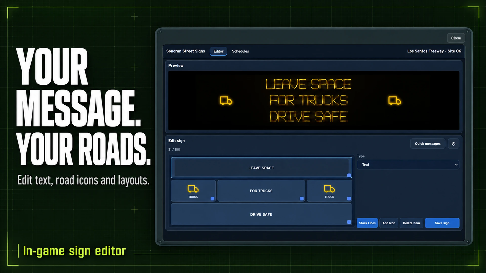
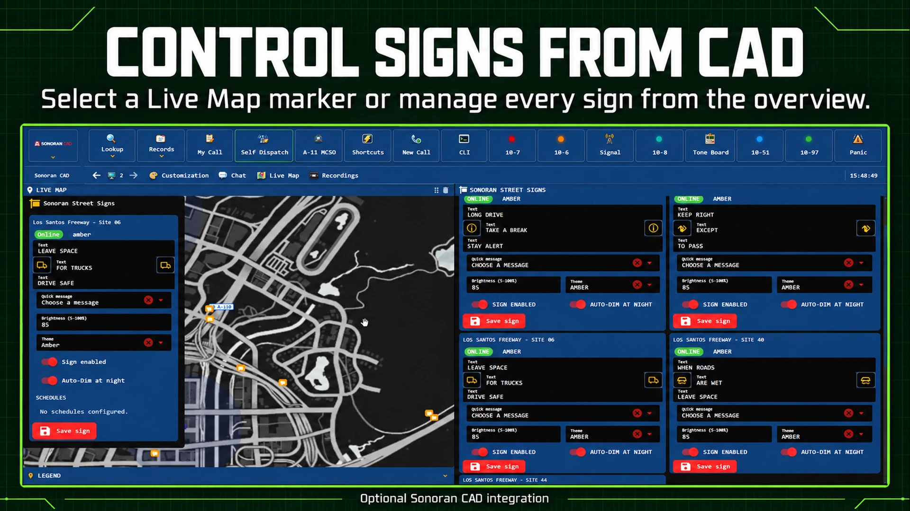
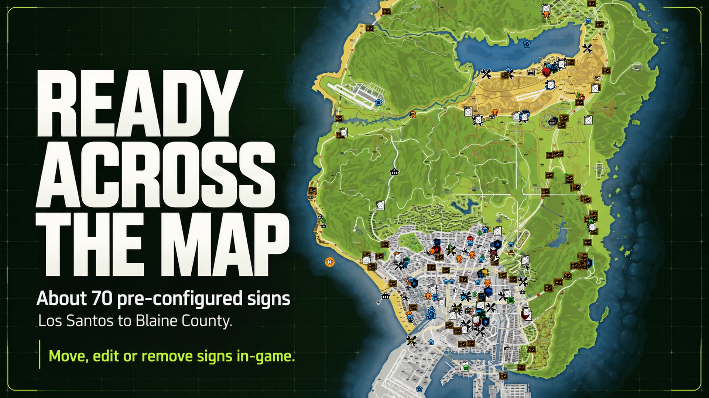

# 🛣️ Sonoran Street Signs

Create road closures, traffic warnings, detours, and event directions with editable highway message signs. Update text and icons in-game, or manage signs from Sonoran CAD with the optional integration.

<figure><figcaption>
Editable highway messages for your community.
</figcaption></figure>

## Features

* **Highway message signs** — Combine text and road icons with a live editor preview.
* **Ready-to-use placements** — Includes 76 editable signs across highways, town roads, and port access routes.
* **In-game management** — Use `/sign` to place, move, edit, or remove signs. Walk up to a sign's control panel to edit its message.
* **Daily schedules** — Display a saved message during a chosen period using the in-game clock.
* **Display controls** — Choose a color and brightness, switch the screen off, or dim it automatically at night.
* **Saved signs** — Placements and messages remain after resource and server restarts.
* **Sonoran CAD control** — Manage all signs from the overview, or open a specific sign from its Live Map marker.
* **Optional integrations** — Connect signs to Sonoran Power Grid and log changes or blocked text to Discord.

## Gallery



<figure><figcaption>
Edit text, road icons and layouts in-game.
</figcaption></figure>



<figure><figcaption>
Manage signs remotely with the optional Sonoran CAD integration.
</figcaption></figure>



<figure><figcaption>
About 70 pre-configured signs across the map.
</figcaption></figure>



The current package includes the **Highway Sign Only** style. Additional sign styles, billboards, and vehicle-mounted signs are planned expansions.


[getting-started.md](getting-started.md)



[commands-and-usage.md](commands-and-usage.md)



[integrations-and-webhooks.md](integrations-and-webhooks.md)

