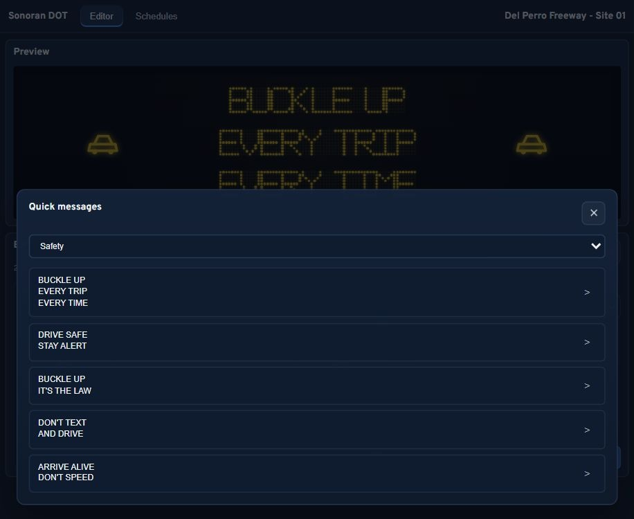
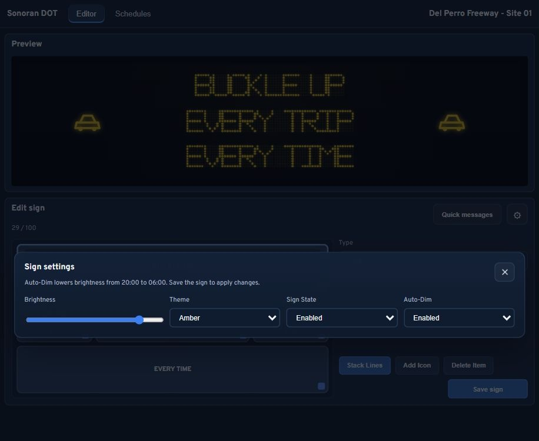

# Using Signs

## Open the sign menu

Run `/sign` to open Street Signs. Select **Nearby signs** or **All signs**, then choose the sign you want to manage. Your permissions determine which actions appear.

Administrators can select **Full sign controller** to manage messages across all signs.

> Screenshot placeholder: The `/sign` menu showing Place a new sign, Nearby signs, and All signs.

## Place a sign

1. Select **Place a new sign**.
2. Enter a unique **Sign ID** and a **Display label** so you can find it later.
3. Select **Start placement**.
4. Use the on-screen controls to move and rotate the preview. **Snap to ground** helps position the support.
5. Select **Save placement**, or **Cancel placement** to discard it.

Check that the sign faces approaching traffic and that its support is clear of the road. To move an existing sign, select it from the menu and choose **Reposition sign**.

> Screenshot placeholder: Placement preview beside a roadway, with movement controls and Save placement visible.

## Edit the message

Walk to the control panel at the base of a sign and press `E`, or select **Open visual editor** from its menu. Nearby editing requires you to remain close to the control panel.

* Select a text block to change its message.
* Use **Stack Lines** for a simple text layout or **Add Icon** to add a road symbol.
* Drag blocks and their resize handles to adjust the layout. **Delete Item** removes the selected block.
* Check the preview, then select **Save sign** and wait for the save confirmation.

Use short messages with letters, numbers, and supported punctuation. If a character cannot be displayed or text is blocked by the word filter, correct it before saving.

<figure><figcaption>
Browser preview of the editor using sample sign data.
</figcaption></figure>

## Quick messages

Select **Quick messages**, choose **Safety**, **Traffic**, or **Closure**, and select a message. Check the resulting preview and select **Save sign** to apply it.

<figure><figcaption>
Quick messages in the browser preview.
</figcaption></figure>

## Sign settings

Select the gear button in the editor to adjust brightness, color theme, screen state, and **Auto-Dim**. Close the settings window and select **Save sign** to apply your changes.

Turning the screen off keeps the physical sign in place. The `/sign` menu also provides **Edit text lines** and **Sign settings** for quick changes.

<figure><figcaption>
Sign settings in the browser preview.
</figcaption></figure>

## Remove a sign

Select the sign in `/sign`, choose **Delete sign**, then **Confirm deletion**. To keep the sign, select **Keep sign** instead. A deleted sign must be placed again if you want to restore it.
