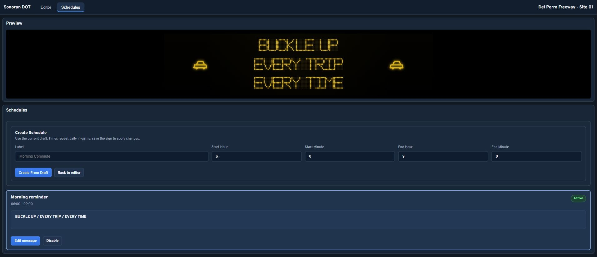

# Using Signs

## Open the sign menu

Run `/sign` to open Sonoran Street Signs. Select **Nearby signs** or **All signs**, then choose the sign you want to manage. Your permissions determine which actions appear. Nearby signs also have map markers to help you find them.

Administrators can select **Full sign controller** to browse all signs in one editor. In-game saves still require you to be within three meters of the selected sign's control panel, including in the full controller. Use [Sonoran CAD](integrations-and-webhooks.md#sonoran-cad) for remote message updates.

> Screenshot placeholder: The `/sign` menu showing Place a new sign, Nearby signs, and All signs.

## Place or move a sign

1. Select **Place a new sign**.
2. Enter a unique **Sign ID** and an optional **Display label** so you can find it later.
3. Select **Start placement**.
4. Use the on-screen controls to move and rotate the preview. **Snap to ground** helps position the support.
5. Select **Save placement**, or **Cancel placement** to discard it.

Check that the sign faces approaching traffic and that its support is clear of the road. The placement must stay within 30 meters of your character. To move an existing sign, select it from the menu and choose **Reposition sign**; remain near its original control panel until you save the move.

> Screenshot placeholder: Placement preview beside a roadway, with movement controls and Save placement visible.

## Edit the message

Walk to the control panel at the base of a sign and press `E`, or select **Open visual editor** from its menu. Remain close to the control panel while editing and saving.

* Select a text block to change its message. Click an empty grid cell to add another block.
* Each text block has its own message, including blocks on the same row.
* Use **Add Icon** to add a road symbol, then select its icon in the item controls.
* Drag blocks and their resize handles to adjust the layout. **Delete Item** removes the selected block.
* **Stack Lines** rebuilds a simple text layout and removes the existing layout, including icons.
* Check the preview, then select **Save sign** and wait for the save confirmation.

Use short messages with letters, numbers, and supported punctuation. If a character cannot be displayed or text is blocked by the word filter, correct it before saving.

Save before closing with `Escape` or switching signs. Changes in the editor do not save automatically.

<figure><figcaption>
Browser preview of the editor using sample sign data.
</figcaption></figure>

## Quick messages

Select **Quick messages**, choose **Safety**, **Traffic**, or **Closure**, and select a message. Check the resulting preview and select **Save sign** to apply it.

<figure><figcaption>
Quick messages in the browser preview.
</figcaption></figure>

## Sign settings

Select the gear button in the editor to adjust brightness, color theme, screen state, and **Auto-Dim**. Close the settings window and select **Save sign** to apply your changes.

Brightness ranges from 5–100%. To blank the display, turn the screen off; entering zero brightness does not turn it off. **Auto-Dim** reduces brightness during in-game nighttime, from 20:00 to 06:00.

Turning the screen off keeps the physical sign in place and overrides scheduled messages. The `/sign` menu also provides **Sign settings** to rename a sign and make quick settings changes. These menu changes save when selected.

**Edit text lines** changes the sign's stored lines. For signs with arranged text blocks, change their text in the visual editor so the displayed layout updates.

<figure><figcaption>
Sign settings in the browser preview.
</figcaption></figure>

## Daily schedules

1. Prepare the message and layout in the editor.
2. Select **Schedules** and enter a label, start time, and end time.
3. Select **Create From Draft** to capture that message and layout.
4. Select **Back to editor**. Prepare the normal message for outside the scheduled period, then select **Save sign**.

Times repeat daily using the **in-game clock**, with hours from 0–23. Overnight periods work across midnight. Equal start and end times apply all day. Outside scheduled periods, the normal message returns.

Avoid overlapping periods: the first matching entry takes priority. **Disable** turns the screen off during that entry's period; it does not cancel the period or return to the normal message. Save after changing its state.

In the current editor, **Edit message** loads a schedule's text into the normal draft; it does not replace the saved schedule. Existing entries have no time-change or removal control, so check the message and times before creating one.

<figure><figcaption>
Daily schedule controls in the browser preview.
</figcaption></figure>

## Remove a sign

Select the sign in `/sign`, choose **Delete sign**, then **Confirm deletion**. To keep the sign, select **Keep sign** instead. A deleted sign must be placed again if you want to restore it.
