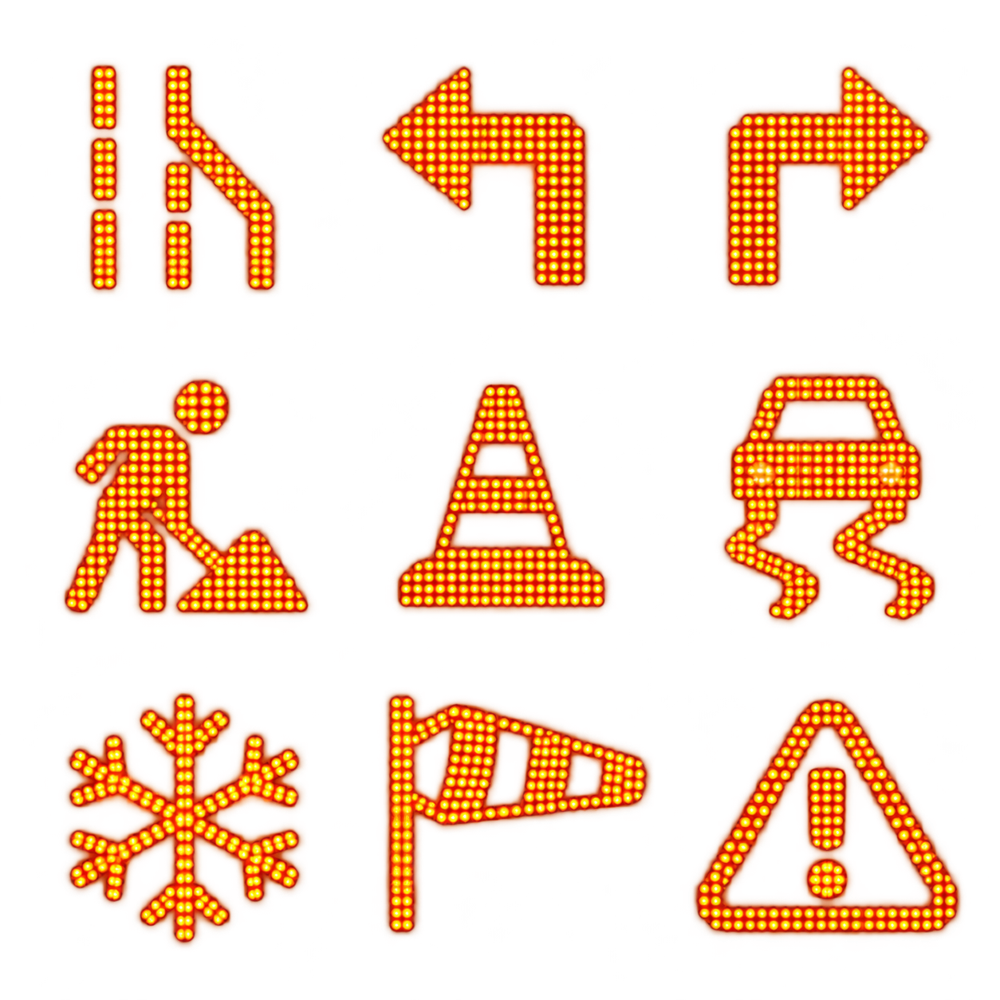
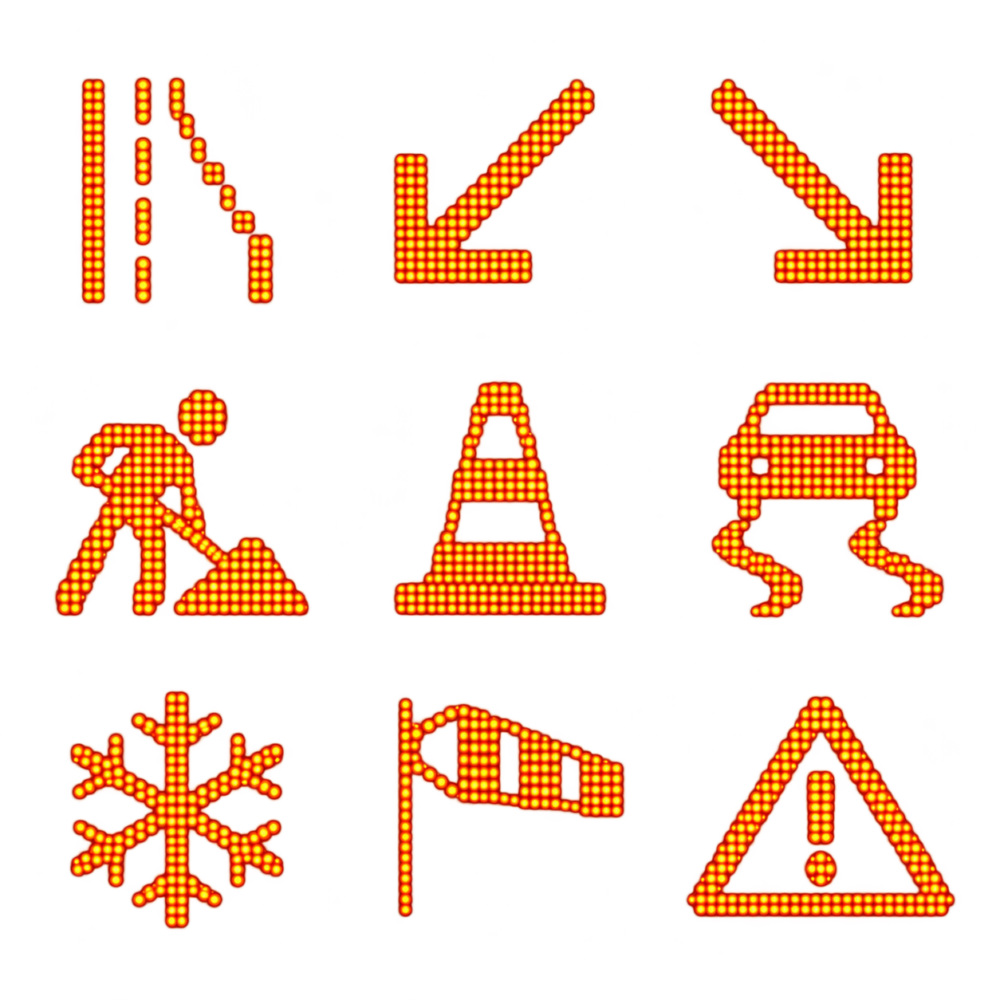

# Visual Showcase


**Coming Soon**

Final in-game screenshots and video require a live FiveM capture session. The placeholders below are intentionally retained so draft or simulated gameplay is never presented as the finished product.


## US and UK VMS Icon Concepts

The following transparent concept atlases were prepared for the planned US and UK grid-style sign controllers. These expansion controllers are not included in the current free Highway Sign version.

<figure><figcaption>
US VMS concept atlas: merge, detour, work-zone, weather, and warning symbols.
</figcaption></figure>

<figure><figcaption>
UK VMS concept atlas: lane control, work-zone, weather, and warning symbols.
</figcaption></figure>

## Planned Gallery

### Hero Banner

> Screenshot Placeholder: Wide cinematic roadway scene featuring multiple Street Signs in use.

### Editor Preview

> Screenshot Placeholder: SonoranDOT VMS Control Center loaded through the real FiveM iframe session, with a live Highway Sign selected.

### Highway Messaging

> Screenshot Placeholder: Highway-style message board showing a live roadway advisory.

### Directional Sign Pack

> Future Expansion Screenshot Placeholder: US or UK grid controller guiding players toward city areas or facilities.

### Warning Sign Pack

> Future Expansion Screenshot Placeholder: Speed warning or hazard sign near a traffic stop or work zone.

### Billboard-Style Display

> Future Expansion Screenshot Placeholder: Larger display board used for event or city messaging.

### Public Works Scene

> Future Expansion Screenshot Placeholder: Construction or detour scene using multiple coordinated signs.

### Event Routing Example

> Screenshot Placeholder: Signage guiding players into an event staging area.

## Suggested Media Style

For the best presentation, future screenshots should focus on:

* Clear daytime visibility
* Real roleplay environments
* Clean framing with readable sign content
* Variety across highways, city streets, and event spaces
* A mix of close-up and wide environmental shots

## Video Preview

> Video Placeholder: Short overview clip showing sign placement, editing, and in-world results.

Capture the final clip only after live FXServer validation. It should show the walk-up prompt, iframe editor, saved in-world result, CAD panel update, and a CAD-originated change returning to the game.
