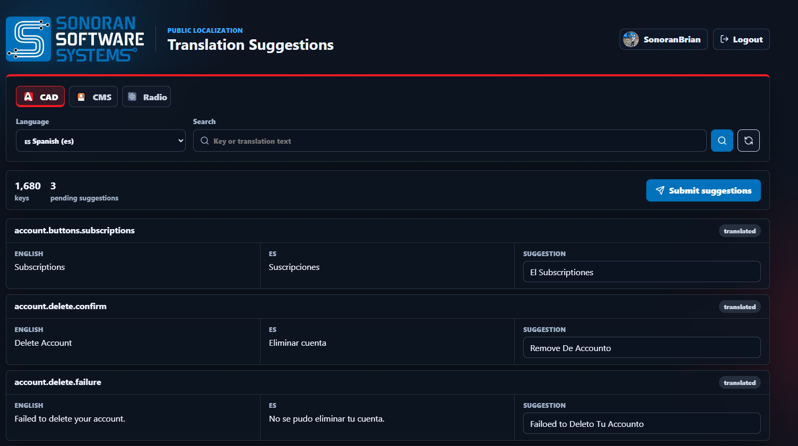

# 🌎 Translation Support

## Language Selection 

Selecting your language is easy!



Once signed in, users can select their language in the top-right dropdown.

<figure><figcaption></figcaption></figure>



Once signed in, users can select their language in the top-right dropdown.

<figure><figcaption></figcaption></figure>



Once signed in, users can select their language in the top-right dropdown.

<figure><figcaption></figcaption></figure>



## Improving Translations: 

Our systems automatically generate translations with AI. These translations can be manually improved by native language speakers.

### 1. Submitting Improvements

To submit translations, sign in with your Sonoran Software account at [translate.sonoransoftware.com](https://translate.sonoransoftware.com/).

* Select the **CAD**, **CMS,** or **Radio** product
* Select the **Language**
* Search and enter improved **Suggestions** for your language
* Once complete select **Submit Suggestions**


If you do not see your language at all, create a [Support Live Chat](https://support.sonoransoftware.com/) ticket to request generation of an entirely new language file.


<figure><figcaption></figcaption></figure>

### 2. Approval Process

Once submitted, you will receive an email confirmation. Our team will attempt to manually review and approve or deny within 72 hours.

If you have not received an email reply back within 72 hours with an **approval** or **denial**, feel free to contact us via our [Support Live Chat](https://support.sonoransoftware.com/) or [Discord](https://discord.sonoransoftware.com/).

<figure><figcaption></figcaption></figure> <figure><figcaption></figcaption></figure>

### 3. Updated Translations

Once approved, the updated translations will be **automatically available** on the website version within a few minutes. Desktop and mobile apps will be updated on the next app release.
