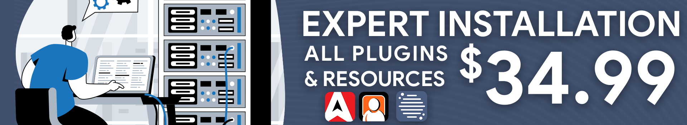

# Expert Installation

<figure><figcaption></figcaption></figure>

## What is expert installation?


Expert installation installs the CAD, CMS, and Radio FiveM resource onto your WIndows server.

This service **does not include one-on-one configuration of the individual submodules/plugins**, configuration inside the CAD/CMS/Radio portal, etc.

Our support team is available 7 days/week to help answer specific questions regarding configuration and customization.


Expert installation is a one-time payment of $34.99 and covers THREE (3) non-transferable installation credits.\
These credits can be used for:

* Sonoran CAD - Framework and Plugin Installation
* Sonoran CMS - Addon Installation
* Sonoran Radio - In-Game Radio and Addon Installation

## How do I purchase expert installation?

### At checkout:

When purchasing a new subscription for Sonoran CAD, CMS, or Radio; click `Add` on the `Expert Installation` option under `Add to your order` on the checkout page.

<figure><figcaption>
Expert Installation - Add to Order
</figcaption></figure>

### In the billing portal:

In the CAD, CMS, or Radio billing portal, select `New Subscription` > `Expert Installation`

<figure><figcaption>
Expert Installation - New Purchase
</figcaption></figure>

## Requirements for Installation

1. Windows VPS or Dedicated Server
2. Windows RDP Access (shared with support agent)
3. Sonoran CAD, CMS, or Radio subscription

## FAQ

### Can I redeem another product installation at a later date?

Yes! Your purchase is valid for three installation credits. You could have the agent install and configure CAD plugins and install CMS plugins at a later date.

### Is this purchase eligible for a refund?

All of our products are covered in our [48-hour moneyback guarantee](https://sonoransoftware.com/assets/files/internal/purchase_policy.pdf). However, this service is not non-refundable after the labor has been performed, regardless if one or all credits have been used.

### The support agent has installed my plugins, what's next?



Configure your submodules and start using Sonoran CAD!


[Submodule Configuration](https://app.gitbook.com/s/-M4pGN81fb4R6zFhodcu/integration-plugins/in-game-integration/submodule-configuration)




Configure your submodules and start using Sonoran CMS!


[FiveM Installation - Next Steps](https://app.gitbook.com/s/-MdBOa9OFjtdqw9FdXli/integration-capabilities/in-game-integration-resources/core/free-plugin-installation-next-steps)




Once installed, learn how to use Sonoran Radio!


[Usage](https://app.gitbook.com/s/fCk5zoeun5gx3ujYW6eg/tutorials/usage)



